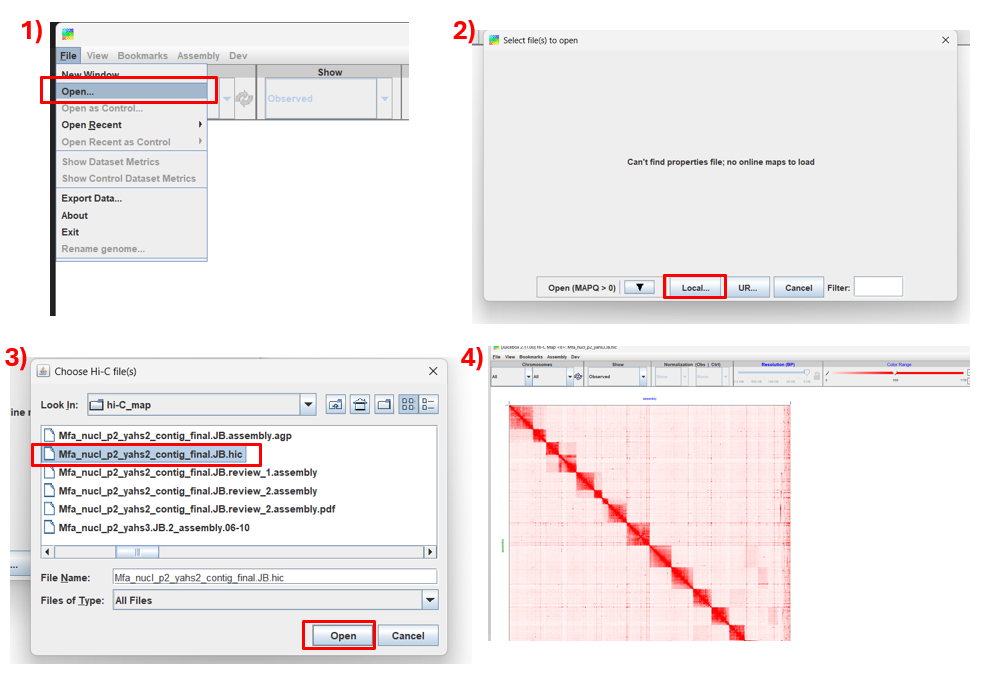
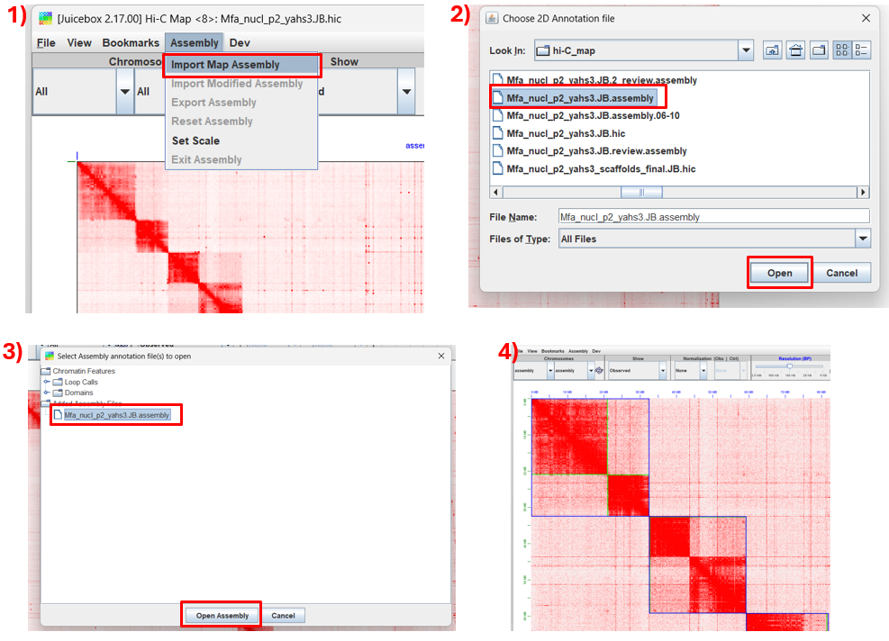
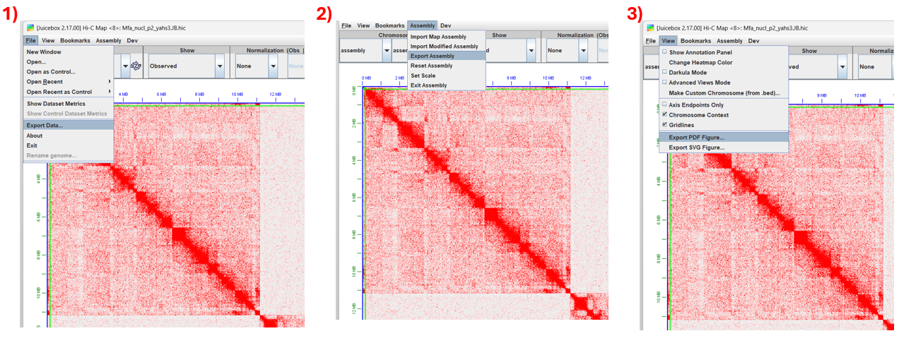

# Scaffolding usando Hi-C

!!! abstract "Resumo"
    Tutorial prático de scaffolding de genomas a partir de dados de Hi-C. Neste tutorial, cobrimos todo o pipeline: alinhamento, scaffolding, construção do mapa de contato, edição do mapa de contato, exportação e avaliação.

**Autor:** Dr. Leonardo C. J. Corvalan
**Instituição:** Laboratório de Genética & Biodiversidade (LGBio) — ICB/UFG
**Contato:** [lcjocorvalan@gmail.com](mailto:lcjcorvalan@gmail.com)
**Última atualização:** Julho de 2026

## :material-target: Objetivos de aprendizagem

Ao final deste curso, você será capaz de:

- [ ] Realizar scaffolding de um genoma
- [ ] Avaliar qualidade do scaffolding
- [ ] Criar mapas de contato e editá-los 
- [ ] Exportar o resultado em formato FASTA

## :material-clock-outline: Carga horária estimada

**~3 horas**

## :material-tools: Pré-requisitos

| Item                | Detalhes                                                                          |
| ------------------- | --------------------------------------------------------------------------------- |
| Curso anterior      | [Bash / Linux para bioinformática](../bash/index.md)                              |
| Biologia molecular  | Conceitos de sequenciamento, genoma, contig, scaffold                             |
| Softwares           | SRA Toolkit, bwa, samtools, PicardCommandLine, QUAST, yahs, juicer_tools, Juicebox|
| Recurso             | Servidor Linux com ≥ 32 GB de RAM, ≥ 16 threads e ≥ 50 GB de armazenamento.                 |

!!! warning "Programas instalados no computador pessoal"
    Para a etapa de visualização dos dados, será necessário instalar localmente o programa Juicebox. Mais instruções estão descritas na Etapa 7.. 

!!! warning "Compatibilidade com outros servidores"
    Este pipeline foi desenvolvido e testado no servidor de Bioinformática do LGBio (ICB/UFG).
    Ao reproduzi-lo em outro ambiente, podem ser necessários ajustes em caminhos de instalação,
    gerenciadores de ambiente (conda, module load), versões de software e parâmetros de memória/threads.
    
    
## :material-database: Dados do exercício

Os dados utilizados neste tutorial são provenientes de uma amostra de ***Saccharomyces cerevisiae***, sequenciada utilizando a enzima de restrição DpnII por meio do protocolo Hi-C. 
Os dados são referentes ao projeto: https://www.ncbi.nlm.nih.gov/geo/query/acc.cgi?acc=GSE227687.

!!! quote "Referência"
    Fouziya S, Krietenstein N, Mir US, Mieczkowski J, Khan MA, Baba A, Dar MA, Altaf M, Wani AH. Genome wide nucleosome landscape shapes 3D chromatin organization. Sci Adv. 2024 Jun 7;10(23):eadn2955. doi: 10.1126/sciadv.adn2955

---

## :material-numeric-1-circle: Etapa 1 — Obtenção dos dados

Os dados estão disponíveis no ENA e no SRA. Mostramos duas opções: via **SRA Toolkit** (controlado e robusto) e via **wget** direto do ENA (mais simples).

=== "Obtendo dados"

```bash
    
    mkdir 0.DadosBrutos
    ln -s /media/lgbio-nas1/lcorvalan/Hic_cafe/hic_scaffolding/0.DadosBrutos/sacCer3_hic20_1.fastq 0.DadosBrutos
    ln -s /media/lgbio-nas1/lcorvalan/Hic_cafe/hic_scaffolding/0.DadosBrutos/sacCer3_hic20_2.fastq 0.DadosBrutos

    cp /media/lgbio-nas1/lcorvalan/Hic_cafe/hic_scaffolding/sacCer3_draft.fasta 0.DadosBrutos
    cp /media/lgbio-nas1/lcorvalan/Hic_cafe/hic_scaffolding/sacCer3_ref.fasta 0.DadosBrutos

```


## :material-numeric-2-circle: Etapa 2 — Alinhamento 

```bash

    mkdir 1.Alinhamento/

    cp /media/lgbio-nas1/lcorvalan/Hic-data/Mfa/Ragtag/arima_map.sh .

    bash arima_map.sh 0.DadosBrutos/sacCer3_draft.fasta 0.DadosBrutos/SRR23913693_1.fastq  0.DadosBrutos/SRR23913693_2.fastq  sacCer3_draft_alin

    mv sacCer3_draft_alin* 1.Alinhamento/

```

### Checklist da Etapa 2

- [ ] Examine `sacCer3_draft_alin.Hic.bam` e `sacCer3_draft_alin.Hic.bam.stats`

---

## :material-numeric-3-circle: Etapa 3 — Crie um index para o genoma

```bash

    samtools faidx 0.DadosBrutos/sacCer3_draft.fasta

```

### Checklist da Etapa 3

- [ ] Tenho `0.DadosBrutos/sacCer3_draft.fastafbai`

---

## :material-numeric-4-circle: Etapa 4 — Scaffolding


```bash
    mkdir 2.Scaffolding

    /media/lgbio-nas1/lcorvalan/programas/YaHS/yahs/yahs 0.DadosBrutos/sacCer3_draft.fasta 1.Alinhamento/sacCer3_draft_alin.Hic.bam \
    --telo-motif TGGG \
    -e GATC \
    -o 2.Scaffolding/sacCer3_draft_alin.Hic.yahs.out

```


### Checklist da Etapa 4

- [ ] Tenho `2.Scaffolding/sacCer3_draft_alin.Hic.yahs.out_scaffolds_final.fa`

---

## :material-numeric-5-circle: Etapa 5 — Qualidade

```bash
    mkdir 3.Qualidade/

    quast.py -r 0.DadosBrutos/sacCer3_ref.fasta \
      0.DadosBrutos/sacCer3_draft.fasta \
      2.Scaffolding/sacCer3_draft_alin.Hic.yahs.out_scaffolds_final.fa \
      -o 3.Qualidade/quast -t 24 \
      --labels "sacCer3_draft,sacCer3_yahs"
  
```

### Checklist da Etapa 5

- [ ] Compare as estatísticas geradas pelo Quast.

---

## :material-numeric-6-circle: Etapa 6 — Gerando o mapa de contato

```bash

    samtools faidx 2.Scaffolding/sacCer3_draft_alin.Hic.yahs.out_scaffolds_final.fa
    samtools faidx 0.DadosBrutos/sacCer3_draft.fasta

    /media/lgbio-nas1/lcorvalan/programas/YaHS/yahs/juicer pre -a -o 2.Scaffolding/sacCer3_draf.JB \
    2.Scaffolding/sacCer3_draft_alin.Hic.yahs.out.bin 2.Scaffolding/sacCer3_draft_alin.Hic.yahs.out_scaffolds_final.agp \
    0.DadosBrutos/sacCer3_draft.fasta.fai > 2.Scaffolding/sacCer3_draft_alin.Hic.yahs.JB.log 2>&1

# Em seguida, execute:
    (java -jar -Xmx200G /home/lgbio/programas/juicer/scripts/juicer_tools.1.9.9_jcuda.0.8.jar pre 2.Scaffolding/sacCer3_draf.JB.txt 2.Scaffolding/sacCer3_draf.JB.hic.part <(cat 2.Scaffolding/sacCer3_draft_alin.Hic.yahs.JB.log  | grep PRE_C_SIZE | awk '{print $2" "$3}')) && (mv 2.Scaffolding/sacCer3_draf.JB.hic.part 2.Scaffolding/sacCer3_draf.JB.hic)

```

??? note "Na primeira parte do script, você deve informar o arquivo de índice (.fai)"

### Checklist da Etapa 6

- [ ] Tenho `sacCer3_draf.JB.assembly` e  `sacCer3_draf.JB.hic` 

---

## :material-numeric-7-circle: Etapa 7 — Plotando e editando o mapa de calor de contatos Hi-C

!!! Observação "Não esquecer de transferir os arquivos para o computador local"

### 7.1 Instalando Juicebox

1) Acesse o site https://github.com/aidenlab/Juicebox/wiki/Download
2) Selecione o seu sistema operacional
3) Após baixar o arquivo, prossiga com a instalação

!!! warning "Erro Java"
    Este programa demanda que o Java esteja instalado em seu computador.

### 7.2 Carregando dados no Juicebox

1) Abra o programa
2) Carregue os dados seguindo os passoso
   
3) Carregue as informações de contigs e scaffolds
   

### 7.3 Editando o mapa de contato

#### Movendo scaffolds e contigs

1. Mantenha a tecla **Shift** pressionada e clique no scaffold que deseja mover.
   > Note que ele ficará selecionado com linhas pretas.
2. Mova o cursor até o local onde deseja realocar o scaffold. Quando o cursor estiver no formato de uma seta, clique.

#### Invertendo scaffolds e contigs

1. Mantenha a tecla **Shift** pressionada e clique no scaffold que deseja inverter.
   > Note que ele ficará selecionado com linhas pretas.
2. Dentro da área do scaffold/contig, mova o cursor até o vértice superior direito. Quando o cursor assumir o formato de uma seta circular, clique.

#### Cortando scaffolds

1. Mantenha a tecla **Shift** pressionada e clique no scaffold que deseja cortar.
   > Note que ele ficará selecionado com linhas pretas.
2. Sobre a diagonal principal, mova o cursor até o ponto onde deseja realizar o corte. Quando o cursor assumir o formato de uma tesoura, clique.

#### Juntando scaffolds

1. Os scaffolds que deseja unir devem estar posicionados um ao lado do outro.
2. Mova o cursor até a extremidade onde os dois scaffolds se encontram. Quando o cursor mudar de formato, clique.

   
### 7.4 Exportando dados
1) Exportar matriz
2) Exportar assembly
3) Exportar figura
    


## :material-numeric-8-circle: Etapa 8 — Convertendo para FASTA

Transfira o arquivo .assembly para o servidor.

### Convertendo para FASTA

```bash

/media/lgbio-nas1/lcorvalan/programas/YaHS/yahs/juicer post -o 2.Scaffolding/sacCer3_draf.JB.out 2.Scaffolding/sacCer3_draf.JB.review.assembly 2.Scaffolding/sacCer3_draf.JB.liftover.agp 0.DadosBrutos/sacCer3_draft.fasta

```

??? note "O arquivo final é:"

    2.Scaffolding/sacCer3_draf.JB.out.FINAL.fa"

## :material-numeric-9-circle: Etapa 9 — Qualidade final

```bash
    mkdir 3.Qualidade/

    quast.py -r 0.DadosBrutos/sacCer3_ref.fasta \
      0.DadosBrutos/sacCer3_draft.fasta \
      2.Scaffolding/sacCer3_draft_alin.Hic.yahs.out_scaffolds_final.fa \
      2.Scaffolding/sacCer3_draf.JB.out.FINAL.fa \
      -o 3.Qualidade/quast -t 24 \
      --labels "sacCer3_draft,sacCer3_yahs,sacCer3_JB"
  
```

#### Parabéns! Você finalizou esta etapa!
Que a Força esteja com você! 🚀

---

## :material-license: Licença

Este tutorial é distribuído sob [CC BY 4.0](https://creativecommons.org/licenses/by/4.0/). Reutilize com atribuição.

## :material-bug: Reportar problemas

Encontrou erro, comando obsoleto, ou tem sugestão? Abra uma [issue no GitHub](https://github.com/LGBIO-UFG/PRO-BIOINFO/issues).
