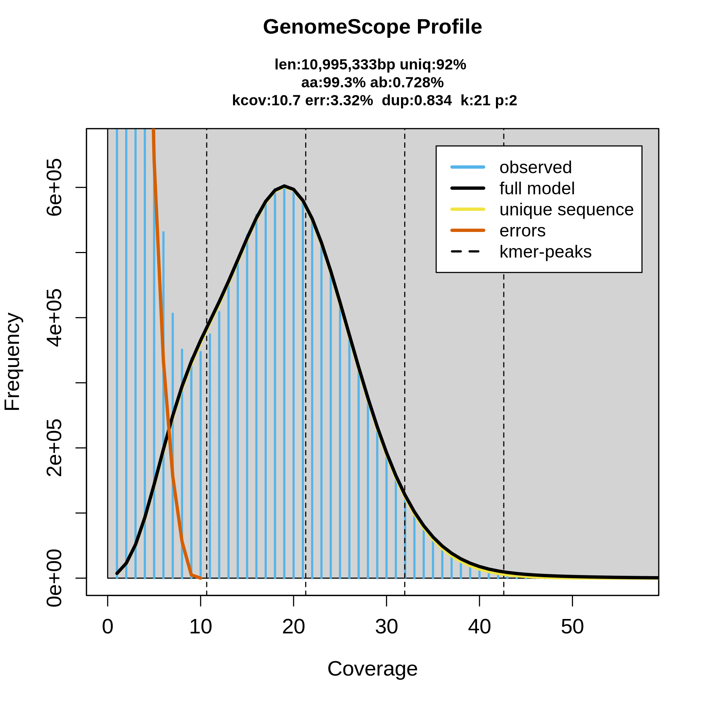
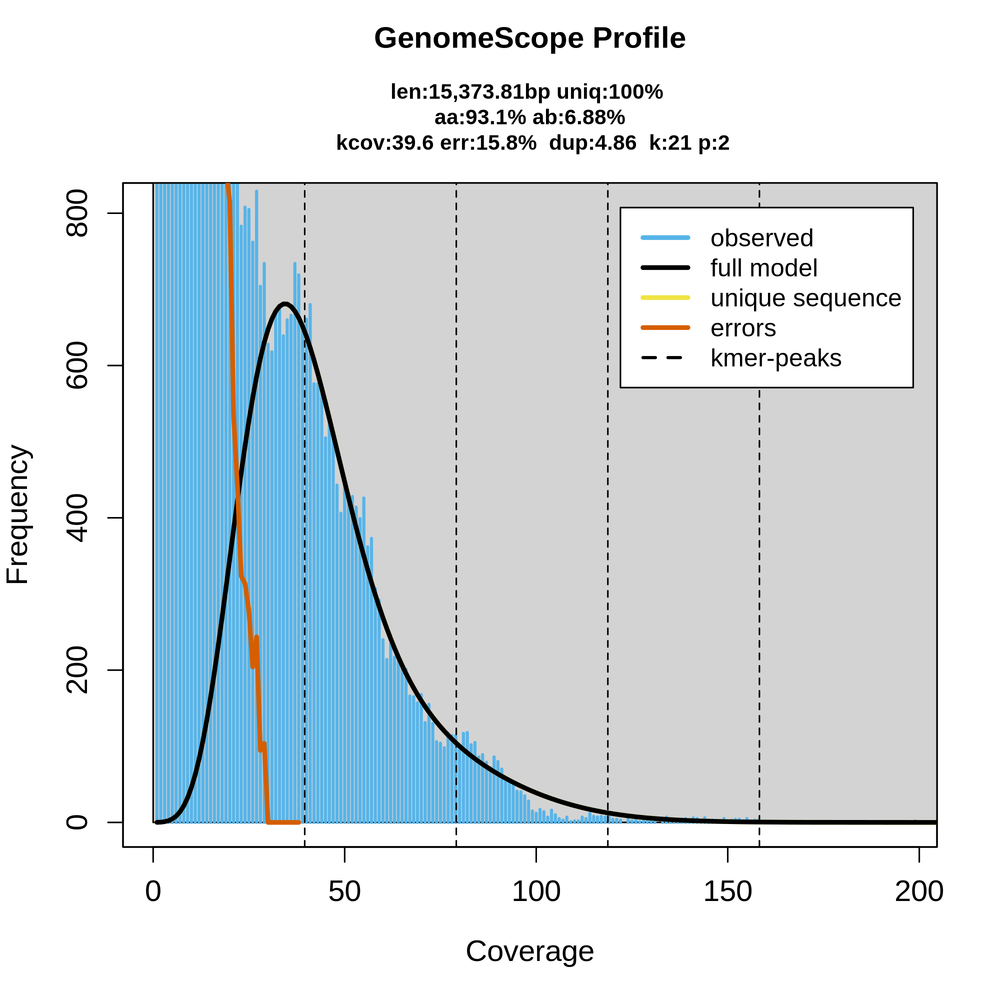
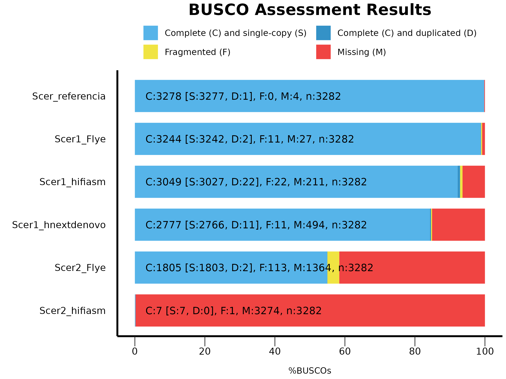
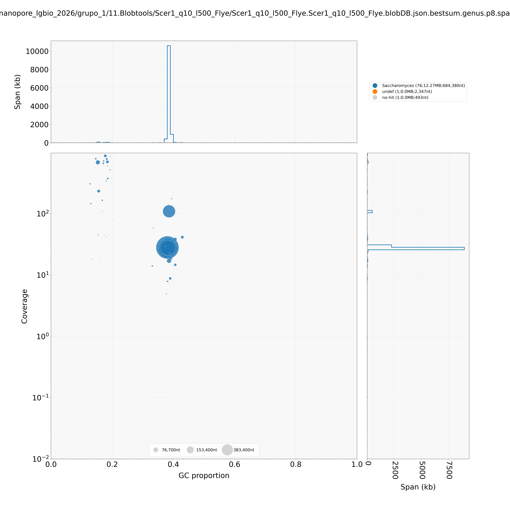
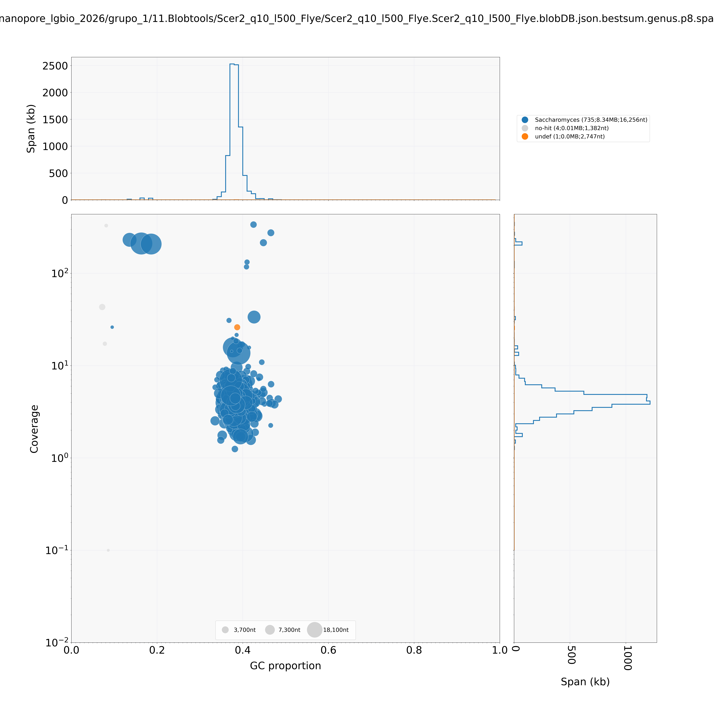

# Montagem de genomas com dados Nanopore

!!! abstract "Resumo"
    Tutorial prático de montagem *de novo* de genomas a partir de dados de sequenciamento Oxford Nanopore Technology (ONT). Cobrimos o pipeline completo: download dos dados públicos, controle de qualidade, filtragem, exploração de contaminantes (Kraken2), estimativa do genoma por k-mers (GenomeScope2), três estratégias de montagem (Flye, Hifiasm, NextDenovo), avaliação comparativa (QUAST, Merqury, BUSCO), polimento (Medaka), scaffolding com e sem referência (RagTag, LongStitch), escolha da montagem final e checagem de contaminação na montagem com BlobTools.

**Autora:** Profa. Renata de Oliveira Dias
**Instituição:** Laboratório de Genética & Biodiversidade (LGBio) — Instituto de Ciências Biológicas (ICB) / Universidade Federal de Goiás (UFG)
**Contato:** [renata_dias@ufg.br](mailto:renata_dias@ufg.br)
**Última atualização:** Julho de 2026

## :material-target: Objetivos de aprendizagem

Ao final deste curso, você será capaz de:

- [ ] Baixar dados públicos de sequenciamento ONT de bancos como ENA/SRA
- [ ] Avaliar qualidade de leituras longas com NanoPlot
- [ ] Remover adaptadores residuais (Porechop_ABI) e filtrar por qualidade/tamanho (Chopper)
- [ ] Explorar contaminantes com Kraken2 e interpretar suas limitações
- [ ] Estimar parâmetros do genoma a partir de k-mers (Meryl + GenomeScope2)
- [ ] Executar e comparar montagens *de novo* com Flye, Hifiasm e NextDenovo
- [ ] Avaliar montagens com QUAST, Merqury e BUSCO e entender por que essas métricas podem discordar
- [ ] Polir montagens com Medaka e avaliar quando o polimento realmente ajuda
- [ ] Realizar scaffolding com referência (RagTag) e sem referência (LongStitch)
- [ ] Escolher a montagem final com base em múltiplas evidências, não em uma métrica isolada
- [ ] Checar contaminação diretamente na montagem com BlobTools

## :material-clock-outline: Carga horária estimada

**~16 horas** 

## :material-tools: Pré-requisitos

| Item                | Detalhes                                                                          |
| ------------------- | ---------------------------------------------------------------------------------- |
| Curso anterior      | [Bash / Linux para bioinformática](../bash/index.md)                              |
| Biologia molecular  | Conceitos de sequenciamento, genoma, contig, scaffold                             |
| Softwares           | SRA Toolkit, NanoPlot, Porechop_ABI, Chopper, Kraken2, Meryl, GenomeScope2, Flye, Hifiasm, NextDenovo, QUAST, Merqury, BUSCO, Medaka, RagTag, LongStitch, minimap2, samtools, BLAST+, BlobTools |
| Recurso             | Servidor Linux com boa quantidade de RAM/threads e várias dezenas de GB de storage livre |

## :material-database: Dados do exercício

Utilizamos duas amostras de *Saccharomyces cerevisiae* sequenciadas com PromethION, depositadas no projeto [PRJEB77686](https://www.ebi.ac.uk/ena/browser/view/PRJEB77686) (ScRAP — *S. cerevisiae* Reference Assembly Panel), parte do estudo de Loegler et al. (2025).

| Amostra | Accession | Linhagem | Bases | Read N50 |
|---------|-----------|----------|-------|----------|
| **Scer1** | [ERR13367646](https://www.ebi.ac.uk/ena/browser/view/ERR13367646) | CBS7963 | ~1 Gb | 5.592 bp |
| **Scer2** | [ERR13375657](https://www.ebi.ac.uk/ena/browser/view/ERR13375657) | SM.9.1.AL1 | ~108 Mb | 1.865 bp |

!!! warning "Atenção à cobertura"
    Scer2 tem cobertura muito baixa para montagem de qualidade — usada aqui apenas para fins didáticos e comparação entre montadores. Ao longo do tutorial ela serve de contraste: mesma metodologia, dados insuficientes.

!!! quote "Referência"
    Loegler V. et al. *From genotype to phenotype with 1,086 near telomere-to-telomere yeast genomes*. **Nature** (2025). DOI: [10.1038/s41586-025-08616-z](https://doi.org/10.1038/s41586-025-08616-z)

## :material-download: Acesso aos resultados pré-computados

Não conseguiu rodar localmente, ou quer conferir se seus resultados batem com os esperados? Os principais outputs deste tutorial estão disponíveis para download/visualização direta na página, próximos de cada etapa. Resumo dos principais:

<div class="grid cards" markdown>

-   :material-file-chart: **Relatórios de QC**

    NanoPlot (bruto e filtrado), estatísticas Kraken2, GenomeScope2

    [:octicons-arrow-right-24: Ir para a Etapa 2](#etapa-2-controle-de-qualidade-dos-dados-brutos-nanoplot)

-   :material-chart-box: **Avaliação das montagens**

    QUAST, Merqury e BUSCO — antes e depois do polimento

    [:octicons-arrow-right-24: Ir para a Etapa 9](#etapa-9-avaliacao-da-qualidade-das-montagens)

-   :material-dna: **Montagens (FASTA)**

    Flye, Hifiasm, NextDenovo, versões polidas e scaffolded

    [:octicons-arrow-right-24: Ver data/exemplos/nanopore/assemblies/](https://github.com/LGBIO-UFG/PRO-BIOINFO/tree/main/data/exemplos/nanopore/assemblies)

-   :material-image-multiple: **Blob plots (BlobTools)**

    Checagem de contaminação nas montagens finais

    [:octicons-arrow-right-24: Ir para a Etapa 14](#etapa-14-checagem-de-contaminantes-na-montagem-blobtools)
</div>

---

## :material-numeric-1-circle: Etapa 1 — Obtenção dos dados públicos

Os dados estão disponíveis no ENA. O download pode ser feito via SRA Toolkit (`prefetch` + `fasterq-dump`) ou diretamente via FTP do ENA, que costuma ser mais rápido.

**Opção 1 — SRA Toolkit (recomendado para arquivos grandes):**

```bash
mkdir 0.DadosBrutos
prefetch ERR13367646 -O 0.DadosBrutos
fasterq-dump ERR13367646 --outdir 0.DadosBrutos --outfile Scer1.fastq --progress && gzip 0.DadosBrutos/Scer1.fastq

prefetch ERR13375657 -O 0.DadosBrutos
fasterq-dump ERR13375657 --outdir 0.DadosBrutos --outfile Scer2.fastq --progress && gzip 0.DadosBrutos/Scer2.fastq
```

??? note "Ver saída do comando"

    ```bash
    $ prefetch ERR13367646 -O 0.DadosBrutos

    2026-06-04T14:11:41 prefetch.3.0.0: Current preference is set to retrieve SRA Normalized Format files with full base quality scores.
    2026-06-04T14:11:42 prefetch.3.0.0: 1) Downloading 'ERR13367646'...
    2026-06-04T14:11:42 prefetch.3.0.0: SRA Normalized Format file is being retrieved, if this is different from your preference, it may be due to current file availability.
    2026-06-04T14:11:42 prefetch.3.0.0:  Downloading via HTTPS...
    2026-06-04T14:12:36 prefetch.3.0.0:  HTTPS download succeed
    2026-06-04T14:12:37 prefetch.3.0.0:  'ERR13367646' is valid
    2026-06-04T14:12:37 prefetch.3.0.0: 1) 'ERR13367646' was downloaded successfully
    2026-06-04T14:12:37 prefetch.3.0.0: 'ERR13367646' has 0 unresolved dependencies

    $ fasterq-dump ERR13367646 --outdir 0.DadosBrutos --outfile Scer1.fastq --progress && gzip 0.DadosBrutos/Scer1.fastq
    join   :|-------------------------------------------------- 100%   
    concat :|-------------------------------------------------- 100%   
    spots read      : 349,324
    reads read      : 349,324
    reads written   : 349,324

    $ prefetch ERR13375657 -O 0.DadosBrutos

    2026-06-04T14:12:12 prefetch.3.0.0: Current preference is set to retrieve SRA Normalized Format files with full base quality scores.
    2026-06-04T14:12:12 prefetch.3.0.0: 1) Downloading 'ERR13375657'...
    2026-06-04T14:12:12 prefetch.3.0.0: SRA Normalized Format file is being retrieved, if this is different from your preference, it may be due to current file availability.
    2026-06-04T14:12:12 prefetch.3.0.0:  Downloading via HTTPS...
    2026-06-04T14:12:27 prefetch.3.0.0:  HTTPS download succeed
    2026-06-04T14:12:27 prefetch.3.0.0:  'ERR13375657' is valid
    2026-06-04T14:12:27 prefetch.3.0.0: 1) 'ERR13375657' was downloaded successfully
    2026-06-04T14:12:27 prefetch.3.0.0: 'ERR13375657' has 0 unresolved dependencies

    $ fasterq-dump ERR13375657 --outdir 0.DadosBrutos --outfile Scer2.fastq --progress && gzip 0.DadosBrutos/Scer2.fastq
    join   :|-------------------------------------------------- 100%   
    concat :|-------------------------------------------------- 100%   
    spots read      : 57,918
    reads read      : 57,918
    reads written   : 57,918
    ```


**Opção 2 — wget direto do ENA (mais simples):**

```bash
mkdir 0.DadosBrutos
wget -P 0.DadosBrutos ftp://ftp.sra.ebi.ac.uk/vol1/fastq/ERR133/046/ERR13367646/ERR13367646.fastq.gz
wget -P 0.DadosBrutos ftp://ftp.sra.ebi.ac.uk/vol1/fastq/ERR133/057/ERR13375657/ERR13375657.fastq.gz

# Renomear para padronizar
mv 0.DadosBrutos/ERR13367646.fastq.gz 0.DadosBrutos/Scer1.fastq.gz
mv 0.DadosBrutos/ERR13375657.fastq.gz 0.DadosBrutos/Scer2.fastq.gz
```

**Verificar integridade após o download:**
```bash
gzip -t 0.DadosBrutos/Scer1.fastq.gz && echo "OK" || echo "CORROMPIDO"
gzip -t 0.DadosBrutos/Scer2.fastq.gz && echo "OK" || echo "CORROMPIDO"
```

## :material-numeric-2-circle: Etapa 2 — Controle de qualidade dos dados brutos (NanoPlot)

O NanoPlot gera estatísticas e gráficos interativos para avaliar a qualidade das reads antes de qualquer processamento.


```bash
mkdir 1.QC_dadosbrutos/
NanoPlot --fastq 0.DadosBrutos/Scer1.fastq.gz -o 1.QC_dadosbrutos/ --prefix Scer1_ --threads 20 --loglength
NanoPlot --fastq 0.DadosBrutos/Scer2.fastq.gz -o 1.QC_dadosbrutos/ --prefix Scer2_ --threads 20 --loglength

```

**Visualizar estatísticas**

```bash
more 1.QC_dadosbrutos/Scer1_NanoStats.txt 
more 1.QC_dadosbrutos/Scer2_NanoStats.txt 
```
**O que observar:**
- **N50:** tamanho da read mediana ponderada (quanto maior, melhor para montagem)
- **Mean quality:** qualidade média das bases (Q≥10 é aceitável para Nanopore R9.4)
- **Total bases:** cobertura estimada (divida pelo tamanho do genoma ~12Mb)
- Compare Scer1 (~1Gb, ~83x) e Scer2 (~108Mb, ~9x). Como veremos ao longo desse tutorial, a diferença de cobertura vai impactar diretamente a qualidade das montagens.

!!! tip "Resultados pré-computados"
    [:material-file-document: Scer1_NanoStats.txt](outputs/qc/Scer1_NanoStats.txt) ·
    [:material-file-document: Scer2_NanoStats.txt](outputs/qc/Scer2_NanoStats.txt) ·
    [:material-file-chart: Relatório NanoPlot Scer1 (HTML)](outputs/qc/Scer1_NanoPlot-report.html){ target=_blank } ·
    [:material-file-chart: Relatório NanoPlot Scer2 (HTML)](outputs/qc/Scer2_NanoPlot-report.html){ target=_blank }

## :material-numeric-3-circle: Etapa 3 — Filtragem dos dados brutos de sequenciamento

Esta etapa é dividida em duas partes: remoção de adaptadores residuais e filtro por qualidade/tamanho.

### 3.1 Remoção de adaptadores (Porechop_ABI)

O Porechop_ABI usa uma abordagem *ab initio*. Ele descobre os adaptadores diretamente nas reads sem precisar de um banco de dados externo, o que é útil quando o kit de sequenciamento não é conhecido.

!!! warning "Atenção aos avisos"
    Mensagens como *"this file is already trimmed"* indicam que o basecaller (Dorado) já removeu parte dos adaptadores. O Porechop_ABI ainda consegue remover resíduos remanescentes. Veja no resultado que adaptadores SQK-NSK007 foram encontrados e removidos em ambas as amostras.

```bash
mkdir 2.Filtragem-dadosbrutos
conda activate porechop_abi_env
porechop_abi -abi -i 0.DadosBrutos/Scer1.fastq.gz -o 2.Filtragem-dadosbrutos/Scer1_trim.fastq.gz --format fastq -t 20 
porechop_abi -abi -i 0.DadosBrutos/Scer2.fastq.gz -o 2.Filtragem-dadosbrutos/Scer2_trim.fastq.gz --format fastq -t 20 
conda deactivate
```

??? note "Ver saída do comando"

    ```bash
    $ porechop_abi -abi -i 0.DadosBrutos/Scer1.fastq.gz -o 2.Filtragem-dadosbrutos/Scer1_trim.fastq.gz --format fastq -t 20 && gzip 2.Filtragem-dadosbrutos/Scer1_trim.fastq

    Ab Initio Phase
    Starting with a 10 run batch.
    Using config file:/home/lgbio/programas/porechop_abi/Porechop_ABI/porechop_abi/ab_initio.config
    Command line:
     /home/lgbio/programas/porechop_abi/Porechop_ABI/porechop_abi/approx_counter 0.DadosBrutos/Scer1.fastq.gz -v 1 --config /home/lgbio/programas/porechop_abi/Porechop_ABI/porechop_abi/ab_initio.config -o ./tmp/temp_approx_kmer_count -nt 20 -mr 10
    Kmer size:             16
    Sampled sequences:     40000
    Sampling length        100
    LC filter threshold:   1
    Adjusted LC threshold: 1
    Nb thread:             20
    Number of kept kmer:   500
    Number of runs:        10
    Verbosity level:       1

    A total of 10 runs will be performed.
    [21.4468 ms]    Parsing FASTA file
    [14110.8 ms]    Number of sequences found: 349324.
    Starting run number 1
    [14110.9 ms]    Working on sequence start.
    [22318.3 ms]    Working on sequence end.
    Starting run number 2
    [31521.1 ms]    Working on sequence start.
    [40071.6 ms]    Working on sequence end.
    Starting run number 3
    [49241.3 ms]    Working on sequence start.
    [57415.3 ms]    Working on sequence end.
    Starting run number 4
    [65462.7 ms]    Working on sequence start.
    [73059.5 ms]    Working on sequence end.
    Starting run number 5
    [81048.3 ms]    Working on sequence start.
    [88638.3 ms]    Working on sequence end.
    Starting run number 6
    [96465.9 ms]    Working on sequence start.
    [103926 ms]     Working on sequence end.
    Starting run number 7
    [111753 ms]     Working on sequence start.
    [119311 ms]     Working on sequence end.
    Starting run number 8
    [127136 ms]     Working on sequence start.
    [134808 ms]     Working on sequence end.
    Starting run number 9
    [142571 ms]     Working on sequence start.
    [150202 ms]     Working on sequence end.
    Starting run number 10
    [158074 ms]     Working on sequence start.
    [165591 ms]     Working on sequence end.
    Assembling run 1
    /!\      The most frequent kmer has been found in less than 10% of the reads starts after approximate count (2.3125%)
    /!\      It could mean this file is already trimmed or the sample do not contains detectable adapters.
    /!\      The most frequent kmer has been found in less than 10% of the reads ends after approximate count (5.1175%)
    /!\      It could mean this file is already trimmed or the sample do not contains detectable adapters.
    Assembling run 2
    /!\      The most frequent kmer has been found in less than 10% of the reads starts after approximate count (2.215%)
    /!\      It could mean this file is already trimmed or the sample do not contains detectable adapters.
    /!\      The most frequent kmer has been found in less than 10% of the reads ends after approximate count (5.015%)
    /!\      It could mean this file is already trimmed or the sample do not contains detectable adapters.
    Assembling run 3
    /!\      The most frequent kmer has been found in less than 10% of the reads starts after approximate count (2.39%)
    /!\      It could mean this file is already trimmed or the sample do not contains detectable adapters.
    /!\      The most frequent kmer has been found in less than 10% of the reads ends after approximate count (4.9225%)
    /!\      It could mean this file is already trimmed or the sample do not contains detectable adapters.
    Assembling run 4
    /!\      The most frequent kmer has been found in less than 10% of the reads starts after approximate count (2.28%)
    /!\      It could mean this file is already trimmed or the sample do not contains detectable adapters.
    /!\      The most frequent kmer has been found in less than 10% of the reads ends after approximate count (5.11%)
    /!\      It could mean this file is already trimmed or the sample do not contains detectable adapters.
    Assembling run 5
    /!\      The most frequent kmer has been found in less than 10% of the reads starts after approximate count (2.4475%)
    /!\      It could mean this file is already trimmed or the sample do not contains detectable adapters.
    /!\      The most frequent kmer has been found in less than 10% of the reads ends after approximate count (5.0525%)
    /!\      It could mean this file is already trimmed or the sample do not contains detectable adapters.
    Assembling run 6
    /!\      The most frequent kmer has been found in less than 10% of the reads starts after approximate count (2.3275%)
    /!\      It could mean this file is already trimmed or the sample do not contains detectable adapters.
    /!\      The most frequent kmer has been found in less than 10% of the reads ends after approximate count (5.08%)
    /!\      It could mean this file is already trimmed or the sample do not contains detectable adapters.
    Assembling run 7
    /!\      The most frequent kmer has been found in less than 10% of the reads starts after approximate count (2.17%)
    /!\      It could mean this file is already trimmed or the sample do not contains detectable adapters.
    /!\      The most frequent kmer has been found in less than 10% of the reads ends after approximate count (5.045%)
    /!\      It could mean this file is already trimmed or the sample do not contains detectable adapters.
    Assembling run 8
    /!\      The most frequent kmer has been found in less than 10% of the reads starts after approximate count (2.4975%)
    /!\      It could mean this file is already trimmed or the sample do not contains detectable adapters.
    /!\      The most frequent kmer has been found in less than 10% of the reads ends after approximate count (4.995%)
    /!\      It could mean this file is already trimmed or the sample do not contains detectable adapters.
    Assembling run 9
    /!\      The most frequent kmer has been found in less than 10% of the reads starts after approximate count (2.3825%)
    /!\      It could mean this file is already trimmed or the sample do not contains detectable adapters.
    /!\      The most frequent kmer has been found in less than 10% of the reads ends after approximate count (5.0475%)
    /!\      It could mean this file is already trimmed or the sample do not contains detectable adapters.
    Assembling run 10
    /!\      The most frequent kmer has been found in less than 10% of the reads starts after approximate count (2.1575%)
    /!\      It could mean this file is already trimmed or the sample do not contains detectable adapters.
    /!\      The most frequent kmer has been found in less than 10% of the reads ends after approximate count (4.8975%)
    /!\      It could mean this file is already trimmed or the sample do not contains detectable adapters.
    /!\      The adapters currently found are not all identical.
    /!\      A consensus will be made.
    /!\      Launching 20 additional runs to build a consensus.
    Following with a 20 run batch.
    Using config file:/home/lgbio/programas/porechop_abi/Porechop_ABI/porechop_abi/ab_initio.config
    Command line:
     /home/lgbio/programas/porechop_abi/Porechop_ABI/porechop_abi/approx_counter 0.DadosBrutos/Scer1.fastq.gz -v 1 --config /home/lgbio/programas/porechop_abi/Porechop_ABI/porechop_abi/ab_initio.config -o ./tmp/temp_approx_kmer_count_sup -nt 20 -mr 20
    Kmer size:             16
    Sampled sequences:     40000
    Sampling length        100
    LC filter threshold:   1
    Adjusted LC threshold: 1
    Nb thread:             20
    Number of kept kmer:   500
    Number of runs:        20
    Verbosity level:       1

    A total of 20 runs will be performed.
    [25.7354 ms]    Parsing FASTA file
    [14215.9 ms]    Number of sequences found: 349324.
    Starting run number 1
    [14215.9 ms]    Working on sequence start.
    [22113.4 ms]    Working on sequence end.
    Starting run number 2
    [29869.4 ms]    Working on sequence start.
    [37435.9 ms]    Working on sequence end.
    Starting run number 3
    [45264.3 ms]    Working on sequence start.
    [52890.6 ms]    Working on sequence end.
    Starting run number 4
    [60605.3 ms]    Working on sequence start.
    [68172.1 ms]    Working on sequence end.
    Starting run number 5
    [76098.1 ms]    Working on sequence start.
    [83774.6 ms]    Working on sequence end.
    Starting run number 6
    [91571.2 ms]    Working on sequence start.
    [99436.1 ms]    Working on sequence end.
    Starting run number 7
    [108804 ms]     Working on sequence start.
    [117528 ms]     Working on sequence end.
    Starting run number 8
    [126774 ms]     Working on sequence start.
    [134599 ms]     Working on sequence end.
    Starting run number 9
    [142501 ms]     Working on sequence start.
    [149933 ms]     Working on sequence end.
    Starting run number 10
    [157774 ms]     Working on sequence start.
    [165387 ms]     Working on sequence end.
    Starting run number 11
    [173340 ms]     Working on sequence start.
    [181025 ms]     Working on sequence end.
    Starting run number 12
    [189132 ms]     Working on sequence start.
    [196879 ms]     Working on sequence end.
    Starting run number 13
    [204648 ms]     Working on sequence start.
    [212251 ms]     Working on sequence end.
    Starting run number 14
    [220225 ms]     Working on sequence start.
    [227699 ms]     Working on sequence end.
    Starting run number 15
    [235864 ms]     Working on sequence start.
    [243914 ms]     Working on sequence end.
    Starting run number 16
    [251873 ms]     Working on sequence start.
    [259489 ms]     Working on sequence end.
    Starting run number 17
    [267158 ms]     Working on sequence start.
    [275342 ms]     Working on sequence end.
    Starting run number 18
    [283498 ms]     Working on sequence start.
    [291669 ms]     Working on sequence end.
    Starting run number 19
    [299825 ms]     Working on sequence start.
    [307689 ms]     Working on sequence end.
    Starting run number 20
    [316329 ms]     Working on sequence start.
    [323925 ms]     Working on sequence end.
    Assembling run 1
    /!\      The most frequent kmer has been found in less than 10% of the reads starts after approximate count (2.425%)
    /!\      It could mean this file is already trimmed or the sample do not contains detectable adapters.
    /!\      The most frequent kmer has been found in less than 10% of the reads ends after approximate count (5.0625%)
    /!\      It could mean this file is already trimmed or the sample do not contains detectable adapters.
    Assembling run 2
    /!\      The most frequent kmer has been found in less than 10% of the reads starts after approximate count (2.43%)
    /!\      It could mean this file is already trimmed or the sample do not contains detectable adapters.
    /!\      The most frequent kmer has been found in less than 10% of the reads ends after approximate count (5.2075%)
    /!\      It could mean this file is already trimmed or the sample do not contains detectable adapters.
    Assembling run 3
    /!\      The most frequent kmer has been found in less than 10% of the reads starts after approximate count (2.2625%)
    /!\      It could mean this file is already trimmed or the sample do not contains detectable adapters.
    /!\      The most frequent kmer has been found in less than 10% of the reads ends after approximate count (4.97%)
    /!\      It could mean this file is already trimmed or the sample do not contains detectable adapters.
    Assembling run 4
    /!\      The most frequent kmer has been found in less than 10% of the reads starts after approximate count (2.505%)
    /!\      It could mean this file is already trimmed or the sample do not contains detectable adapters.
    /!\      The most frequent kmer has been found in less than 10% of the reads ends after approximate count (4.94%)
    /!\      It could mean this file is already trimmed or the sample do not contains detectable adapters.
    Assembling run 5
    /!\      The most frequent kmer has been found in less than 10% of the reads starts after approximate count (2.3475%)
    /!\      It could mean this file is already trimmed or the sample do not contains detectable adapters.
    /!\      The most frequent kmer has been found in less than 10% of the reads ends after approximate count (4.8975%)
    /!\      It could mean this file is already trimmed or the sample do not contains detectable adapters.
    Assembling run 6
    /!\      The most frequent kmer has been found in less than 10% of the reads starts after approximate count (2.4625%)
    /!\      It could mean this file is already trimmed or the sample do not contains detectable adapters.
    /!\      The most frequent kmer has been found in less than 10% of the reads ends after approximate count (5.15%)
    /!\      It could mean this file is already trimmed or the sample do not contains detectable adapters.
    Assembling run 7
    /!\      The most frequent kmer has been found in less than 10% of the reads starts after approximate count (2.2475%)
    /!\      It could mean this file is already trimmed or the sample do not contains detectable adapters.
    /!\      The most frequent kmer has been found in less than 10% of the reads ends after approximate count (5.055%)
    /!\      It could mean this file is already trimmed or the sample do not contains detectable adapters.
    Assembling run 8
    /!\      The most frequent kmer has been found in less than 10% of the reads starts after approximate count (2.405%)
    /!\      It could mean this file is already trimmed or the sample do not contains detectable adapters.
    /!\      The most frequent kmer has been found in less than 10% of the reads ends after approximate count (5.0525%)
    /!\      It could mean this file is already trimmed or the sample do not contains detectable adapters.
    Assembling run 9
    /!\      The most frequent kmer has been found in less than 10% of the reads starts after approximate count (2.175%)
    /!\      It could mean this file is already trimmed or the sample do not contains detectable adapters.
    /!\      The most frequent kmer has been found in less than 10% of the reads ends after approximate count (5.085%)
    /!\      It could mean this file is already trimmed or the sample do not contains detectable adapters.
    Assembling run 10
    /!\      The most frequent kmer has been found in less than 10% of the reads starts after approximate count (2.465%)
    /!\      It could mean this file is already trimmed or the sample do not contains detectable adapters.
    /!\      The most frequent kmer has been found in less than 10% of the reads ends after approximate count (4.8175%)
    /!\      It could mean this file is already trimmed or the sample do not contains detectable adapters.
    Assembling run 11
    /!\      The most frequent kmer has been found in less than 10% of the reads starts after approximate count (2.38%)
    /!\      It could mean this file is already trimmed or the sample do not contains detectable adapters.
    /!\      The most frequent kmer has been found in less than 10% of the reads ends after approximate count (5.0625%)
    /!\      It could mean this file is already trimmed or the sample do not contains detectable adapters.
    Assembling run 12
    /!\      The most frequent kmer has been found in less than 10% of the reads starts after approximate count (2.2%)
    /!\      It could mean this file is already trimmed or the sample do not contains detectable adapters.
    /!\      The most frequent kmer has been found in less than 10% of the reads ends after approximate count (5.0975%)
    /!\      It could mean this file is already trimmed or the sample do not contains detectable adapters.
    Assembling run 13
    /!\      The most frequent kmer has been found in less than 10% of the reads starts after approximate count (2.2925%)
    /!\      It could mean this file is already trimmed or the sample do not contains detectable adapters.
    /!\      The most frequent kmer has been found in less than 10% of the reads ends after approximate count (4.9775%)
    /!\      It could mean this file is already trimmed or the sample do not contains detectable adapters.
    Assembling run 14
    /!\      The most frequent kmer has been found in less than 10% of the reads starts after approximate count (2.3625%)
    /!\      It could mean this file is already trimmed or the sample do not contains detectable adapters.
    /!\      The most frequent kmer has been found in less than 10% of the reads ends after approximate count (5.42%)
    /!\      It could mean this file is already trimmed or the sample do not contains detectable adapters.
    Assembling run 15
    /!\      The most frequent kmer has been found in less than 10% of the reads starts after approximate count (2.2725%)
    /!\      It could mean this file is already trimmed or the sample do not contains detectable adapters.
    /!\      The most frequent kmer has been found in less than 10% of the reads ends after approximate count (5.1775%)
    /!\      It could mean this file is already trimmed or the sample do not contains detectable adapters.
    Assembling run 16
    /!\      The most frequent kmer has been found in less than 10% of the reads starts after approximate count (2.2325%)
    /!\      It could mean this file is already trimmed or the sample do not contains detectable adapters.
    /!\      The most frequent kmer has been found in less than 10% of the reads ends after approximate count (4.995%)
    /!\      It could mean this file is already trimmed or the sample do not contains detectable adapters.
    Assembling run 17
    /!\      The most frequent kmer has been found in less than 10% of the reads starts after approximate count (2.2825%)
    /!\      It could mean this file is already trimmed or the sample do not contains detectable adapters.
    /!\      The most frequent kmer has been found in less than 10% of the reads ends after approximate count (5.2975%)
    /!\      It could mean this file is already trimmed or the sample do not contains detectable adapters.
    Assembling run 18
    /!\      The most frequent kmer has been found in less than 10% of the reads starts after approximate count (2.4025%)
    /!\      It could mean this file is already trimmed or the sample do not contains detectable adapters.
    /!\      The most frequent kmer has been found in less than 10% of the reads ends after approximate count (4.905%)
    /!\      It could mean this file is already trimmed or the sample do not contains detectable adapters.
    Assembling run 19
    /!\      The most frequent kmer has been found in less than 10% of the reads starts after approximate count (2.21%)
    /!\      It could mean this file is already trimmed or the sample do not contains detectable adapters.
    /!\      The most frequent kmer has been found in less than 10% of the reads ends after approximate count (5.1525%)
    /!\      It could mean this file is already trimmed or the sample do not contains detectable adapters.
    Assembling run 20
    /!\      The most frequent kmer has been found in less than 10% of the reads starts after approximate count (2.16%)
    /!\      It could mean this file is already trimmed or the sample do not contains detectable adapters.
    /!\      The most frequent kmer has been found in less than 10% of the reads ends after approximate count (5.095%)
    /!\      It could mean this file is already trimmed or the sample do not contains detectable adapters.
    Consensus step done
    /!\      Frequency warning triggered by 30/30 runs for start adapters
    /!\      Frequency warning triggered by 30/30 runs for end adapters

    Rebuild adapters:

    Start
    Consensus_1_start_(100.0%)
    GTACTTCGTTCAGTTACGTATTGCTAAGGTTAACCTGGGAGCATCAGGT

    End
    Consensus_1_end_(100.0%)
    AGGTGCTGCTGTTACTACCTGATGCTCCCAGGTTAACCTTAGCAATACGTAACTTA

    Building consensus adapter objects
    The inference of adapters sequence is done.

    Loading reads
    0.DadosBrutos/Scer1.fastq.gz
    349,324 reads loaded


    Looking for known adapter sets
    10,000 / 10,000 (100.0%)
                                            Best               
                                            read       Best    
                                            start      read end
      Set                                   %ID        %ID     
      SQK-NSK007                                96.6       81.8
      Rapid                                     68.5        0.0
      RBK004_upstream                           76.9        0.0
      SQK-MAP006                                78.6       82.6
      SQK-MAP006 short                          74.1       75.9
      PCR adapters 1                            78.3       83.3
      PCR adapters 2                            81.8       82.6
      PCR adapters 3                            79.2       78.3
      1D^2 part 1                               75.0       73.3
      1D^2 part 2                               85.3       80.6
      cDNA SSP                                  73.7       70.5
      Barcode 1 (reverse)                       84.0       80.0
      Barcode 2 (reverse)                       79.2       83.3
      Barcode 3 (reverse)                       76.9       75.0
      Barcode 4 (reverse)                       77.8       76.9
      Barcode 5 (reverse)                       80.0       77.8
      Barcode 6 (reverse)                       76.9       76.9
      Barcode 7 (reverse)                       80.0       76.9
      Barcode 8 (reverse)                       80.0       76.9
      Barcode 9 (reverse)                       79.2       76.9
      Barcode 10 (reverse)                      80.0       81.5
      Barcode 11 (reverse)                      76.9       80.0
      Barcode 12 (reverse)                      80.0       79.2
      Barcode 1 (forward)                       77.8       80.0
      Barcode 2 (forward)                       79.2       80.0
      Barcode 3 (forward)                       76.0       77.8
      Barcode 4 (forward)                       79.2       76.0
      Barcode 5 (forward)                       80.8       79.2
      Barcode 6 (forward)                       76.0       80.0
      Barcode 7 (forward)                       80.8       79.2
      Barcode 8 (forward)                       79.2       80.0
      Barcode 9 (forward)                       77.8       77.8
      Barcode 10 (forward)                      80.0       76.9
      Barcode 11 (forward)                      77.8       80.8
      Barcode 12 (forward)                      79.2       80.8
      Barcode 13 (forward)                      79.2       76.9
      Barcode 14 (forward)                      77.8       80.0
      Barcode 15 (forward)                      76.0       84.6
      Barcode 16 (forward)                      79.2       79.2
      Barcode 17 (forward)                      80.0       79.2
      Barcode 18 (forward)                      77.8       80.0
      Barcode 19 (forward)                      79.2       80.0
      Barcode 20 (forward)                      76.0       80.8
      Barcode 21 (forward)                      80.0       76.9
      Barcode 22 (forward)                      76.9       80.0
      Barcode 23 (forward)                      77.8       77.8
      Barcode 24 (forward)                      76.0       92.3
      Barcode 25 (forward)                      77.8       79.2
      Barcode 26 (forward)                      80.0       80.0
      Barcode 27 (forward)                      76.0       83.3
      Barcode 28 (forward)                      76.0       79.2
      Barcode 29 (forward)                      76.9       76.0
      Barcode 30 (forward)                      76.9       76.9
      Barcode 31 (forward)                      79.2       76.9
      Barcode 32 (forward)                      76.9       80.0
      Barcode 33 (forward)                      76.0       79.2
      Barcode 34 (forward)                      80.0       79.2
      Barcode 35 (forward)                      80.8       76.0
      Barcode 36 (forward)                      80.0       79.2
      Barcode 37 (forward)                      79.2       79.2
      Barcode 38 (forward)                      81.5       79.2
      Barcode 39 (forward)                      76.9       76.9
      Barcode 40 (forward)                      79.2       76.0
      Barcode 41 (forward)                      76.0       79.2
      Barcode 42 (forward)                      76.9       76.9
      Barcode 43 (forward)                      77.8       76.9
      Barcode 44 (forward)                      76.0       75.0
      Barcode 45 (forward)                      77.8       76.9
      Barcode 46 (forward)                      80.0       76.0
      Barcode 47 (forward)                      76.0       79.2
      Barcode 48 (forward)                      79.2       83.3
      Barcode 49 (forward)                      80.8       76.9
      Barcode 50 (forward)                      77.8       76.9
      Barcode 51 (forward)                      76.9       79.2
      Barcode 52 (forward)                      84.0       80.0
      Barcode 53 (forward)                      76.9       76.0
      Barcode 54 (forward)                      78.6       80.0
      Barcode 55 (forward)                      76.0       79.2
      Barcode 56 (forward)                      76.9       80.0
      Barcode 57 (forward)                      76.0       77.8
      Barcode 58 (forward)                      80.0       76.9
      Barcode 59 (forward)                      79.2       88.0
      Barcode 60 (forward)                      79.2       79.2
      Barcode 61 (forward)                      76.9       76.9
      Barcode 62 (forward)                      75.0       76.0
      Barcode 63 (forward)                      76.0       83.3
      Barcode 64 (forward)                      80.0       76.0
      Barcode 65 (forward)                      80.0       79.2
      Barcode 66 (forward)                      76.9       76.0
      Barcode 67 (forward)                      76.0       76.0
      Barcode 68 (forward)                      77.8       76.0
      Barcode 69 (forward)                      80.0       79.2
      Barcode 70 (forward)                      76.0       76.0
      Barcode 71 (forward)                     100.0      100.0
      Barcode 72 (forward)                      79.2       79.2
      Barcode 73 (forward)                      76.9       80.0
      Barcode 74 (forward)                      80.0       80.0
      Barcode 75 (forward)                      76.9       78.6
      Barcode 76 (forward)                      76.9       77.8
      Barcode 77 (forward)                      75.0       80.0
      Barcode 78 (forward)                      80.0       77.8
      Barcode 79 (forward)                      76.9       79.2
      Barcode 80 (forward)                      80.8       76.9
      Barcode 81 (forward)                      78.6       79.2
      Barcode 82 (forward)                      77.8       79.2
      Barcode 83 (forward)                      76.0       76.9
      Barcode 84 (forward)                      79.2       76.9
      Barcode 85 (forward)                      76.0       79.2
      Barcode 86 (forward)                      76.9       76.0
      Barcode 87 (forward)                      75.0       77.8
      Barcode 88 (forward)                      80.0       80.8
      Barcode 89 (forward)                      80.8       77.8
      Barcode 90 (forward)                      76.0       75.0
      Barcode 91 (forward)                      75.0       76.9
      Barcode 92 (forward)                      80.0       79.2
      Barcode 93 (forward)                      80.0       80.0
      Barcode 94 (forward)                      76.9       75.0
      Barcode 95 (forward)                      80.0       79.2
      Barcode 96 (forward)                      76.9       79.2
      Consensus_1_start_(100.0%)_adapter        94.0        0.0
      Consensus_1_end_(100.0%)_adapter           0.0       86.0


    Trimming adapters from read ends
                SQK-NSK007_Y_Top: AATGTACTTCGTTCAGTTACGTATTGCT
             SQK-NSK007_Y_Bottom: GCAATACGTAACTGAACGAAGT
                            BC24: GCATAGTTCTGCATGATGGGTTAG
                        BC24_rev: CTAACCCATCATGCAGAACTATGC
                            BC71: CCTGGGAGCATCAGGTAGTAACAG
                        BC71_rev: CTGTTACTACCTGATGCTCCCAGG
      Consensus_1_start_(100.0%): GTACTTCGTTCAGTTACGTATTGCTAAGGTTAACCTGGGAGCATCAGGT


    349,324 / 349,324 (100.0%)

     40,770 / 349,324 reads had adapters trimmed from their start (572,257 bp removed)
     55,520 / 349,324 reads had adapters trimmed from their end (860,293 bp removed)


    Splitting reads containing middle adapters
    349,324 / 349,324 (100.0%)

    739 / 349,324 reads were split based on middle adapters


    Saving trimmed reads to file

    Saved result to /media/lgbio-nas1/renatadias/curso-nanopore/2.Filtragem-dadosbrutos/Scer1_trim.fastq.gz

    ####

    porechop_abi -abi -i 0.DadosBrutos/Scer2.fastq.gz -o 2.Filtragem-dadosbrutos/Scer2_trim.fastq.gz --format fastq -t 20 && gzip 2.Filtragem-dadosbrutos/Scer2_trim.fastq

    Ab Initio Phase
    Starting with a 10 run batch.
    Using config file:/home/lgbio/programas/porechop_abi/Porechop_ABI/porechop_abi/ab_initio.config
    Command line:
     /home/lgbio/programas/porechop_abi/Porechop_ABI/porechop_abi/approx_counter 0.DadosBrutos/Scer2.fastq.gz -v 1 --config /home/lgbio/programas/porechop_abi/Porechop_ABI/porechop_abi/ab_initio.config -o ./tmp/temp_approx_kmer_count -nt 20 -mr 10
    Kmer size:             16
    Sampled sequences:     40000
    Sampling length        100
    LC filter threshold:   1
    Adjusted LC threshold: 1
    Nb thread:             20
    Number of kept kmer:   500
    Number of runs:        10
    Verbosity level:       1

    A total of 10 runs will be performed.
    [16.4298 ms]    Parsing FASTA file
    [1589.24 ms]    Number of sequences found: 57918.
    Starting run number 1
    [1589.31 ms]    Working on sequence start.
    [9765.63 ms]    Working on sequence end.
    Starting run number 2
    [18117.4 ms]    Working on sequence start.
    [26095.7 ms]    Working on sequence end.
    Starting run number 3
    [34462.3 ms]    Working on sequence start.
    [42472 ms]      Working on sequence end.
    Starting run number 4
    [50624 ms]      Working on sequence start.
    [58573.2 ms]    Working on sequence end.
    Starting run number 5
    [66899.8 ms]    Working on sequence start.
    [74878 ms]      Working on sequence end.
    Starting run number 6
    [83553.4 ms]    Working on sequence start.
    [92333.3 ms]    Working on sequence end.
    Starting run number 7
    [100981 ms]     Working on sequence start.
    [109052 ms]     Working on sequence end.
    Starting run number 8
    [117444 ms]     Working on sequence start.
    [125616 ms]     Working on sequence end.
    Starting run number 9
    [133919 ms]     Working on sequence start.
    [141910 ms]     Working on sequence end.
    Starting run number 10
    [150151 ms]     Working on sequence start.
    [157967 ms]     Working on sequence end.
    Assembling run 1
    /!\      The most frequent kmer has been found in less than 10% of the reads starts after approximate count (2.3125%)
    /!\      It could mean this file is already trimmed or the sample do not contains detectable adapters.
    /!\      The most frequent kmer has been found in less than 10% of the reads ends after approximate count (5.1175%)
    /!\      It could mean this file is already trimmed or the sample do not contains detectable adapters.
    Assembling run 2
    /!\      The most frequent kmer has been found in less than 10% of the reads starts after approximate count (2.215%)
    /!\      It could mean this file is already trimmed or the sample do not contains detectable adapters.
    /!\      The most frequent kmer has been found in less than 10% of the reads ends after approximate count (5.015%)
    /!\      It could mean this file is already trimmed or the sample do not contains detectable adapters.
    Assembling run 3
    /!\      The most frequent kmer has been found in less than 10% of the reads starts after approximate count (2.39%)
    /!\      It could mean this file is already trimmed or the sample do not contains detectable adapters.
    /!\      The most frequent kmer has been found in less than 10% of the reads ends after approximate count (4.9225%)
    /!\      It could mean this file is already trimmed or the sample do not contains detectable adapters.
    Assembling run 4
    /!\      The most frequent kmer has been found in less than 10% of the reads starts after approximate count (2.28%)
    /!\      It could mean this file is already trimmed or the sample do not contains detectable adapters.
    /!\      The most frequent kmer has been found in less than 10% of the reads ends after approximate count (5.11%)
    /!\      It could mean this file is already trimmed or the sample do not contains detectable adapters.
    Assembling run 5
    /!\      The most frequent kmer has been found in less than 10% of the reads starts after approximate count (2.4475%)
    /!\      It could mean this file is already trimmed or the sample do not contains detectable adapters.
    /!\      The most frequent kmer has been found in less than 10% of the reads ends after approximate count (5.0525%)
    /!\      It could mean this file is already trimmed or the sample do not contains detectable adapters.
    Assembling run 6
    /!\      The most frequent kmer has been found in less than 10% of the reads starts after approximate count (2.3275%)
    /!\      It could mean this file is already trimmed or the sample do not contains detectable adapters.
    /!\      The most frequent kmer has been found in less than 10% of the reads ends after approximate count (5.08%)
    /!\      It could mean this file is already trimmed or the sample do not contains detectable adapters.
    Assembling run 7
    /!\      The most frequent kmer has been found in less than 10% of the reads starts after approximate count (2.17%)
    /!\      It could mean this file is already trimmed or the sample do not contains detectable adapters.
    /!\      The most frequent kmer has been found in less than 10% of the reads ends after approximate count (5.045%)
    /!\      It could mean this file is already trimmed or the sample do not contains detectable adapters.
    Assembling run 8
    /!\      The most frequent kmer has been found in less than 10% of the reads starts after approximate count (2.4975%)
    /!\      It could mean this file is already trimmed or the sample do not contains detectable adapters.
    /!\      The most frequent kmer has been found in less than 10% of the reads ends after approximate count (4.995%)
    /!\      It could mean this file is already trimmed or the sample do not contains detectable adapters.
    Assembling run 9
    /!\      The most frequent kmer has been found in less than 10% of the reads starts after approximate count (2.3825%)
    /!\      It could mean this file is already trimmed or the sample do not contains detectable adapters.
    /!\      The most frequent kmer has been found in less than 10% of the reads ends after approximate count (5.0475%)
    /!\      It could mean this file is already trimmed or the sample do not contains detectable adapters.
    Assembling run 10
    /!\      The most frequent kmer has been found in less than 10% of the reads starts after approximate count (2.315%)
    /!\      It could mean this file is already trimmed or the sample do not contains detectable adapters.
    /!\      The most frequent kmer has been found in less than 10% of the reads ends after approximate count (4.835%)
    /!\      It could mean this file is already trimmed or the sample do not contains detectable adapters.
    /!\      The adapters currently found are not all identical.
    /!\      A consensus will be made.
    /!\      Launching 20 additional runs to build a consensus.
    Following with a 20 run batch.
    Using config file:/home/lgbio/programas/porechop_abi/Porechop_ABI/porechop_abi/ab_initio.config
    Command line:
     /home/lgbio/programas/porechop_abi/Porechop_ABI/porechop_abi/approx_counter 0.DadosBrutos/Scer2.fastq.gz -v 1 --config /home/lgbio/programas/porechop_abi/Porechop_ABI/porechop_abi/ab_initio.config -o ./tmp/temp_approx_kmer_count_sup -nt 20 -mr 20
    Kmer size:             16
    Sampled sequences:     40000
    Sampling length        100
    LC filter threshold:   1
    Adjusted LC threshold: 1
    Nb thread:             20
    Number of kept kmer:   500
    Number of runs:        20
    Verbosity level:       1

    A total of 20 runs will be performed.
    [17.3946 ms]    Parsing FASTA file
    [1585.55 ms]    Number of sequences found: 57918.
    Starting run number 1
    [1585.59 ms]    Working on sequence start.
    [9568.51 ms]    Working on sequence end.
    Starting run number 2
    [17710.3 ms]    Working on sequence start.
    [25479.1 ms]    Working on sequence end.
    Starting run number 3
    [33575.1 ms]    Working on sequence start.
    [41757.3 ms]    Working on sequence end.
    Starting run number 4
    [49839.5 ms]    Working on sequence start.
    [57713.9 ms]    Working on sequence end.
    Starting run number 5
    [65781.7 ms]    Working on sequence start.
    [73809 ms]      Working on sequence end.
    Starting run number 6
    [81993.1 ms]    Working on sequence start.
    [89834.7 ms]    Working on sequence end.
    Starting run number 7
    [97854.9 ms]    Working on sequence start.
    [106005 ms]     Working on sequence end.
    Starting run number 8
    [115672 ms]     Working on sequence start.
    [123409 ms]     Working on sequence end.
    Starting run number 9
    [131425 ms]     Working on sequence start.
    [139101 ms]     Working on sequence end.
    Starting run number 10
    [147107 ms]     Working on sequence start.
    [154984 ms]     Working on sequence end.
    Starting run number 11
    [163193 ms]     Working on sequence start.
    [171475 ms]     Working on sequence end.
    Starting run number 12
    [179717 ms]     Working on sequence start.
    [187427 ms]     Working on sequence end.
    Starting run number 13
    [195547 ms]     Working on sequence start.
    [203773 ms]     Working on sequence end.
    Starting run number 14
    [211724 ms]     Working on sequence start.
    [219693 ms]     Working on sequence end.
    Starting run number 15
    [228202 ms]     Working on sequence start.
    [236211 ms]     Working on sequence end.
    Starting run number 16
    [244346 ms]     Working on sequence start.
    [252378 ms]     Working on sequence end.
    Starting run number 17
    [260652 ms]     Working on sequence start.
    [268446 ms]     Working on sequence end.
    Starting run number 18
    [277681 ms]     Working on sequence start.
    [285523 ms]     Working on sequence end.
    Starting run number 19
    [294005 ms]     Working on sequence start.
    [301827 ms]     Working on sequence end.
    Starting run number 20
    [310082 ms]     Working on sequence start.
    [317979 ms]     Working on sequence end.
    Assembling run 1
    /!\      The most frequent kmer has been found in less than 10% of the reads starts after approximate count (2.425%)
    /!\      It could mean this file is already trimmed or the sample do not contains detectable adapters.
    /!\      The most frequent kmer has been found in less than 10% of the reads ends after approximate count (5.0625%)
    /!\      It could mean this file is already trimmed or the sample do not contains detectable adapters.
    Assembling run 2
    /!\      The most frequent kmer has been found in less than 10% of the reads starts after approximate count (2.43%)
    /!\      It could mean this file is already trimmed or the sample do not contains detectable adapters.
    /!\      The most frequent kmer has been found in less than 10% of the reads ends after approximate count (5.2075%)
    /!\      It could mean this file is already trimmed or the sample do not contains detectable adapters.
    Assembling run 3
    /!\      The most frequent kmer has been found in less than 10% of the reads starts after approximate count (2.2625%)
    /!\      It could mean this file is already trimmed or the sample do not contains detectable adapters.
    /!\      The most frequent kmer has been found in less than 10% of the reads ends after approximate count (4.97%)
    /!\      It could mean this file is already trimmed or the sample do not contains detectable adapters.
    Assembling run 4
    /!\      The most frequent kmer has been found in less than 10% of the reads starts after approximate count (2.505%)
    /!\      It could mean this file is already trimmed or the sample do not contains detectable adapters.
    /!\      The most frequent kmer has been found in less than 10% of the reads ends after approximate count (4.94%)
    /!\      It could mean this file is already trimmed or the sample do not contains detectable adapters.
    Assembling run 5
    /!\      The most frequent kmer has been found in less than 10% of the reads starts after approximate count (2.3475%)
    /!\      It could mean this file is already trimmed or the sample do not contains detectable adapters.
    /!\      The most frequent kmer has been found in less than 10% of the reads ends after approximate count (4.8975%)
    /!\      It could mean this file is already trimmed or the sample do not contains detectable adapters.
    Assembling run 6
    /!\      The most frequent kmer has been found in less than 10% of the reads starts after approximate count (2.4625%)
    /!\      It could mean this file is already trimmed or the sample do not contains detectable adapters.
    /!\      The most frequent kmer has been found in less than 10% of the reads ends after approximate count (5.15%)
    /!\      It could mean this file is already trimmed or the sample do not contains detectable adapters.
    Assembling run 7
    /!\      The most frequent kmer has been found in less than 10% of the reads starts after approximate count (2.2475%)
    /!\      It could mean this file is already trimmed or the sample do not contains detectable adapters.
    /!\      The most frequent kmer has been found in less than 10% of the reads ends after approximate count (5.055%)
    /!\      It could mean this file is already trimmed or the sample do not contains detectable adapters.
    Assembling run 8
    /!\      The most frequent kmer has been found in less than 10% of the reads starts after approximate count (2.405%)
    /!\      It could mean this file is already trimmed or the sample do not contains detectable adapters.
    /!\      The most frequent kmer has been found in less than 10% of the reads ends after approximate count (5.0525%)
    /!\      It could mean this file is already trimmed or the sample do not contains detectable adapters.
    Assembling run 9
    /!\      The most frequent kmer has been found in less than 10% of the reads starts after approximate count (2.175%)
    /!\      It could mean this file is already trimmed or the sample do not contains detectable adapters.
    /!\      The most frequent kmer has been found in less than 10% of the reads ends after approximate count (5.085%)
    /!\      It could mean this file is already trimmed or the sample do not contains detectable adapters.
    Assembling run 10
    /!\      The most frequent kmer has been found in less than 10% of the reads starts after approximate count (2.465%)
    /!\      It could mean this file is already trimmed or the sample do not contains detectable adapters.
    /!\      The most frequent kmer has been found in less than 10% of the reads ends after approximate count (4.8175%)
    /!\      It could mean this file is already trimmed or the sample do not contains detectable adapters.
    Assembling run 11
    /!\      The most frequent kmer has been found in less than 10% of the reads starts after approximate count (2.38%)
    /!\      It could mean this file is already trimmed or the sample do not contains detectable adapters.
    /!\      The most frequent kmer has been found in less than 10% of the reads ends after approximate count (5.0625%)
    /!\      It could mean this file is already trimmed or the sample do not contains detectable adapters.
    Assembling run 12
    /!\      The most frequent kmer has been found in less than 10% of the reads starts after approximate count (2.2%)
    /!\      It could mean this file is already trimmed or the sample do not contains detectable adapters.
    /!\      The most frequent kmer has been found in less than 10% of the reads ends after approximate count (5.0975%)
    /!\      It could mean this file is already trimmed or the sample do not contains detectable adapters.
    Assembling run 13
    /!\      The most frequent kmer has been found in less than 10% of the reads starts after approximate count (2.2925%)
    /!\      It could mean this file is already trimmed or the sample do not contains detectable adapters.
    /!\      The most frequent kmer has been found in less than 10% of the reads ends after approximate count (4.9775%)
    /!\      It could mean this file is already trimmed or the sample do not contains detectable adapters.
    Assembling run 14
    /!\      The most frequent kmer has been found in less than 10% of the reads starts after approximate count (2.3625%)
    /!\      It could mean this file is already trimmed or the sample do not contains detectable adapters.
    /!\      The most frequent kmer has been found in less than 10% of the reads ends after approximate count (5.42%)
    /!\      It could mean this file is already trimmed or the sample do not contains detectable adapters.
    Assembling run 15
    /!\      The most frequent kmer has been found in less than 10% of the reads starts after approximate count (2.2725%)
    /!\      It could mean this file is already trimmed or the sample do not contains detectable adapters.
    /!\      The most frequent kmer has been found in less than 10% of the reads ends after approximate count (5.1775%)
    /!\      It could mean this file is already trimmed or the sample do not contains detectable adapters.
    Assembling run 16
    /!\      The most frequent kmer has been found in less than 10% of the reads starts after approximate count (2.2325%)
    /!\      It could mean this file is already trimmed or the sample do not contains detectable adapters.
    /!\      The most frequent kmer has been found in less than 10% of the reads ends after approximate count (4.995%)
    /!\      It could mean this file is already trimmed or the sample do not contains detectable adapters.
    Assembling run 17
    /!\      The most frequent kmer has been found in less than 10% of the reads starts after approximate count (2.2825%)
    /!\      It could mean this file is already trimmed or the sample do not contains detectable adapters.
    /!\      The most frequent kmer has been found in less than 10% of the reads ends after approximate count (5.2975%)
    /!\      It could mean this file is already trimmed or the sample do not contains detectable adapters.
    Assembling run 18
    /!\      The most frequent kmer has been found in less than 10% of the reads starts after approximate count (2.4025%)
    /!\      It could mean this file is already trimmed or the sample do not contains detectable adapters.
    /!\      The most frequent kmer has been found in less than 10% of the reads ends after approximate count (4.905%)
    /!\      It could mean this file is already trimmed or the sample do not contains detectable adapters.
    Assembling run 19
    /!\      The most frequent kmer has been found in less than 10% of the reads starts after approximate count (2.21%)
    /!\      It could mean this file is already trimmed or the sample do not contains detectable adapters.
    /!\      The most frequent kmer has been found in less than 10% of the reads ends after approximate count (4.7975%)
    /!\      It could mean this file is already trimmed or the sample do not contains detectable adapters.
    Assembling run 20
    /!\      The most frequent kmer has been found in less than 10% of the reads starts after approximate count (2.21%)
    /!\      It could mean this file is already trimmed or the sample do not contains detectable adapters.
    /!\      The most frequent kmer has been found in less than 10% of the reads ends after approximate count (4.785%)
    /!\      It could mean this file is already trimmed or the sample do not contains detectable adapters.
    Consensus step done
    /!\      Frequency warning triggered by 30/30 runs for start adapters
    /!\      Frequency warning triggered by 30/30 runs for end adapters

    Rebuild adapters:

    Start
    Consensus_1_start_(93.3%)
    GTACTTCGTTCAGTTACGTATTGCTAAGGTTAACCTGGGAGCATCAGGT

    End
    Consensus_1_end_(90.0%)
    AGGTGCTGCTGTTACTACCTGATGCTCCCAGGTTAACCTTAGCAATACGTAACTTAA

    Consensus_2_end_(10.0%)
    AGGTGCTGAATCACATGAACTCGGACTGTATTAACCTTAGCAATACGTAACTTA

    Building consensus adapter objects
    The inference of adapters sequence is done.

    Loading reads
    0.DadosBrutos/Scer2.fastq.gz
    57,918 reads loaded


    Looking for known adapter sets
    10,000 / 10,000 (100.0%)
                                            Best               
                                            read       Best    
                                            start      read end
      Set                                   %ID        %ID     
      SQK-NSK007                                96.4       81.8
      Rapid                                     67.3        0.0
      RBK004_upstream                           75.0        0.0
      SQK-MAP006                                78.6       82.6
      SQK-MAP006 short                          76.9       75.0
      PCR adapters 1                            78.3       83.3
      PCR adapters 2                            90.9       82.6
      PCR adapters 3                            78.3       80.0
      1D^2 part 1                               75.9       74.1
      1D^2 part 2                               88.6       78.1
      cDNA SSP                                  69.8       69.0
      Barcode 1 (reverse)                       84.0       76.9
      Barcode 2 (reverse)                       77.8       80.0
      Barcode 3 (reverse)                       78.6       76.0
      Barcode 4 (reverse)                       79.2       78.6
      Barcode 5 (reverse)                       76.9       80.0
      Barcode 6 (reverse)                       77.8       79.2
      Barcode 7 (reverse)                       79.2       76.0
      Barcode 8 (reverse)                       76.0       79.2
      Barcode 9 (reverse)                       79.2       79.2
      Barcode 10 (reverse)                      76.9       79.2
      Barcode 11 (reverse)                      76.9       76.9
      Barcode 12 (reverse)                      83.3       95.8
      Barcode 1 (forward)                       80.0       80.0
      Barcode 2 (forward)                       80.0       80.8
      Barcode 3 (forward)                       80.0       76.9
      Barcode 4 (forward)                       80.8       76.9
      Barcode 5 (forward)                       80.0       77.8
      Barcode 6 (forward)                       79.2       80.8
      Barcode 7 (forward)                       76.9       80.8
      Barcode 8 (forward)                       76.0       79.2
      Barcode 9 (forward)                       80.0       76.0
      Barcode 10 (forward)                      80.0       76.9
      Barcode 11 (forward)                      80.0       80.8
      Barcode 12 (forward)                      76.9       83.3
      Barcode 13 (forward)                      80.0       87.5
      Barcode 14 (forward)                      76.9       76.9
      Barcode 15 (forward)                      79.2       76.0
      Barcode 16 (forward)                      80.0       76.9
      Barcode 17 (forward)                      80.8       76.0
      Barcode 18 (forward)                      76.0       79.2
      Barcode 19 (forward)                      80.0       77.8
      Barcode 20 (forward)                      76.9       77.8
      Barcode 21 (forward)                      80.0       76.0
      Barcode 22 (forward)                      76.9       80.0
      Barcode 23 (forward)                      79.2       80.0
      Barcode 24 (forward)                      80.0       80.0
      Barcode 25 (forward)                      76.9       77.8
      Barcode 26 (forward)                      79.2       80.8
      Barcode 27 (forward)                      83.3       79.2
      Barcode 28 (forward)                      79.2       79.2
      Barcode 29 (forward)                      76.0       76.9
      Barcode 30 (forward)                      92.0       79.2
      Barcode 31 (forward)                      80.0       80.0
      Barcode 32 (forward)                      80.8       76.9
      Barcode 33 (forward)                      77.8       77.8
      Barcode 34 (forward)                      77.8       76.9
      Barcode 35 (forward)                      80.8       81.5
      Barcode 36 (forward)                      80.8       76.9
      Barcode 37 (forward)                      79.2       80.0
      Barcode 38 (forward)                      84.6       80.0
      Barcode 39 (forward)                      79.2       76.0
      Barcode 40 (forward)                      78.6       80.0
      Barcode 41 (forward)                      79.2       79.2
      Barcode 42 (forward)                      76.0       76.9
      Barcode 43 (forward)                      77.8       79.2
      Barcode 44 (forward)                      79.2       79.2
      Barcode 45 (forward)                      80.0       76.9
      Barcode 46 (forward)                      80.0       76.0
      Barcode 47 (forward)                      79.2       79.2
      Barcode 48 (forward)                      92.0       81.5
      Barcode 49 (forward)                      80.0       80.0
      Barcode 50 (forward)                      80.8       77.8
      Barcode 51 (forward)                      80.8       77.8
      Barcode 52 (forward)                      80.8       80.0
      Barcode 53 (forward)                      80.0       77.8
      Barcode 54 (forward)                      79.2       80.8
      Barcode 55 (forward)                      78.6       76.9
      Barcode 56 (forward)                      79.2       80.0
      Barcode 57 (forward)                      76.9       76.9
      Barcode 58 (forward)                      87.5       76.9
      Barcode 59 (forward)                      83.3       80.0
      Barcode 60 (forward)                      76.9       77.8
      Barcode 61 (forward)                      91.7       80.8
      Barcode 62 (forward)                      80.0       76.0
      Barcode 63 (forward)                      80.0       79.2
      Barcode 64 (forward)                      80.8       78.6
      Barcode 65 (forward)                      76.9       76.0
      Barcode 66 (forward)                      76.9       76.9
      Barcode 67 (forward)                      79.2       80.0
      Barcode 68 (forward)                      79.2       76.9
      Barcode 69 (forward)                     100.0      100.0
      Barcode 70 (forward)                      76.0       79.2
      Barcode 71 (forward)                      79.2       79.2
      Barcode 72 (forward)                      79.2       76.9
      Barcode 73 (forward)                      77.8       76.9
      Barcode 74 (forward)                      79.2       80.0
      Barcode 75 (forward)                      76.9       78.6
      Barcode 76 (forward)                      76.0       76.9
      Barcode 77 (forward)                      80.0       79.2
      Barcode 78 (forward)                      79.2       79.2
      Barcode 79 (forward)                      76.9       77.8
      Barcode 80 (forward)                      80.8       80.8
      Barcode 81 (forward)                      80.0       76.0
      Barcode 82 (forward)                      79.2       80.8
      Barcode 83 (forward)                      80.8       76.9
      Barcode 84 (forward)                      80.0       79.2
      Barcode 85 (forward)                      79.2       77.8
      Barcode 86 (forward)                      77.8       79.2
      Barcode 87 (forward)                      80.0       80.0
      Barcode 88 (forward)                      80.0       80.0
      Barcode 89 (forward)                      80.0       79.2
      Barcode 90 (forward)                      76.0       75.0
      Barcode 91 (forward)                      76.0       76.0
      Barcode 92 (forward)                      77.8       76.9
      Barcode 93 (forward)                      79.2       76.9
      Barcode 94 (forward)                      76.0       76.0
      Barcode 95 (forward)                      80.8       76.9
      Barcode 96 (forward)                      76.9       80.0
      Consensus_1_start_(93.3%)_adapter         81.1        0.0
      Consensus_1_end_(90.0%)_adapter            0.0       73.3
      Consensus_2_end_(10.0%)_adapter            0.0       90.9


    Trimming adapters from read ends
             SQK-NSK007_Y_Top: AATGTACTTCGTTCAGTTACGTATTGCT
          SQK-NSK007_Y_Bottom: GCAATACGTAACTGAACGAAGT
                  PCR_2_start: TTTCTGTTGGTGCTGATATTGC
                    PCR_2_end: GCAATATCAGCACCAACAGAAA
                     BC12_rev: TCCGATTCTGCTTCTTTCTACCTG
                         BC12: CAGGTAGAAAGAAGCAGAATCGGA
                         BC30: TCAGTGAGGATCTACTTCGACCCA
                     BC30_rev: TGGGTCGAAGTAGATCCTCACTGA
                         BC48: CATCTGGAACGTGGTACACCTGTA
                     BC48_rev: TACAGGTGTACCACGTTCCAGATG
                         BC61: AGAGGGTACTATGTGCCTCAGCAC
                     BC61_rev: GTGCTGAGGCACATAGTACCCTCT
                         BC69: TACAGTCCGAGCCTCATGTGATCT
                     BC69_rev: AGATCACATGAGGCTCGGACTGTA
      Consensus_2_end_(10.0%): AGGTGCTGAATCACATGAACTCGGACTGTATTAACCTTAGCAATACGTAACTTA

                   NB12_start: AATGTACTTCGTTCAGTTACGTATTGCTAAGGTTAATCCGATTCTGCTTCTTTCTACCTGCAGCACCT
                     NB12_end: AGGTGCTGCAGGTAGAAAGAAGCAGAATCGGATTAACCTTAGCAATACGTAACTGAACGAAGT

    57,918 / 57,918 (100.0%)

    12,616 / 57,918 reads had adapters trimmed from their start (165,943 bp removed)
    13,566 / 57,918 reads had adapters trimmed from their end (220,542 bp removed)


    Splitting reads containing middle adapters
    57,918 / 57,918 (100.0%)

    43 / 57,918 reads were split based on middle adapters


    Saving trimmed reads to file

    Saved result to /media/lgbio-nas1/renatadias/curso-nanopore/2.Filtragem-dadosbrutos/Scer2_trim.fastq.gz
    ```


!!! tip "Dica"
    Quando você já conhece a biblioteca/kit usado (como confirmamos aqui, SQK-NSK007), você pode usar o `-abi` apenas uma vez para **confirmar** o adaptador e, nas próximas rodadas, filtrar diretamente pelo adaptador já conhecido com a opção `--custom_adapters` (`-cap`), passando um arquivo de texto com o nome e a sequência do adaptador. Combinado com `--discard_database`/`-ddb` (que ignora a busca no banco padrão do Porechop), o processo fica bem mais rápido e evita erros de detecção de falsos adaptadores, já que você não depende mais da inferência *ab initio* rodar de novo (e possivelmente errar) a cada nova amostra.

??? tip "Exemplo usando adaptador já conhecido (opcional)"

    ```bash
    # arquivo de adaptador conhecido (formato: nome / seq inicial / seq final)
    cat > sqk_nsk007.txt << EOF
    SQK-NSK007
    AATGTACTTCGTTCAGTTACGTATTGCT
    GCAATACGTAACTGAACGAAGT
    EOF

    porechop_abi -cap sqk_nsk007.txt -ddb -i 0.DadosBrutos/Scer1.fastq.gz -o 2.Filtragem-dadosbrutos/Scer1_trim.fastq.gz --format fastq -t 20
    ```


### 3.2 Filtro por qualidade e tamanho (Chopper)

| Parâmetro | Valor | Justificativa |
|-----------|-------|---------------|
| `-q 10` | Phred ≥ 10 | Remove reads com >10% de erro, o mínimo aceitável para Nanopore R9.4 |
| `-l 500` | ≥ 500bp | Remove reads curtas que prejudicam a montagem |

??? tip "Extra: como funciona a escala Phred"

    A escala é logarítmica: P(erro) = 10^(-Q/10)

    | Phred Score (Q) | Probabilidade de erro | Acurácia |
    |---|---|---|
    | Q10 | 10% (1 em 10) | 90% |
    | Q20 | 1% (1 em 100) | 99% |
    | Q30 | 0,1% (1 em 1.000) | 99,9% |
    | Q40 | 0,01% (1 em 10.000) | 99,99% |


```bash
chopper -q 10 -l 500 -t 32 < 2.Filtragem-dadosbrutos/Scer1_trim.fastq.gz | gzip > 2.Filtragem-dadosbrutos/Scer1_q10_l500.fastq.gz
chopper -q 10 -l 500 -t 32 < 2.Filtragem-dadosbrutos/Scer2_trim.fastq.gz | gzip > 2.Filtragem-dadosbrutos/Scer2_q10_l500.fastq.gz
```

??? note "Ver saída do comando"

    ```bash
    $ chopper -q 10 -l 500 -t 32 < 2.Filtragem-dadosbrutos/Scer1_trim.fastq.gz | gzip > 2.Filtragem-dadosbrutos/Scer1_q10_l500.fastq.gz
    Kept 230433 reads out of 349234 reads

    $ chopper -q 10 -l 500 -t 32 < 2.Filtragem-dadosbrutos/Scer2_trim.fastq.gz | gzip > 2.Filtragem-dadosbrutos/Scer2_q10_l500.fastq.gz
    Kept 33007 reads out of 57792 reads

    ```


!!! example "Resultado"
    Scer1 manteve 230.433 de 349.234 reads (66%) e Scer2 manteve 33.007 de 57.792 (57%). A maior taxa de descarte em Scer2 é esperada dado o N50 mais baixo dessa amostra.

## :material-numeric-4-circle: Etapa 4 — Remoção de contaminantes com Kraken2 :material-flask-outline: *(opcional)*

!!! note "Nota"
    Na prática, muitos pipelines realizam a remoção de contaminantes após a montagem usando o **Blobtools**, que permite visualizar e filtrar contigs contaminantes com base em cobertura, composição GC e classificação taxonômica. Ambas as abordagens são válidas e complementares — este tutorial mostra as duas (Kraken2 na Etapa 4, Blobtools na Etapa 14).

O Kraken2 classifica as reads contra um banco de dados de referência. As reads **não classificadas** são mantidas como dados limpos. No caso de *S. cerevisiae*, isso é o comportamento esperado, pois fungos não estão no banco minikraken2.

!!! warning "Limitação do banco minikraken2"
    Inclui apenas bactérias, vírus e humano. Para confirmar que as reads não classificadas são de fato de levedura, seria necessário um banco que inclua fungos (ex.: `PlusPF`).


```bash
mkdir 3.Descontaminacao
kraken2 --db /home/lgbio/lgbio_database/minikraken2_v2_8GB_201904_UPDATE --threads 20 --gzip-compressed --output 3.Descontaminacao/Scer1_kraken.out --report 3.Descontaminacao/Scer1_kraken_report.txt --unclassified-out /dev/stdout 2.Filtragem-dadosbrutos/Scer1_q10_l500.fastq.gz | gzip > 3.Descontaminacao/Scer1_clean.fastq.gz

kraken2 --db /home/lgbio/lgbio_database/minikraken2_v2_8GB_201904_UPDATE --threads 20 --gzip-compressed --output 3.Descontaminacao/Scer2_kraken.out --report 3.Descontaminacao/Scer2_kraken_report.txt --unclassified-out /dev/stdout 2.Filtragem-dadosbrutos/Scer2_q10_l500.fastq.gz | gzip > 3.Descontaminacao/Scer2_clean.fastq.gz
```

??? note "Ver saída do comando"

    ```bash
    $ kraken2 --db /home/lgbio/lgbio_database/minikraken2_v2_8GB_201904_UPDATE --threads 20 --gzip-compressed --output 3.Descontaminacao/Scer1_kraken.out --report 3.Descontaminacao/Scer1_kraken_report.txt --unclassified-out /dev/stdout 2.Filtragem-dadosbrutos/Scer1_q10_l500.fastq.gz | gzip > 3.Descontaminacao/Scer1_clean.fastq.gz
    Loading database information... done.
    230433 sequences (824.93 Mbp) processed in 74.589s (185.4 Kseq/m, 663.58 Mbp/m).
      78405 sequences classified (34.03%)
      152028 sequences unclassified (65.97%)

    ###

    $ kraken2 --db /home/lgbio/lgbio_database/minikraken2_v2_8GB_201904_UPDATE --threads 20 --gzip-compressed --output 3.Descontaminacao/Scer2_kraken.out --report 3.Descontaminacao/Scer2_kraken_report.txt --unclassified-out /dev/stdout 2.Filtragem-dadosbrutos/Scer2_q10_l500.fastq.gz | gzip > 3.Descontaminacao/Scer2_clean.fastq.gz
    Loading database information... done.
    33007 sequences (79.21 Mbp) processed in 7.261s (272.8 Kseq/m, 654.57 Mbp/m).
      10718 sequences classified (32.47%)
      22289 sequences unclassified (67.53%)

    ```


* Análise dos contaminantes identificados pelo Kraken2 — Opcional

!!! info "Sobre esta etapa"
    Esta etapa não remove dados, apenas explora o que o Kraken2 classificou. Útil para entender a composição da amostra.

**Visualizar os top organismos classificados:**
```bash
# Top 20 organismos mais abundantes (excluindo não classificados)
sort -k2 -rn 3.Descontaminacao/Scer1_kraken_report.txt | grep -v "unclassified" | head -20
sort -k2 -rn 3.Descontaminacao/Scer2_kraken_report.txt | grep -v "unclassified" | head -20

```

**Entendendo o relatório:**
O arquivo `kraken_report.txt` tem 6 colunas:
1. % de reads
2. reads nesse táxon + descendentes
3. reads apenas nesse táxon
4. rank taxonômico (S=espécie, G=gênero, F=família...)
5. taxID
6. nome

??? note "Ver saída do comando"

    ```bash
    $ sort -k2 -rn 3.Descontaminacao/Scer1_kraken_report.txt | grep -v "unclassified" | head -20
     34.03  78405   95      R       1       root
     32.89  75788   644     R1      131567    cellular organisms
     23.54  54238   54238   S       9606                                                                  Homo sapiens
     23.54  54238   0       P9      32524                                     Amniota
     23.54  54238   0       P8      32523                                   Tetrapoda
     23.54  54238   0       P       7711                    Chordata
     23.54  54238   0       P7      1338369                               Dipnotetrapodomorpha
     23.54  54238   0       P6      8287                                Sarcopterygii
     23.54  54238   0       P5      117571                            Euteleostomi
     23.54  54238   0       P4      117570                          Teleostomi
     23.54  54238   0       P3      7776                          Gnathostomata
     23.54  54238   0       P2      7742                        Vertebrata
     23.54  54238   0       P1      89593                     Craniata
     23.54  54238   0       O       9443                                                  Primates
     23.54  54238   0       O4      314295                                                        Hominoidea
     23.54  54238   0       O3      9526                                                        Catarrhini
     23.54  54238   0       O2      314293                                                    Simiiformes
     23.54  54238   0       O1      376913                                                  Haplorrhini
     23.54  54238   0       K3      33511                 Deuterostomia
     23.54  54238   0       K       33208           Metazoa

    ####
    $ sort -k2 -rn 3.Descontaminacao/Scer2_kraken_report.txt | grep -v "unclassified" | head -20
     32.47  10718   6       R       1       root
     31.85  10512   48      R1      131567    cellular organisms
     24.63  8130    8130    S       9606                                                                  Homo sapiens
     24.63  8130    0       P9      32524                                     Amniota
     24.63  8130    0       P8      32523                                   Tetrapoda
     24.63  8130    0       P       7711                    Chordata
     24.63  8130    0       P7      1338369                               Dipnotetrapodomorpha
     24.63  8130    0       P6      8287                                Sarcopterygii
     24.63  8130    0       P5      117571                            Euteleostomi
     24.63  8130    0       P4      117570                          Teleostomi
     24.63  8130    0       P3      7776                          Gnathostomata
     24.63  8130    0       P2      7742                        Vertebrata
     24.63  8130    0       P1      89593                     Craniata
     24.63  8130    0       O       9443                                                  Primates
     24.63  8130    0       O4      314295                                                        Hominoidea
     24.63  8130    0       O3      9526                                                        Catarrhini
     24.63  8130    0       O2      314293                                                    Simiiformes
     24.63  8130    0       O1      376913                                                  Haplorrhini
     24.63  8130    0       K3      33511                 Deuterostomia
     24.63  8130    0       K       33208           Metazoa

    ```


**Extrair apenas espécies classificadas:**
```bash
awk '$4=="S"' 3.Descontaminacao/Scer1_kraken_report.txt | sort -k2 -rn | head -20
awk '$4=="S"' 3.Descontaminacao/Scer2_kraken_report.txt | sort -k2 -rn | head -20
```

**Lembre-se:** 34% das reads foram classificadas — isso é esperado pois o banco minikraken2 não inclui fungos. A maioria das classificações são provavelmente reads de baixa qualidade com homologia inespecífica a bactérias.

??? note "Ver saída do comando"

    ```bash
    $ awk '$4=="S"' 3.Descontaminacao/Scer1_kraken_report.txt | sort -k2 -rn | head -20
     23.54  54238   54238   S       9606                                                                  Homo sapiens
      7.65  17630   320     S       1396                        Bacillus cereus
      0.17  394     394     S       1405                        Bacillus mycoides
      0.06  140     140     S       856                     Fusobacterium varium
      0.06  131     131     S       1980001                   Cellulosimicrobium sp. TH-20
      0.03  68      68      S       471223                    Geobacillus sp. WCH70
      0.03  68      0       S       336988                    Oenococcus kitaharae
      0.03  65      65      S       47885                     Pseudomonas oryzihabitans
      0.02  55      55      S       2014542                 Alcanivorax sp. N3-2A
      0.02  39      39      S       28037                     Streptococcus mitis
      0.02  37      37      S       1540872                 Candidatus Gracilibacteria bacterium HOT-871
      0.02  35      35      S       29575                   Taylorella equigenitalis
      0.01  33      2       S       1296                      Staphylococcus sciuri
      0.01  32      32      S       777                     Coxiella burnetii
      0.01  27      0       S       851                     Fusobacterium nucleatum
      0.01  26      26      S       545612                  Bartonella sp. OE 1-1
      0.01  26      26      S       237610                  Pseudomonas psychrotolerans
      0.01  25      0       S       938406                    Calothrix brevissima
      0.01  24      24      S       164393                    Lactobacillus fuchuensis
      0.01  24      0       S       1219                      Prochlorococcus marinus

    ####
    $ awk '$4=="S"' 3.Descontaminacao/Scer2_kraken_report.txt | sort -k2 -rn | head -20
     24.63  8130    8130    S       9606                                                                  Homo sapiens
      5.21  1721    71      S       1396                        Bacillus cereus
      0.76  252     252     S       1980001                   Cellulosimicrobium sp. TH-20
      0.12  41      41      S       1405                        Bacillus mycoides
      0.08  25      25      S       944                       Ehrlichia canis
      0.03  11      11      S       2014542                 Alcanivorax sp. N3-2A
      0.03  10      10      S       856                     Fusobacterium varium
      0.02  7       7       S       1244531                   Campylobacter iguaniorum
      0.02  6       6       S       562                     Escherichia coli
      0.01  4       4       S       87541                     Aerococcus christensenii
      0.01  4       4       S       1288                      Staphylococcus xylosus
      0.01  4       0       S       668                     Aliivibrio fischeri
      0.01  4       0       S       165096                    Weissella koreensis
      0.01  3       3       S       74700                     Entomoplasma freundtii
      0.01  3       3       S       46867                     Clostridium chauvoei
      0.01  3       3       S       28037                     Streptococcus mitis
      0.01  3       3       S       2027857                     Mariniflexile sp. TRM1-10
      0.01  3       3       S       1540872                 Candidatus Gracilibacteria bacterium HOT-871
      0.01  3       3       S       1283                      Staphylococcus haemolyticus
      0.01  3       0       S       1296                      Staphylococcus sciuri
    ```


### Resultados — Análise dos contaminantes

O principal contaminante identificado foi **DNA humano** (~23% das reads em Scer1, ~24% em Scer2), contaminação típica de manipulação laboratorial. O segundo contaminante mais abundante foi *Bacillus cereus* (~7% Scer1, ~5% Scer2), um bacilo comum no ambiente de laboratório.

| Amostra | Reads totais | Classificadas | DNA humano | *B. cereus* |
|---------|-------------|---------------|------------|-------------|
| Scer1 | 230,433 | 34.03% | 23.54% | 7.65% |
| Scer2 | 33,007 | 32.47% | 24.63% | 5.21% |

!!! tip
    As demais espécies classificadas representam <0,2% cada e são provavelmente artefatos de homologia inespecífica em reads de baixa qualidade.

!!! tip "Resultados pré-computados"
    [:material-file-document: Scer1 Kraken report](outputs/kraken/Scer1_kraken_report.txt) ·
    [:material-file-document: Scer2 Kraken report](outputs/kraken/Scer2_kraken_report.txt)

!!! warning "Atenção"
    O Kraken2 pode remover, por engano, reads que não são contaminantes de fato (falsos positivos na classificação taxonômica). Por isso, seguimos o tutorial sem aplicar essa filtragem agora. Ao final (Etapa 14), comparamos os reads que o Kraken2 classificaria como contaminantes com os resultados de contaminação observados na montagem via BlobTools, para avaliar se as duas abordagens concordam.

## :material-numeric-5-circle: Etapa 5 — Controle de qualidade dos dados filtrados

### 5.1 - Comparar as estatísticas antes e após a filtragem para avaliar o impacto do processamento

```bash
mkdir 4.QC_dadosfiltrados/
NanoPlot --fastq  2.Filtragem-dadosbrutos/Scer1_q10_l500.fastq.gz -o 4.QC_dadosfiltrados/ --prefix Scer1_q10_l500_ --threads 20 --loglength
NanoPlot --fastq  2.Filtragem-dadosbrutos/Scer2_q10_l500.fastq.gz -o 4.QC_dadosfiltrados/ --prefix Scer2_q10_l500_ --threads 20 --loglength
```

**Visualizar estatísticas**
!!! tip "O que observar"
    Observe o N50, a qualidade média (mean quality) e a distribuição de tamanhos das reads.

```bash
more 1.QC_dadosbrutos/Scer1_NanoStats.txt 
more 4.QC_dadosfiltrados/Scer1_q10_l500_NanoStats.txt 
more 1.QC_dadosbrutos/Scer2_NanoStats.txt  
more 4.QC_dadosfiltrados/Scer2_q10_l500_NanoStats.txt 
```

??? note "Ver saída do comando"

    ```bash
    ### Scer1 - Bruto
    $ more 1.QC_dadosbrutos/Scer1_NanoStats.txt
    General summary:         
    Mean read length:                 2,909.1
    Mean read quality:                   11.6
    Median read length:               1,599.0
    Median read quality:                 12.8
    Number of reads:                349,324.0
    Read length N50:                  5,592.0
    STDEV read length:                3,578.7
    Total bases:              1,016,222,921.0
    Number, percentage and megabases of reads above quality cutoffs
    >Q10:	274368 (78.5%) 840.0Mb
    >Q15:	84994 (24.3%) 262.8Mb
    >Q20:	2246 (0.6%) 2.5Mb
    >Q25:	34 (0.0%) 0.0Mb
    >Q30:	4 (0.0%) 0.0Mb
    Top 5 highest mean basecall quality scores and their read lengths
    1:	31.2 (217)
    2:	30.9 (265)
    3:	30.4 (102)
    4:	30.1 (264)
    5:	29.4 (213)
    Top 5 longest reads and their mean basecall quality score
    1:	88753 (7.6)
    2:	82457 (11.0)
    3:	79554 (4.3)
    4:	71052 (12.0)
    5:	49948 (13.8)

    ### Scer1 - Filtrado
    $ more 4.QC_dadosfiltrados/Scer1_q10_l500_NanoStats.txt 
    General summary:         
    Mean read length:                3,579.9
    Mean read quality:                  13.3
    Median read length:              2,280.0
    Median read quality:                13.8
    Number of reads:               230,433.0
    Read length N50:                 5,790.0
    STDEV read length:               3,739.4
    Total bases:               824,928,400.0
    Number, percentage and megabases of reads above quality cutoffs
    >Q10:	230433 (100.0%) 824.9Mb
    >Q15:	72869 (31.6%) 259.7Mb
    >Q20:	1329 (0.6%) 2.3Mb
    >Q25:	5 (0.0%) 0.0Mb
    >Q30:	0 (0.0%) 0.0Mb
    Top 5 highest mean basecall quality scores and their read lengths
    1:	26.5 (567)
    2:	26.1 (657)
    3:	25.6 (7242)
    4:	25.4 (926)
    5:	25.0 (660)
    Top 5 longest reads and their mean basecall quality score
    1:	82457 (11.0)
    2:	71052 (12.0)
    3:	49939 (13.8)
    4:	49916 (14.5)
    5:	48511 (12.0)

    ### Scer2 - Bruto
    $ more 1.QC_dadosbrutos/Scer2_NanoStats.txt
    General summary:         
    Mean read length:                1,865.7
    Mean read quality:                  10.9
    Median read length:              1,127.0
    Median read quality:                12.2
    Number of reads:                57,918.0
    Read length N50:                 3,145.0
    STDEV read length:               2,252.9
    Total bases:               108,057,273.0
    Number, percentage and megabases of reads above quality cutoffs
    >Q10:	41441 (71.6%) 82.1Mb
    >Q15:	12940 (22.3%) 26.6Mb
    >Q20:	561 (1.0%) 0.8Mb
    >Q25:	16 (0.0%) 0.0Mb
    >Q30:	0 (0.0%) 0.0Mb
    Top 5 highest mean basecall quality scores and their read lengths
    1:	28.5 (139)
    2:	28.0 (142)
    3:	27.9 (552)
    4:	26.9 (310)
    5:	26.7 (387)
    Top 5 longest reads and their mean basecall quality score
    1:	88333 (7.8)
    2:	71372 (13.3)
    3:	70398 (13.3)
    4:	63207 (10.1)
    5:	46792 (5.1)

    ### Scer2 - Filtrado
    $ more 4.QC_dadosfiltrados/Scer2_q10_l500_NanoStats.txt 
    General summary:         
    Mean read length:               2,399.8
    Mean read quality:                 13.3
    Median read length:             1,585.0
    Median read quality:               13.7
    Number of reads:               33,007.0
    Read length N50:                3,484.0
    STDEV read length:              2,413.2
    Total bases:               79,209,559.0
    Number, percentage and megabases of reads above quality cutoffs
    >Q10:	33007 (100.0%) 79.2Mb
    >Q15:	10502 (31.8%) 25.9Mb
    >Q20:	392 (1.2%) 0.7Mb
    >Q25:	1 (0.0%) 0.0Mb
    >Q30:	0 (0.0%) 0.0Mb
    Top 5 highest mean basecall quality scores and their read lengths
    1:	27.9 (552)
    2:	25.0 (580)
    3:	24.7 (749)
    4:	24.0 (656)
    5:	24.0 (1233)
    Top 5 longest reads and their mean basecall quality score
    1:	71372 (13.3)
    2:	70392 (13.3)
    3:	63200 (10.1)
    4:	31363 (16.0)
    5:	30179 (12.8)

    ```


**Comparação antes vs. após filtragem:**

| Métrica | Scer1 bruto | Scer1 filtrado | Scer2 bruto | Scer2 filtrado |
|---------|-------------|----------------|-------------|----------------|
| Número de reads | 349,324 | 230,433 | 57,918 | 33,007 |
| Total de bases | ~1Gb | 824.9Mb | ~108Mb | 79.2Mb |
| Mean quality | 11.6 | 13.3 | 13.2 | 13.3 |
| Read N50 | 5,592bp | 5,790bp | 1,865bp | 3,484bp |
| Reads mantidas | — | 66.0% | — | 57.0% |

!!! tip "Resultados pré-computados"
    [:material-file-document: Scer1_q10_l500_NanoStats.txt](outputs/qc/Scer1_q10_l500_NanoStats.txt) ·
    [:material-file-document: Scer2_q10_l500_NanoStats.txt](outputs/qc/Scer2_q10_l500_NanoStats.txt) ·
    [:material-file-chart: Relatório NanoPlot Scer1 filtrado (HTML)](outputs/qc/Scer1_q10_l500_NanoPlot-report.html){ target=_blank } ·
    [:material-file-chart: Relatório NanoPlot Scer2 filtrado (HTML)](outputs/qc/Scer2_q10_l500_NanoPlot-report.html){ target=_blank }

### 5.2 Checar a qualidade dos dados filtrados pela distribuição de k-mers

### Contagem de k-mers (k=31) com Meryl
```bash
meryl k=31 memory=24 threads=20 count 2.Filtragem-dadosbrutos/Scer1_q10_l500.fastq.gz output 4.QC_dadosfiltrados/Scer1_q10_l500.meryl
meryl k=31 memory=24 threads=20 count 2.Filtragem-dadosbrutos/Scer2_q10_l500.fastq.gz output 4.QC_dadosfiltrados/Scer2_q10_l500.meryl
```

??? note "Ver saída do comando"

    ```bash 
    $ meryl k=31 memory=24 threads=20 count 2.Filtragem-dadosbrutos/Scer1_q10_l500.fastq.gz output 4.QC_dadosfiltrados/Scer1_q10_l500.meryl

    Found 1 command tree.

    Counting 2230 (estimated) million canonical 31-mers from 1 input file:
        sequence-file: 2.Filtragem-dadosbrutos/Scer1_q10_l500.fastq.gz


    SIMPLE MODE
    -----------

      Not possible.


    COMPLEX MODE
    ------------

    prefix     # of   struct   kmers/    segs/      min     data    total
      bits   prefix   memory   prefix   prefix   memory   memory   memory
    ------  -------  -------  -------  -------  -------  -------  -------
         1     2  P    16 MB   557 MM  1063 kS  8192  B  8507 MB  8524 MB
         2     4  P    16 MB   278 MM   522 kS    16 kB  8367 MB  8383 MB
         3     8  P    16 MB   139 MM   257 kS    32 kB  8231 MB  8247 MB
         4    16  P    15 MB    69 MM   126 kS    64 kB  8100 MB  8116 MB
         5    32  P    15 MB    34 MM    62 kS   128 kB  7959 MB  7974 MB
         6    64  P    15 MB    17 MM    30 kS   256 kB  7809 MB  7825 MB
         7   128  P    15 MB  8923 kM    14 kS   512 kB  7678 MB  7693 MB
         8   256  P    15 MB  4461 kM  7539  S  1024 kB  7539 MB  7554 MB
         9   512  P    16 MB  2230 kM  3697  S  2048 kB  7394 MB  7410 MB
        10  1024  P    17 MB  1115 kM  1813  S  4096 kB  7252 MB  7269 MB
        11  2048  P    20 MB   557 kM   890  S  8192 kB  7120 MB  7140 MB
        12  4096  P    26 MB   278 kM   436  S    16 MB  6976 MB  7002 MB
        13  8192  P    38 MB   139 kM   214  S    32 MB  6848 MB  6886 MB
        14    16 kP    63 MB    69 kM   105  S    64 MB  6720 MB  6783 MB
        15    32 kP   114 MB    34 kM    52  S   128 MB  6656 MB  6770 MB
        16    64 kP   215 MB    17 kM    26  S   256 MB  6656 MB  6871 MB
        17   128 kP   417 MB  8924  M    13  S   512 MB  6656 MB  7073 MB  Best Value!
        18   256 kP   820 MB  4462  M     6  S  1024 MB  6144 MB  6964 MB
        19   512 kP  1628 MB  2231  M     3  S  2048 MB  6144 MB  7772 MB
        20  1024 kP  3248 MB  1116  M     2  S  4096 MB  8192 MB    11 GB
        21  2048 kP  6480 MB   558  M     1  S  8192 MB  8192 MB    14 GB
        22  4096 kP    12 GB   279  M     1  S    16 GB    16 GB    28 GB
        23  8192 kP    25 GB   140  M     1  S    32 GB    32 GB    57 GB
        24    16 MP    50 GB    70  M     1  S    64 GB    64 GB   114 GB
        25    32 MP   101 GB    35  M     1  S   128 GB   128 GB   229 GB


    FINAL CONFIGURATION
    -------------------

    Estimated to require 12 GB memory out of 24 GB allowed.
    Estimated to require 2 batches.

    Configured complex mode for 12.919 GB memory per batch, and up to 2 batches.

    Start counting with THREADED method.
    Used 1.556 GB / 23.844 GB to store      2071107 kmers; need 0.016 GB to sort        54371 kmers
    Used 1.674 GB / 23.844 GB to store     37370597 kmers; need 0.023 GB to sort        76338 kmers
    Used 1.782 GB / 23.844 GB to store     64399200 kmers; need 0.041 GB to sort       137004 kmers
    Used 1.894 GB / 23.844 GB to store     89350109 kmers; need 0.057 GB to sort       190286 kmers
    Used 2.014 GB / 23.844 GB to store    114300429 kmers; need 0.067 GB to sort       223849 kmers
    Used 2.127 GB / 23.844 GB to store    137175348 kmers; need 0.083 GB to sort       279270 kmers
    Used 2.254 GB / 23.844 GB to store    162122503 kmers; need 0.089 GB to sort       298288 kmers
    Used 2.371 GB / 23.844 GB to store    184991480 kmers; need 0.106 GB to sort       354694 kmers
    Used 2.489 GB / 23.844 GB to store    207865022 kmers; need 0.122 GB to sort       408356 kmers
    Used 2.619 GB / 23.844 GB to store    232817921 kmers; need 0.129 GB to sort       431700 kmers
    Used 2.738 GB / 23.844 GB to store    255689250 kmers; need 0.143 GB to sort       480943 kmers
    Used 2.857 GB / 23.844 GB to store    278564140 kmers; need 0.158 GB to sort       529079 kmers
    Used 2.978 GB / 23.844 GB to store    301435056 kmers; need 0.166 GB to sort       557949 kmers
    Used 3.098 GB / 23.844 GB to store    324287822 kmers; need 0.181 GB to sort       607514 kmers
    Used 3.218 GB / 23.844 GB to store    347149022 kmers; need 0.195 GB to sort       654293 kmers
    Used 3.339 GB / 23.844 GB to store    370016072 kmers; need 0.203 GB to sort       680290 kmers
    Used 3.460 GB / 23.844 GB to store    392888356 kmers; need 0.216 GB to sort       726232 kmers
    Used 3.580 GB / 23.844 GB to store    415764009 kmers; need 0.231 GB to sort       774788 kmers
    Used 3.701 GB / 23.844 GB to store    438640193 kmers; need 0.238 GB to sort       797522 kmers
    Used 3.812 GB / 23.844 GB to store    459425601 kmers; need 0.253 GB to sort       847801 kmers
    Used 3.933 GB / 23.844 GB to store    482291451 kmers; need 0.260 GB to sort       873131 kmers
    Used 4.054 GB / 23.844 GB to store    505153869 kmers; need 0.274 GB to sort       920258 kmers
    Used 4.175 GB / 23.844 GB to store    528022611 kmers; need 0.287 GB to sort       962374 kmers
    Used 4.295 GB / 23.844 GB to store    550896003 kmers; need 0.295 GB to sort       991458 kmers
    Used 4.417 GB / 23.844 GB to store    573765117 kmers; need 0.310 GB to sort      1038693 kmers
    Used 4.538 GB / 23.844 GB to store    596634287 kmers; need 0.322 GB to sort      1079061 kmers
    Used 4.660 GB / 23.844 GB to store    619505663 kmers; need 0.332 GB to sort      1112858 kmers
    Used 4.781 GB / 23.844 GB to store    642380656 kmers; need 0.343 GB to sort      1151075 kmers
    Used 4.902 GB / 23.844 GB to store    665251163 kmers; need 0.355 GB to sort      1191075 kmers
    Used 5.023 GB / 23.844 GB to store    688125950 kmers; need 0.367 GB to sort      1232227 kmers
    Used 5.145 GB / 23.844 GB to store    710996058 kmers; need 0.381 GB to sort      1278670 kmers
    Used 5.266 GB / 23.844 GB to store    733867316 kmers; need 0.394 GB to sort      1322377 kmers
    Used 5.387 GB / 23.844 GB to store    756736787 kmers; need 0.400 GB to sort      1342991 kmers
    Used 5.498 GB / 23.844 GB to store    777525440 kmers; need 0.419 GB to sort      1407476 kmers
    Used 5.631 GB / 23.844 GB to store    802472538 kmers; need 0.421 GB to sort      1411058 kmers

    Input complete.  Writing results to '4.QC_dadosfiltrados/Scer1_q10_l500.meryl', using 20 threads.
    finishIteration()--

    Finished counting.

    Cleaning up.

    Bye.

    #####
    $ meryl k=31 memory=24 threads=20 count 2.Filtragem-dadosbrutos/Scer2_q10_l500.fastq.gz output 4.QC_dadosfiltrados/Scer2_q10_l500.meryl

    Found 1 command tree.

    Counting 215 (estimated) million canonical 31-mers from 1 input file:
        sequence-file: 2.Filtragem-dadosbrutos/Scer2_q10_l500.fastq.gz


    SIMPLE MODE
    -----------

      Not possible.


    COMPLEX MODE
    ------------

    prefix     # of   struct   kmers/    segs/      min     data    total
      bits   prefix   memory   prefix   prefix   memory   memory   memory
    ------  -------  -------  -------  -------  -------  -------  -------
         1     2  P  1651 kB    53 MM   102 kS  8192  B   822 MB   824 MB
         2     4  P  1630 kB    26 MM    50 kS    16 kB   809 MB   810 MB
         3     8  P  1617 kB    13 MM    24 kS    32 kB   795 MB   797 MB
         4    16  P  1617 kB  6902 kM    12 kS    64 kB   783 MB   784 MB
         5    32  P  1640 kB  3451 kM  6157  S   128 kB   769 MB   771 MB
         6    64  P  1712 kB  1725 kM  3021  S   256 kB   755 MB   756 MB
         7   128  P  1889 kB   862 kM  1485  S   512 kB   742 MB   744 MB
         8   256  P  2266 kB   431 kM   729  S  1024 kB   729 MB   731 MB
         9   512  P  3048 kB   215 kM   358  S  2048 kB   716 MB   718 MB
        10  1024  P  4640 kB   107 kM   176  S  4096 kB   704 MB   708 MB  Best Value!
        11  2048  P  7856 kB    53 kM    87  S  8192 kB   696 MB   703 MB
        12  4096  P    13 MB    26 kM    43  S    16 MB   688 MB   701 MB
        13  8192  P    26 MB    13 kM    21  S    32 MB   672 MB   698 MB
        14    16 kP    51 MB  6903  M    11  S    64 MB   704 MB   755 MB
        15    32 kP   102 MB  3452  M     5  S   128 MB   640 MB   742 MB
        16    64 kP   203 MB  1726  M     3  S   256 MB   768 MB   971 MB
        17   128 kP   406 MB   863  M     2  S   512 MB  1024 MB  1430 MB
        18   256 kP   810 MB   432  M     1  S  1024 MB  1024 MB  1834 MB
        19   512 kP  1620 MB   216  M     1  S  2048 MB  2048 MB  3668 MB
        20  1024 kP  3240 MB   108  M     1  S  4096 MB  4096 MB  7336 MB
        21  2048 kP  6480 MB    54  M     1  S  8192 MB  8192 MB    14 GB
        22  4096 kP    12 GB    27  M     1  S    16 GB    16 GB    28 GB


    FINAL CONFIGURATION
    -------------------

    Estimated to require 1409 MB memory out of 24 GB allowed.
    Estimated to require 2 batches.

    Configured complex mode for 1.377 GB memory per batch, and up to 2 batches.

    Start counting with THREADED method.
    Used 0.274 GB / 23.844 GB to store      2063231 kmers; need 0.140 GB to sort       470937 kmers
    Used 0.350 GB / 23.844 GB to store     14479126 kmers; need 0.200 GB to sort       672121 kmers
    Used 0.452 GB / 23.844 GB to store     31039449 kmers; need 0.228 GB to sort       765153 kmers
    Used 0.503 GB / 23.844 GB to store     39321921 kmers; need 0.344 GB to sort      1152698 kmers
    Used 0.605 GB / 23.844 GB to store     55882594 kmers; need 0.395 GB to sort      1326407 kmers
    Used 0.733 GB / 23.844 GB to store     76588422 kmers; need 0.413 GB to sort      1387460 kmers

    Input complete.  Writing results to '4.QC_dadosfiltrados/Scer2_q10_l500.meryl', using 20 threads.
    finishIteration()--

    Finished counting.

    Cleaning up.

    Bye.
    ```


** Gerar histograma (para uso posterior no GenomeScope):**

```bash
meryl histogram 4.QC_dadosfiltrados/Scer1_q10_l500.meryl | sed 's/\t/ /g' > 4.QC_dadosfiltrados/Scer1_q10_l500.hist
meryl histogram 4.QC_dadosfiltrados/Scer2_q10_l500.meryl | sed 's/\t/ /g' > 4.QC_dadosfiltrados/Scer2_q10_l500.hist
```

??? note "Ver saída do comando"

    ```bash
    $ meryl histogram 4.QC_dadosfiltrados/Scer1_q10_l500.meryl | sed 's/\t/ /g' > 4.QC_dadosfiltrados/Scer1_q10_l500.hist

    Found 1 command tree.

    #####
    $ meryl histogram 4.QC_dadosfiltrados/Scer2_q10_l500.meryl | sed 's/\t/ /g' > 4.QC_dadosfiltrados/Scer2_q10_l500.hist

    Found 1 command tree.
    ```


### Rodar o GenomeScope2:
```bash
conda activate genomescope2_env
genomescope2 -i 4.QC_dadosfiltrados/Scer1_q10_l500.hist -o 4.QC_dadosfiltrados/Scer1_q10_l500_genomescope -k 21 -p 2 --name_prefix "Scer1_Oxford_Nanopore"
genomescope2 -i 4.QC_dadosfiltrados/Scer2_q10_l500.hist -o 4.QC_dadosfiltrados/Scer2_q10_l500_genomescope -k 21 -p 2 --name_prefix "Scer1_Oxford_Nanopore"
conda deactivate
```

??? note "Ver saída do comando"

    ```bash
    $ genomescope2 -i 4.QC_dadosfiltrados/Scer1_q10_l500.hist -o 4.QC_dadosfiltrados/Scer1_q10_l500_genomescope -k 21 -p 2 --name_prefix "Scer1_Oxford_Nanopore"
    GenomeScope analyzing 4.QC_dadosfiltrados/Scer1_q10_l500.hist p=2 k=21 outdir=4.QC_dadosfiltrados/Scer1_q10_l500_genomescope
    Fontconfig warning: using without calling FcInit()
    aa:99.5% ab:0.464%
    Model converged het:0.00464 kcov:12.7 err:0.0294 model fit:0.761 len:17233197

    #####
    $ genomescope2 -i 4.QC_dadosfiltrados/Scer2_q10_l500.hist -o 4.QC_dadosfiltrados/Scer2_q10_l500_genomescope -k 21 -p 2 --name_prefix "Scer1_Oxford_Nanopore"
    GenomeScope analyzing 4.QC_dadosfiltrados/Scer2_q10_l500.hist p=2 k=21 outdir=4.QC_dadosfiltrados/Scer2_q10_l500_genomescope
    Fontconfig warning: using without calling FcInit()
    aa:99.4% ab:0.637%
    Model converged het:0.00637 kcov:78.1 err:0.0771 model fit:8.28 len:92847
    ```


=== "Scer1"

    

    [:material-download: Baixar imagem em alta resolução](outputs/genomescope/Scer1_Oxford_Nanopore_linear_plot.png){ target=_blank }

=== "Scer2"

    

    [:material-download: Baixar imagem em alta resolução](outputs/genomescope/Scer2_Oxford_Nanopore_linear_plot.png){ target=_blank }


**Interpretando os resultados:**
*Scer1:* genoma estimado ~17,2 Mb, heterozigosidade ~0,46%, cobertura ~12,7x, com bom ajuste do modelo (model fit 0,761). Tamanho acima do esperado para *S. cerevisiae* (~12 Mb), possivelmente refletindo contaminação dos reads, conteúdo repetitivo/duplicado capturado pelos k-mers.
*Scer2:* resultado de baixíssima confiança (genoma estimado de apenas ~93 kb, model fit 8,28), muito distante do tamanho real de *S. cerevisiae*, indicando dados insuficientes ou distribuição de k-mers enviesada demais para uma estimativa confiável.

## :material-numeric-6-circle: Etapa 6 — Montagem com Flye

O Flye é um montador baseado em grafos de repeat, robusto para dados de longa leitura com cobertura variável. É especialmente recomendado quando a cobertura é baixa (como Scer2).

### Comando
```bash
mkdir 5.Montagem-Flye
mkdir 5.Montagem-Flye/Scer1_q10_l500
mkdir 5.Montagem-Flye/Scer2_q10_l500
conda activate flye_env
flye --genome-size 12M --scaffold --nano-hq 2.Filtragem-dadosbrutos/Scer1_q10_l500.fastq.gz  -o 5.Montagem-Flye/Scer1_q10_l500 -t 24

flye --genome-size 12M --scaffold --nano-hq 2.Filtragem-dadosbrutos/Scer2_q10_l500.fastq.gz  -o 5.Montagem-Flye/Scer2_q10_l500 -t 24

conda deactivate
```

!!! tip "FASTAs disponíveis no repositório"
    [:material-dna: Scer1_Flye_assembly.fasta](https://github.com/LGBIO-UFG/PRO-BIOINFO/blob/main/data/exemplos/nanopore/assemblies/Scer1_Flye_assembly.fasta) ·
    [:material-dna: Scer2_Flye_assembly.fasta](https://github.com/LGBIO-UFG/PRO-BIOINFO/blob/main/data/exemplos/nanopore/assemblies/Scer2_Flye_assembly.fasta)

### Checklist da Etapa 6

- [ ] Tenho `assembly.fasta` para Scer1 e Scer2 em `5.Montagem-Flye/`

---

## :material-numeric-7-circle: Etapa 7 — Montagem com Hifiasm

O Hifiasm foi desenvolvido para dados HiFi (PacBio), mas tem suporte para Nanopore via `--ont`. Usa correção de erros baseada em overlap, geralmente gerando menos contigs que o Flye.

**Comando**

```bash
mkdir 6.Montagem-hifiasm
hifiasm -o 6.Montagem-hifiasm/Scer1_q10_l500_hifiasm -t 12 --primary --write-ec --ont 2.Filtragem-dadosbrutos/Scer1_q10_l500.fastq.gz 2> 6.Montagem-hifiasm/Scer1_q10_l500_hifiasm.log

hifiasm -o 6.Montagem-hifiasm/Scer2_q10_l500_hifiasm -t 12 --primary --write-ec --ont 2.Filtragem-dadosbrutos/Scer2_q10_l500.fastq.gz 2> 6.Montagem-hifiasm/Scer2_q10_l500_hifiasm.log
```

??? note "Ver saída do comando"

    ```bash
    ### Scer1
    $ hifiasm -o 6.Montagem-hifiasm/Scer1_q10_l500_hifiasm -t 12 --primary --write-ec --ont 2.Filtragem-dadosbrutos/Scer1_q10_l500.fastq.gz 2> 6.Montagem-hifiasm/Scer1_q10_l500_hifiasm.log
    ### Scer2
    $ hifiasm -o 6.Montagem-hifiasm/Scer2_q10_l500_hifiasm -t 12 --primary --write-ec --ont 2.Filtragem-dadosbrutos/Scer2_q10_l500.fastq.gz 2> 6.Montagem-hifiasm/Scer2_q10_l500_hifiasm.log
    ```


### Converter o GFA para FASTA

```bash
awk '/^S/{print ">"$2"\n"$3}' 6.Montagem-hifiasm/Scer1_q10_l500_hifiasm.p_ctg.gfa > 6.Montagem-hifiasm/Scer1_q10_l500_hifiasm.p_ctg.fa
awk '/^S/{print ">"$2"\n"$3}' 6.Montagem-hifiasm/Scer2_q10_l500_hifiasm.p_ctg.gfa > 6.Montagem-hifiasm/Scer2_q10_l500_hifiasm.p_ctg.fa

```

!!! tip "FASTAs disponíveis no repositório"
    [:material-dna: Scer1_Hifiasm_assembly.fa](https://github.com/LGBIO-UFG/PRO-BIOINFO/blob/main/data/exemplos/nanopore/assemblies/Scer1_Hifiasm_assembly.fa) ·
    [:material-dna: Scer2_Hifiasm_assembly.fa](https://github.com/LGBIO-UFG/PRO-BIOINFO/blob/main/data/exemplos/nanopore/assemblies/Scer2_Hifiasm_assembly.fa)

### Checklist da Etapa 7

- [ ] Tenho `Scer1_q10_l500_hifiasm.p_ctg.fa` e `Scer2_q10_l500_hifiasm.p_ctg.fa`

---

## :material-numeric-8-circle: Etapa 8 — Montagem com NextDenovo

O NextDenovo faz uma etapa de correção de erros nas reads (baseada em sobreposições entre elas) antes da montagem propriamente dita, o que ajuda a compensar reads mais ruidosas ou com cobertura mais baixa. Para rodar o NextDenovo, primeiro precisamos preparar um arquivo de configuração (`run.cfg`).

**Criar o arquivo de configuração**

```bash
mkdir 7.Montagem-NextDenovo/
mkdir 7.Montagem-NextDenovo/Scer1_q10_l500
realpath 2.Filtragem-dadosbrutos/Scer1_q10_l500.fastq.gz > 7.Montagem-NextDenovo/Scer1_q10_l500/input.fofn
cp /home/lgbio/programas/NextDenovo/doc/run.cfg 7.Montagem-NextDenovo/Scer1_q10_l500/.
nano 7.Montagem-NextDenovo/Scer1_q10_l500/run.cfg 
```
Edite o arquivo `run.cfg` alterando os seguintes parâmetros

```
read_type = ont
genome_size = 12m
```

*** Comando para rodar: ***
```bash
nextDenovo 7.Montagem-NextDenovo/Scer1_q10_l500/run.cfg
```
??? note "Ver saída do comando"

    ```bash
    $ nextDenovo 7.Montagem-NextDenovo/Scer1_q10_l500/run.cfg
    [96893 INFO] 2026-07-07 15:09:23 NextDenovo start...
    [96893 INFO] 2026-07-07 15:09:23 version:2.5.2 logfile:pid96893.log.info
    [96893 WARNING] 2026-07-07 15:09:23 Re-write workdir
    [96893 INFO] 2026-07-07 15:09:23 skip mkdir: /media/lgbio-nas1/renatadias/curso-nanopore/7.Montagem-NextDenovo/Scer1_q10_l500/01_rundir
    [96893 INFO] 2026-07-07 15:09:23 skip mkdir: /media/lgbio-nas1/renatadias/curso-nanopore/7.Montagem-NextDenovo/Scer1_q10_l500/01_rundir/01.raw_align
    [96893 INFO] 2026-07-07 15:09:23 skip mkdir: /media/lgbio-nas1/renatadias/curso-nanopore/7.Montagem-NextDenovo/Scer1_q10_l500/01_rundir/02.cns_align
    [96893 INFO] 2026-07-07 15:09:23 skip mkdir: /media/lgbio-nas1/renatadias/curso-nanopore/7.Montagem-NextDenovo/Scer1_q10_l500/01_rundir/03.ctg_graph
    [96893 INFO] 2026-07-07 15:09:24 skip step: db_stat
    [96893 INFO] 2026-07-07 15:09:24 updated options:
    rerun:                        3
    task:                         all
    deltmp:                       1
    rewrite:                      1
    read_type:                    ont
    job_type:                     local
    input_type:                   raw
    read_cutoff:                  1k
    seed_depth:                   25.0
    pa_correction:                3
    seed_cutfiles:                3
    genome_size:                  12m
    parallel_jobs:                20
    seed_cutoff:                  7803
    blocksize:                    28261865
    job_prefix:                   nextDenovo
    ctg_cns_options:              -p 15
    nextgraph_options:            -a 1
    sort_options:                 -m 20g -t 15 -k 40
    minimap2_options_map:         -x map-ont
    minimap2_options_raw:         -t 8 -x ava-ont
    correction_options:           -p 15 -max_lq_length 10000 -r ont -min_len_seed 3901
    minimap2_options_cns:         -t 8 -x ava-ont -k 17 -w 17 --minlen 780 --maxhan1 3901
    workdir:                      /media/lgbio-nas1/renatadias/curso-nanopore/7.Montagem-NextDenovo/Scer1_q10_l500/01_rundir
    input_fofn:                   /media/lgbio-nas1/renatadias/curso-nanopore/7.Montagem-NextDenovo/Scer1_q10_l500/input.fofn
    raw_aligndir:                 /media/lgbio-nas1/renatadias/curso-nanopore/7.Montagem-NextDenovo/Scer1_q10_l500/01_rundir/01.raw_align
    cns_aligndir:                 /media/lgbio-nas1/renatadias/curso-nanopore/7.Montagem-NextDenovo/Scer1_q10_l500/01_rundir/02.cns_align
    ctg_graphdir:                 /media/lgbio-nas1/renatadias/curso-nanopore/7.Montagem-NextDenovo/Scer1_q10_l500/01_rundir/03.ctg_graph
    [96893 INFO] 2026-07-07 15:09:24 summary of input data:
    file: /media/lgbio-nas1/renatadias/curso-nanopore/7.Montagem-NextDenovo/Scer1_q10_l500/01_rundir/01.raw_align/input.reads.stat 
    [Read length stat]
    Types            Count (#) Length (bp)
    N10                   3858   15868
    N20                   9732   11734
    N30                  17361    9253
    N40                  26904    7470
    N50                  38676    6060
    N60                  53232    4879
    N70                  71503    3835
    N80                  95240    2877
    N90                 128367    1956

    Types               Count (#)           Bases (bp)  Depth (X)
    Raw                    230433            824928400      68.74
    Filtered                46859             34214814       2.85
    Clean                  183574            790713586      65.89

    *Suggested seed_cutoff (genome size: 12.00Mb, expected seed depth: 45, real seed depth: 25.00): 7803 bp
    *NOTE: The read/seed length is too short, and the assembly result is unexpected and please check the assembly quality carefully. Of course, it's better to sequencing more longer reads and try again.
    [96893 INFO] 2026-07-07 15:09:24 skip step: db_split
    [96893 INFO] 2026-07-07 15:09:24 skip step: raw_align
    [96893 INFO] 2026-07-07 15:09:26 skip step: sort_align
    [96893 INFO] 2026-07-07 15:09:26 skip step: seed_cns
    [96893 INFO] 2026-07-07 15:09:26 seed_cns finished, and final corrected reads file:
    [96893 INFO] 2026-07-07 15:09:26  /media/lgbio-nas1/renatadias/curso-nanopore/7.Montagem-NextDenovo/Scer1_q10_l500/01_rundir/02.cns_align/01.seed_cns.sh.work/seed_cns*/cns.fasta 
    [96893 INFO] 2026-07-07 15:09:26 skip step: cns_align
    [96893 INFO] 2026-07-07 15:09:26 skip step: ctg_graph
    [96893 INFO] 2026-07-07 15:09:28 skip step: ctg_align
    [96893 INFO] 2026-07-07 15:09:29 skip step: ctg_cns
    [96893 INFO] 2026-07-07 15:09:29 nextDenovo finished
    [96893 INFO] 2026-07-07 15:09:29 final assembly file:
    [96893 INFO] 2026-07-07 15:09:29  /media/lgbio-nas1/renatadias/curso-nanopore/7.Montagem-NextDenovo/Scer1_q10_l500/01_rundir/03.ctg_graph/nd.asm.v1.fasta 
    [96893 INFO] 2026-07-07 15:09:29 final stat file:
    [96893 INFO] 2026-07-07 15:09:29  /media/lgbio-nas1/renatadias/curso-nanopore/7.Montagem-NextDenovo/Scer1_q10_l500/01_rundir/03.ctg_graph/nd.asm.v1.fasta.stat 
    [96893 INFO] 2026-07-07 15:09:29 asm stat:
    [96893 INFO] 2026-07-07 15:09:29 
    Type           Length (bp)            Count (#)
    N10              1411305                   1
    N20              1130250                   2
    N30               908335                   3
    N40               775998                   5
    N50               718358                   6
    N60               584617                   8
    N70               453293                  10
    N80               443866                  12
    N90               263619                  16

    Min.               12180                   -
    Max.             1411305                   -
    Ave.              395820                   -
    Total           11082976                  28

    ```


** Configuração: **
```bash
mkdir 7.Montagem-NextDenovo/Scer2_q10_l500
realpath 2.Filtragem-dadosbrutos/Scer2_q10_l500.fastq.gz > 7.Montagem-NextDenovo/Scer2_q10_l500/input.fofn
cp /home/lgbio/programas/NextDenovo/doc/run.cfg 7.Montagem-NextDenovo/Scer2_q10_l500/.
nano 7.Montagem-NextDenovo/Scer2_q10_l500/run.cfg 
```
Edite o arquivo run.cfg alterando os seguintes parâmetros

read_type = ont
genome_size = 12m

*** Comando para rodar: ***
```bash
nextDenovo 7.Montagem-NextDenovo/Scer2_q10_l500/run.cfg
```


??? note "Ver saída do comando"

    ```bash
    $ nextDenovo 7.Montagem-NextDenovo/Scer2_q10_l500/run.cfg
    [97035 INFO] 2026-07-07 15:11:38 NextDenovo start...
    [97035 INFO] 2026-07-07 15:11:38 version:2.5.2 logfile:pid97035.log.info
    [97035 WARNING] 2026-07-07 15:11:38 Re-write workdir
    [97035 INFO] 2026-07-07 15:11:38 skip mkdir: /media/lgbio-nas1/renatadias/curso-nanopore/7.Montagem-NextDenovo/Scer2_q10_l500/01_rundir
    [97035 INFO] 2026-07-07 15:11:38 skip mkdir: /media/lgbio-nas1/renatadias/curso-nanopore/7.Montagem-NextDenovo/Scer2_q10_l500/01_rundir/01.raw_align
    [97035 INFO] 2026-07-07 15:11:38 skip mkdir: /media/lgbio-nas1/renatadias/curso-nanopore/7.Montagem-NextDenovo/Scer2_q10_l500/01_rundir/02.cns_align
    [97035 INFO] 2026-07-07 15:11:38 skip mkdir: /media/lgbio-nas1/renatadias/curso-nanopore/7.Montagem-NextDenovo/Scer2_q10_l500/01_rundir/03.ctg_graph
    [97035 INFO] 2026-07-07 15:11:38 skip step: db_stat
    [97035 INFO] 2026-07-07 15:11:38 updated options:
    rerun:                        3
    task:                         all
    deltmp:                       1
    rewrite:                      1
    read_type:                    ont
    job_type:                     local
    input_type:                   raw
    read_cutoff:                  1k
    seed_depth:                   6.03
    pa_correction:                3
    seed_cutfiles:                3
    genome_size:                  12m
    parallel_jobs:                20
    seed_cutoff:                  1001
    blocksize:                    10000000
    job_prefix:                   nextDenovo
    ctg_cns_options:              -p 15
    nextgraph_options:            -a 1
    sort_options:                 -m 20g -t 15 -k 4
    minimap2_options_map:         -x map-ont
    minimap2_options_raw:         -t 8 -x ava-ont
    correction_options:           -p 15 -max_lq_length 10000 -r ont -min_len_seed 500
    minimap2_options_cns:         -t 8 -x ava-ont -k 17 -w 17 --minlen 100 --maxhan1 500
    workdir:                      /media/lgbio-nas1/renatadias/curso-nanopore/7.Montagem-NextDenovo/Scer2_q10_l500/01_rundir
    input_fofn:                   /media/lgbio-nas1/renatadias/curso-nanopore/7.Montagem-NextDenovo/Scer2_q10_l500/input.fofn
    raw_aligndir:                 /media/lgbio-nas1/renatadias/curso-nanopore/7.Montagem-NextDenovo/Scer2_q10_l500/01_rundir/01.raw_align
    cns_aligndir:                 /media/lgbio-nas1/renatadias/curso-nanopore/7.Montagem-NextDenovo/Scer2_q10_l500/01_rundir/02.cns_align
    ctg_graphdir:                 /media/lgbio-nas1/renatadias/curso-nanopore/7.Montagem-NextDenovo/Scer2_q10_l500/01_rundir/03.ctg_graph
    [97035 INFO] 2026-07-07 15:11:38 summary of input data:
    file: /media/lgbio-nas1/renatadias/curso-nanopore/7.Montagem-NextDenovo/Scer2_q10_l500/01_rundir/01.raw_align/input.reads.stat 
    [Read length stat]
    Types            Count (#) Length (bp)
    N10                    531   10337
    N20                   1367    7520
    N30                   2455    5961
    N40                   3811    4773
    N50                   5497    3864
    N60                   7587    3109
    N70                  10184    2494
    N80                  13456    1960
    N90                  17730    1463

    Types               Count (#)           Bases (bp)  Depth (X)
    Raw                     33007             79209559       6.60
    Filtered                 9315              6860981       0.57
    Clean                   23692             72348578       6.03

    *Suggested seed_cutoff (genome size: 12.00Mb, expected seed depth: 45, real seed depth: 6.03): 1001 bp
    *NOTE: The read/seed length is too short, and the assembly result is unexpected and please check the assembly quality carefully. Of course, it's better to sequencing more longer reads and try again.
    [97035 ERROR] 2026-07-07 15:11:38 the input data is insufficient for an assembly.
    ERROR conda.cli.main_run:execute(142): `conda run /home/lgbio/programas/NextDenovo/nextDenovo 7.Montagem-NextDenovo/Scer2_q10_l500/run.cfg` failed. (See above for error)

    ```


!!! danger "NextDenovo na Scer2"
    O NextDenovo **não conseguiu rodar** para a amostra Scer2. O próprio log revela o motivo: a profundidade real de seeds foi de apenas 6,03x, bem abaixo dos 45x esperados para um genoma de ~12 Mb (`real seed depth: 6.03`), levando ao erro `the input data is insufficient for an assembly`. Isso confirma que o Scer2 tem cobertura de sequenciamento insuficiente para essa amostra — não é um bug do NextDenovo.

!!! tip "FASTA disponível no repositório"
    [:material-dna: Scer1_NextDenovo_assembly.fasta](https://github.com/LGBIO-UFG/PRO-BIOINFO/blob/main/data/exemplos/nanopore/assemblies/Scer1_NextDenovo_assembly.fasta)

### Checklist da Etapa 8

- [ ] Tenho `nd.asm.fasta` para Scer1 em `7.Montagem-NextDenovo/Scer1_q10_l500/01_rundir/03.ctg_graph/`
- [ ] Entendi por que Scer2 não gerou montagem

---

## :material-numeric-9-circle: Etapa 9 — Avaliação da qualidade das montagens

Utilizamos três ferramentas complementares:

| Ferramenta | O que avalia |
|------------|-------------|
| QUAST | Contiguidade, tamanho, erros em relação à referência |
| Merqury | Qualidade de bases (QV) e completude por k-mers |
| BUSCO | Completude de genes conservados |


* Fazer download do genoma de referência: *
  
```bash
datasets download genome accession GCF_000146045.2 --include genome --filename Scer_reference.zip
unzip Scer_reference.zip
```

### 9.1 Estatísticas básicas (QUAST)

```bash
quast.py -r ncbi_dataset/data/GCF_000146045.2/GCF_000146045.2_R64_genomic.fna -s 5.Montagem-Flye/Scer1_q10_l500/assembly.fasta 5.Montagem-Flye/Scer2_q10_l500/assembly.fasta 6.Montagem-hifiasm/Scer1_q10_l500_hifiasm.p_ctg.fa 6.Montagem-hifiasm/Scer2_q10_l500_hifiasm.p_ctg.fa 7.Montagem-NextDenovo/Scer1_q10_l500/01_rundir/03.ctg_graph/nd.asm.fasta -o 8.QC_montagens/quast_q10_l500 -t 24 --labels "Scer1_Flye,Scer2_Flye,Scer1_Hifiasm,Scer2_Hifiasm,Scer1_NextDenovo"
```

Abra os arquivos report.html e icarus.html no seu navegador de internet.

!!! tip "Relatório pré-computado"
    [:material-file-chart: QUAST report.html](outputs/quast/report.html){ target=_blank } ·
    [:material-file-chart: QUAST icarus.html (navegador de contigs)](outputs/quast/icarus.html){ target=_blank }

### 9.2 Qualidade das bases e completude por k-mers (Merqury)

```bash
mkdir -p 8.QC_montagens/merqury
# Scer1_Flye
mkdir -p 8.QC_montagens/merqury/Scer1_q10_l500_Flye
cd 8.QC_montagens/merqury/Scer1_q10_l500_Flye
merqury.sh ../../../4.QC_dadosfiltrados/Scer1_q10_l500.meryl ../../../5.Montagem-Flye/Scer1_q10_l500/assembly.fasta Scer1_q10_l500_Flye
cd ../../..

# Scer2_Flye
mkdir -p 8.QC_montagens/merqury/Scer2_q10_l500_Flye
cd 8.QC_montagens/merqury/Scer2_q10_l500_Flye
merqury.sh ../../../4.QC_dadosfiltrados/Scer2_q10_l500.meryl ../../../5.Montagem-Flye/Scer2_q10_l500/assembly.fasta Scer2_q10_l500_Flye
cd ../../..

# Scer1_hifiasm
mkdir -p 8.QC_montagens/merqury/Scer1_q10_l500_hifiasm
cd 8.QC_montagens/merqury/Scer1_q10_l500_hifiasm
merqury.sh ../../../4.QC_dadosfiltrados/Scer1_q10_l500.meryl ../../../6.Montagem-hifiasm/Scer1_q10_l500_hifiasm.p_ctg.fa Scer1_q10_l500_hifiasm
cd ../../..

# Scer2_hifiasm
mkdir -p 8.QC_montagens/merqury/Scer2_q10_l500_hifiasm
cd 8.QC_montagens/merqury/Scer2_q10_l500_hifiasm
merqury.sh ../../../4.QC_dadosfiltrados/Scer2_q10_l500.meryl ../../../6.Montagem-hifiasm/Scer2_q10_l500_hifiasm.p_ctg.fa Scer2_q10_l500_hifiasm
cd ../../..

# Scer1_nextdenovo
mkdir -p 8.QC_montagens/merqury/Scer1_q10_l500_nextdenovo
cd 8.QC_montagens/merqury/Scer1_q10_l500_nextdenovo
merqury.sh ../../../4.QC_dadosfiltrados/Scer1_q10_l500.meryl ../../../7.Montagem-NextDenovo/Scer1_q10_l500/01_rundir/03.ctg_graph/nd.asm.fasta Scer1_q10_l500_nextdenovo
cd ../../..
```

??? note "Ver saída do comando"

    ```bash
    ### Scer1 - Flye
    $ merqury.sh ../../../4.QC_dadosfiltrados/Scer1_q10_l500.meryl ../../../5.Montagem-Flye/Scer1_q10_l500/assembly.fasta Scer1_q10_l500_Flye
    read: Scer1_q10_l500.meryl

    No haplotype dbs provided.
    Running Merqury in non-trio mode...

    asm1: assembly.fasta
    out : Scer1_q10_l500_Flye


    Get spectra-cn plots and QV stats

    #### Scer2 - Flye
    $ merqury.sh ../../../4.QC_dadosfiltrados/Scer2_q10_l500.meryl ../../../5.Montagem-Flye/Scer2_q10_l500/assembly.fasta Scer2_q10_l500_Flye
    read: Scer2_q10_l500.meryl

    No haplotype dbs provided.
    Running Merqury in non-trio mode...

    asm1: assembly.fasta
    out : Scer2_q10_l500_Flye


    Get spectra-cn plots and QV stats

    ### Scer1 - Hifiasm
    $ merqury.sh ../../../4.QC_dadosfiltrados/Scer1_q10_l500.meryl ../../../6.Montagem-hifiasm/Scer1_q10_l500_hifiasm.p_ctg.fa Scer1_q10_l500_hifiasm
    read: Scer1_q10_l500.meryl

    No haplotype dbs provided.
    Running Merqury in non-trio mode...

    asm1: Scer1_q10_l500_hifiasm.p_ctg.fa
    out : Scer1_q10_l500_hifiasm


    Get spectra-cn plots and QV stats

    ### Scer2 - Hifiasm
    $ merqury.sh ../../../4.QC_dadosfiltrados/Scer2_q10_l500.meryl ../../../6.Montagem-hifiasm/Scer2_q10_l500_hifiasm.p_ctg.fa Scer2_q10_l500_hifiasm
    read: Scer2_q10_l500.meryl

    No haplotype dbs provided.
    Running Merqury in non-trio mode...

    asm1: Scer2_q10_l500_hifiasm.p_ctg.fa
    out : Scer2_q10_l500_hifiasm


    Get spectra-cn plots and QV stats

    ### Scer1 - NextDenovo
    $ merqury.sh ../../../4.QC_dadosfiltrados/Scer1_q10_l500.meryl ../../../7.Montagem-NextDenovo/Scer1_q10_l500/01_rundir/03.ctg_graph/nd.asm.fasta Scer1_q10_l500_nextdenovo
    read: Scer1_q10_l500.meryl

    No haplotype dbs provided.
    Running Merqury in non-trio mode...

    asm1: nd.asm.fasta
    out : Scer1_q10_l500_nextdenovo


    Get spectra-cn plots and QV stats
    ```


** Juntar os resultados do Merqury em um arquivo: **
```bash
cd 8.QC_montagens/merqury

echo -e "Sample\tQV\tError_rate\tCompleteness" > merqury_summary.tsv

for prefix in Scer1_q10_l500_Flye Scer2_q10_l500_Flye Scer1_q10_l500_hifiasm Scer2_q10_l500_hifiasm Scer1_q10_l500_nextdenovo; do
  qv=$(awk 'END{print $4}' ${prefix}/${prefix}.qv 2>/dev/null)
  err=$(awk 'END{print $5}' ${prefix}/${prefix}.qv 2>/dev/null)
  comp=$(awk 'END{print $5}' ${prefix}/${prefix}.completeness.stats 2>/dev/null)
  echo -e "$prefix\t$qv\t$err\t$comp"
done >> merqury_summary.tsv

cat merqury_summary.tsv

cd ../..
```

??? note "Ver saída do comando"

    ```bash
    $ cat merqury_summary.tsv
    Sample  QV      Error_rate      Completeness
    Scer1_q10_l500_Flye     42.0691 6.21003e-05     92.5528
    Scer2_q10_l500_Flye     24.3244 0.00369458      96.1273
    Scer1_q10_l500_hifiasm  48.6515 1.36412e-05     92.6789
    Scer2_q10_l500_hifiasm  37.3776 0.000182911     84.2958
    Scer1_q10_l500_nextdenovo       40.5011 8.91026e-05     82.5871
    ```

!!! tip "Resultado pré-computado"
    [:material-file-document: merqury_summary.tsv](outputs/merqury/merqury_summary.tsv)

### 9.3 Completude de genes conservados (BUSCO)

O BUSCO (*Benchmarking Universal Single-Copy Orthologs*) avalia a completude do assembly a partir de um conjunto curado de genes esperados como cópia única em quase todas as espécies de uma linhagem específica. Nesse tutorial, utilizaremos o banco `saccharomycetaceae_odb12`, adequado para leveduras. Diferente do Merqury (que usa só os reads, sem referência) e do QUAST (que depende de um genoma de referência), o BUSCO não precisa de nenhum dos dois: ele busca os genes conservados diretamente na montagem, via alinhamento de proteínas e modelos HMM.

O resultado classifica cada gene esperado em quatro categorias:

- **Complete (C):** gene encontrado por completo. Pode ser *single-copy (S)*, uma cópia, o esperado para um genoma haploide, ou *duplicated (D)*, mais de uma cópia, sinal de possível haplótipo não colapsado ou expansão gênica real
- **Fragmented (F):** gene encontrado só parcialmente
- **Missing (M):** gene não encontrado


```bash
# Escolha o dataset mais adequado
busco --list-datasets
# Nesse caso, podemos usar o saccharomycetaceae_odb12.2
busco -i ncbi_dataset/data/GCF_000146045.2/GCF_000146045.2_R64_genomic.fna -l saccharomycetaceae_odb12 -m genome -o 8.QC_montagens/BUSCO/Scer_referencia
busco -i 5.Montagem-Flye/Scer1_q10_l500/assembly.fasta -l saccharomycetaceae_odb12 -m genome -o 8.QC_montagens/BUSCO/Scer1_q10_l500_Flye
busco -i 5.Montagem-Flye/Scer2_q10_l500/assembly.fasta -l saccharomycetaceae_odb12 -m genome -o 8.QC_montagens/BUSCO/Scer2_q10_l500_Flye
busco -i 6.Montagem-hifiasm/Scer1_q10_l500_hifiasm.p_ctg.fa -l saccharomycetaceae_odb12 -m genome -o 8.QC_montagens/BUSCO/Scer1_q10_l500_hifiasm
busco -i 6.Montagem-hifiasm/Scer2_q10_l500_hifiasm.p_ctg.fa -l saccharomycetaceae_odb12 -m genome -o 8.QC_montagens/BUSCO/Scer2_q10_l500_hifiasm
busco -i 7.Montagem-NextDenovo/Scer1_q10_l500/01_rundir/03.ctg_graph/nd.asm.fasta -l saccharomycetaceae_odb12 -m genome -o 8.QC_montagens/BUSCO/Scer1_q10_l500_nextdenovo
```

??? note "Ver saída do comando"

    ```bash
    $ busco -i 5.Montagem-Flye/Scer1_q10_l500/assembly.fasta -l saccharomycetaceae_odb12 -m genome -o 8.QC_montagens/BUSCO/Scer1_q10_l500_Flye

    2026-07-06 16:53:18 INFO:       ***** Start a BUSCO v6.0.0 analysis, current time: 07/06/2026 16:53:18 *****
    2026-07-06 16:53:18 INFO:       Configuring BUSCO with /home/lgbio/busco/config/config.ini
    2026-07-06 16:53:18 INFO:       Running genome mode
    2026-07-06 16:53:18 INFO:       Downloading information on latest versions of BUSCO data...
    2026-07-06 16:53:22 INFO:       Input file is /media/lgbio-nas1/renatadias/curso-nanopore/5.Montagem-Flye/Scer1_q10_l500/assembly.fasta
    2026-07-06 16:53:22 INFO:       The local file or folder /media/lgbio-nas1/renatadias/curso-nanopore/busco_downloads/lineages/saccharomycetaceae_odb12 is the last available version.
    2026-07-06 16:53:24 INFO:       Running BUSCO using lineage dataset saccharomycetaceae_odb12 (eukaryota, 2026-05-22)
    2026-07-06 16:53:24 INFO:       Running 1 job(s) on bbtools, starting at 07/06/2026 16:53:24
    2026-07-06 16:53:26 INFO:       [bbtools]       1 of 1 task(s) completed
    2026-07-06 16:53:26 INFO:       Running 1 job(s) on miniprot_index, starting at 07/06/2026 16:53:26
    2026-07-06 16:53:28 INFO:       [miniprot_index]        1 of 1 task(s) completed
    2026-07-06 16:53:31 INFO:       Running 1 job(s) on miniprot_align, starting at 07/06/2026 16:53:31
    2026-07-06 17:05:59 INFO:       [miniprot_align]        1 of 1 task(s) completed
    2026-07-06 17:06:21 INFO:       ***** Run HMMER on gene sequences *****
    2026-07-06 17:06:24 INFO:       Running 3282 job(s) on hmmsearch, starting at 07/06/2026 17:06:24
    2026-07-06 17:06:54 INFO:       [hmmsearch]     329 of 3282 task(s) completed
    2026-07-06 17:07:22 INFO:       [hmmsearch]     657 of 3282 task(s) completed
    2026-07-06 17:08:15 INFO:       [hmmsearch]     985 of 3282 task(s) completed
    2026-07-06 17:09:53 INFO:       [hmmsearch]     1313 of 3282 task(s) completed
    2026-07-06 17:11:30 INFO:       [hmmsearch]     1641 of 3282 task(s) completed
    2026-07-06 17:13:06 INFO:       [hmmsearch]     1970 of 3282 task(s) completed
    2026-07-06 17:14:35 INFO:       [hmmsearch]     2298 of 3282 task(s) completed
    2026-07-06 17:16:18 INFO:       [hmmsearch]     2626 of 3282 task(s) completed
    2026-07-06 17:17:44 INFO:       [hmmsearch]     2954 of 3282 task(s) completed
    2026-07-06 17:19:13 INFO:       [hmmsearch]     3282 of 3282 task(s) completed
    2026-07-06 17:19:27 INFO:       15 candidate overlapping regions found
    2026-07-06 17:19:27 INFO:       3483 exons in total
    2026-07-06 17:19:29 WARNING:    54 of 3273 Complete matches (1.6%) contain internal stop codons in Miniprot gene predictions
    2026-07-06 17:20:02 INFO:

        -------------------------------------------------------------------------------------------
        |Results from dataset saccharomycetaceae_odb12                                             |
        -------------------------------------------------------------------------------------------
        |C:99.7%[S:99.6%,D:0.2%],F:0.0%,M:0.2%,n:3282,E:1.6%                                       |
        |3273    Complete BUSCOs (C)    (of which 54 contain internal stop codons)                 |
        |3268    Complete and single-copy BUSCOs (S)                                               |
        |5    Complete and duplicated BUSCOs (D)                                                   |
        |1    Fragmented BUSCOs (F)                                                                |
        |8    Missing BUSCOs (M)                                                                   |
        |3282    Total BUSCO groups searched                                                       |
        -------------------------------------------------------------------------------------------
    2026-07-06 17:20:02 INFO:       BUSCO analysis done with WARNING(s). Total running time: 1600 seconds

    ***** Summary of warnings: *****
    2026-07-06 17:19:29 WARNING:busco.busco_tools.hmmer     54 of 3273 Complete matches (1.6%) contain internal stop codons in Miniprot gene predictions

    2026-07-06 17:20:02 INFO:       Results written in 8.QC_montagens/BUSCO/Scer1_q10_l500_Flye
    2026-07-06 17:20:02 INFO:       For assistance with interpreting the results, please consult the userguide: https://busco.ezlab.org/busco_userguide.html

    2026-07-06 17:20:02 INFO:       Visit this page https://gitlab.com/ezlab/busco#how-to-cite-busco to see how to cite BUSCO
    2026-07-06 17:20:02 INFO:       Thank you for using BUSCO! Anonymous usage data is gathered to improve the tool. You may opt out with --opt-out-run-stats.
    renata.dias@lgbio-ProLiant-DL580-Gen10:~/curso-nanopore$ busco -i 5.Montagem-Flye/Scer2_q10_l500/assembly.fasta -l saccharomycetaceae_odb12 -m genome -o 8.QC_montagens/BUSCO/Scer2_q10_l500_Flye
    2026-07-06 17:20:12 INFO:       ***** Start a BUSCO v6.0.0 analysis, current time: 07/06/2026 17:20:12 *****
    2026-07-06 17:20:12 INFO:       Configuring BUSCO with /home/lgbio/busco/config/config.ini
    2026-07-06 17:20:12 INFO:       Running genome mode
    2026-07-06 17:20:12 INFO:       Downloading information on latest versions of BUSCO data...
    2026-07-06 17:20:16 INFO:       Input file is /media/lgbio-nas1/renatadias/curso-nanopore/5.Montagem-Flye/Scer2_q10_l500/assembly.fasta
    2026-07-06 17:20:16 INFO:       The local file or folder /media/lgbio-nas1/renatadias/curso-nanopore/busco_downloads/lineages/saccharomycetaceae_odb12 is the last available version.
    2026-07-06 17:20:18 INFO:       Running BUSCO using lineage dataset saccharomycetaceae_odb12 (eukaryota, 2026-05-22)
    2026-07-06 17:20:18 INFO:       Running 1 job(s) on bbtools, starting at 07/06/2026 17:20:18
    2026-07-06 17:20:22 INFO:       [bbtools]       1 of 1 task(s) completed
    2026-07-06 17:20:22 INFO:       Running 1 job(s) on miniprot_index, starting at 07/06/2026 17:20:22
    2026-07-06 17:20:32 INFO:       [miniprot_index]        1 of 1 task(s) completed
    2026-07-06 17:20:41 INFO:       Running 1 job(s) on miniprot_align, starting at 07/06/2026 17:20:41
    2026-07-06 17:38:19 INFO:       [miniprot_align]        1 of 1 task(s) completed
    2026-07-06 17:38:36 INFO:       ***** Run HMMER on gene sequences *****
    2026-07-06 17:38:40 INFO:       Running 2798 job(s) on hmmsearch, starting at 07/06/2026 17:38:40
    2026-07-06 17:38:57 INFO:       [hmmsearch]     280 of 2798 task(s) completed
    2026-07-06 17:39:20 INFO:       [hmmsearch]     560 of 2798 task(s) completed
    2026-07-06 17:39:38 INFO:       [hmmsearch]     840 of 2798 task(s) completed
    2026-07-06 17:40:00 INFO:       [hmmsearch]     1120 of 2798 task(s) completed
    2026-07-06 17:40:18 INFO:       [hmmsearch]     1400 of 2798 task(s) completed
    2026-07-06 17:40:35 INFO:       [hmmsearch]     1679 of 2798 task(s) completed
    2026-07-06 17:40:52 INFO:       [hmmsearch]     1959 of 2798 task(s) completed
    2026-07-06 17:41:11 INFO:       [hmmsearch]     2239 of 2798 task(s) completed
    2026-07-06 17:41:31 INFO:       [hmmsearch]     2519 of 2798 task(s) completed
    2026-07-06 17:41:47 INFO:       [hmmsearch]     2798 of 2798 task(s) completed
    2026-07-06 17:41:58 INFO:       8 candidate overlapping regions found
    2026-07-06 17:41:58 INFO:       2458 exons in total
    2026-07-06 17:41:59 WARNING:    30 of 2208 Complete matches (1.4%) contain internal stop codons in Miniprot gene predictions
    2026-07-06 17:42:25 INFO:

        -------------------------------------------------------------------------------------------
        |Results from dataset saccharomycetaceae_odb12                                             |
        -------------------------------------------------------------------------------------------
        |C:67.3%[S:67.1%,D:0.2%],F:3.5%,M:29.2%,n:3282,E:1.4%                                      |
        |2208    Complete BUSCOs (C)    (of which 30 contain internal stop codons)                 |
        |2203    Complete and single-copy BUSCOs (S)                                               |
        |5    Complete and duplicated BUSCOs (D)                                                   |
        |115    Fragmented BUSCOs (F)                                                              |
        |959    Missing BUSCOs (M)                                                                 |
        |3282    Total BUSCO groups searched                                                       |
        -------------------------------------------------------------------------------------------
    2026-07-06 17:42:25 INFO:       BUSCO analysis done with WARNING(s). Total running time: 1329 seconds

    ***** Summary of warnings: *****
    2026-07-06 17:41:59 WARNING:busco.busco_tools.hmmer     30 of 2208 Complete matches (1.4%) contain internal stop codons in Miniprot gene predictions

    2026-07-06 17:42:25 INFO:       Results written in 8.QC_montagens/BUSCO/Scer2_q10_l500_Flye
    2026-07-06 17:42:25 INFO:       For assistance with interpreting the results, please consult the userguide: https://busco.ezlab.org/busco_userguide.html

    2026-07-06 17:42:25 INFO:       Visit this page https://gitlab.com/ezlab/busco#how-to-cite-busco to see how to cite BUSCO
    2026-07-06 17:42:25 INFO:       Thank you for using BUSCO! Anonymous usage data is gathered to improve the tool. You may opt out with --opt-out-run-stats.
    renata.dias@lgbio-ProLiant-DL580-Gen10:~/curso-nanopore$ busco -i 6.Montagem-hifiasm/Scer1_q10_l500_hifiasm.p_ctg.fa -l saccharomycetaceae_odb12 -m genome -o 8.QC_montagens/BUSCO/Scer1_q10_l500_hifiasm
    2026-07-06 17:42:27 INFO:       ***** Start a BUSCO v6.0.0 analysis, current time: 07/06/2026 17:42:27 *****
    2026-07-06 17:42:27 INFO:       Configuring BUSCO with /home/lgbio/busco/config/config.ini
    2026-07-06 17:42:27 INFO:       Running genome mode
    2026-07-06 17:42:28 INFO:       Downloading information on latest versions of BUSCO data...
    2026-07-06 17:42:31 INFO:       Input file is /media/lgbio-nas1/renatadias/curso-nanopore/6.Montagem-hifiasm/Scer1_q10_l500_hifiasm.p_ctg.fa
    2026-07-06 17:42:31 INFO:       The local file or folder /media/lgbio-nas1/renatadias/curso-nanopore/busco_downloads/lineages/saccharomycetaceae_odb12 is the last available version.
    2026-07-06 17:42:31 INFO:       Running BUSCO using lineage dataset saccharomycetaceae_odb12 (eukaryota, 2026-05-22)
    2026-07-06 17:42:31 INFO:       Running 1 job(s) on bbtools, starting at 07/06/2026 17:42:31
    2026-07-06 17:42:32 INFO:       [bbtools]       1 of 1 task(s) completed
    2026-07-06 17:42:32 INFO:       Running 1 job(s) on miniprot_index, starting at 07/06/2026 17:42:32
    2026-07-06 17:42:35 INFO:       [miniprot_index]        1 of 1 task(s) completed
    2026-07-06 17:42:36 INFO:       Running 1 job(s) on miniprot_align, starting at 07/06/2026 17:42:36
    2026-07-06 17:54:01 INFO:       [miniprot_align]        1 of 1 task(s) completed
    2026-07-06 17:54:22 INFO:       ***** Run HMMER on gene sequences *****
    2026-07-06 17:54:26 INFO:       Running 3282 job(s) on hmmsearch, starting at 07/06/2026 17:54:26
    2026-07-06 17:54:47 INFO:       [hmmsearch]     329 of 3282 task(s) completed
    2026-07-06 17:55:08 INFO:       [hmmsearch]     657 of 3282 task(s) completed
    2026-07-06 17:55:30 INFO:       [hmmsearch]     985 of 3282 task(s) completed
    2026-07-06 17:55:51 INFO:       [hmmsearch]     1313 of 3282 task(s) completed
    2026-07-06 17:56:13 INFO:       [hmmsearch]     1641 of 3282 task(s) completed
    2026-07-06 17:56:35 INFO:       [hmmsearch]     1970 of 3282 task(s) completed
    2026-07-06 17:56:57 INFO:       [hmmsearch]     2298 of 3282 task(s) completed
    2026-07-06 17:57:20 INFO:       [hmmsearch]     2626 of 3282 task(s) completed
    2026-07-06 17:57:44 INFO:       [hmmsearch]     2954 of 3282 task(s) completed
    2026-07-06 17:58:04 INFO:       [hmmsearch]     3282 of 3282 task(s) completed
    2026-07-06 17:58:18 INFO:       19 candidate overlapping regions found
    2026-07-06 17:58:18 INFO:       3540 exons in total
    2026-07-06 17:58:19 WARNING:    51 of 3269 Complete matches (1.6%) contain internal stop codons in Miniprot gene predictions
    2026-07-06 17:58:55 INFO:

        -------------------------------------------------------------------------------------------
        |Results from dataset saccharomycetaceae_odb12                                             |
        -------------------------------------------------------------------------------------------
        |C:99.6%[S:97.9%,D:1.7%],F:0.0%,M:0.4%,n:3282,E:1.6%                                       |
        |3269    Complete BUSCOs (C)    (of which 51 contain internal stop codons)                 |
        |3212    Complete and single-copy BUSCOs (S)                                               |
        |57    Complete and duplicated BUSCOs (D)                                                  |
        |1    Fragmented BUSCOs (F)                                                                |
        |12    Missing BUSCOs (M)                                                                  |
        |3282    Total BUSCO groups searched                                                       |
        -------------------------------------------------------------------------------------------
    2026-07-06 17:58:55 INFO:       BUSCO analysis done with WARNING(s). Total running time: 984 seconds

    ***** Summary of warnings: *****
    2026-07-06 17:58:19 WARNING:busco.busco_tools.hmmer     51 of 3269 Complete matches (1.6%) contain internal stop codons in Miniprot gene predictions

    2026-07-06 17:58:55 INFO:       Results written in 8.QC_montagens/BUSCO/Scer1_q10_l500_hifiasm
    2026-07-06 17:58:55 INFO:       For assistance with interpreting the results, please consult the userguide: https://busco.ezlab.org/busco_userguide.html

    2026-07-06 17:58:55 INFO:       Visit this page https://gitlab.com/ezlab/busco#how-to-cite-busco to see how to cite BUSCO
    2026-07-06 17:58:55 INFO:       Thank you for using BUSCO! Anonymous usage data is gathered to improve the tool. You may opt out with --opt-out-run-stats.
    renata.dias@lgbio-ProLiant-DL580-Gen10:~/curso-nanopore$ busco -i 6.Montagem-hifiasm/Scer2_q10_l500_hifiasm.p_ctg.fa -l saccharomycetaceae_odb12 -m genome -o 8.QC_montagens/BUSCO/Scer2_q10_l500_hifiasm
    2026-07-06 17:58:58 INFO:       ***** Start a BUSCO v6.0.0 analysis, current time: 07/06/2026 17:58:58 *****
    2026-07-06 17:58:58 INFO:       Configuring BUSCO with /home/lgbio/busco/config/config.ini
    2026-07-06 17:58:58 INFO:       Running genome mode
    2026-07-06 17:58:58 INFO:       Downloading information on latest versions of BUSCO data...
    2026-07-06 17:59:01 INFO:       Input file is /media/lgbio-nas1/renatadias/curso-nanopore/6.Montagem-hifiasm/Scer2_q10_l500_hifiasm.p_ctg.fa
    2026-07-06 17:59:01 INFO:       The local file or folder /media/lgbio-nas1/renatadias/curso-nanopore/busco_downloads/lineages/saccharomycetaceae_odb12 is the last available version.
    2026-07-06 17:59:01 INFO:       Running BUSCO using lineage dataset saccharomycetaceae_odb12 (eukaryota, 2026-05-22)
    2026-07-06 17:59:01 INFO:       Running 1 job(s) on bbtools, starting at 07/06/2026 17:59:01
    2026-07-06 17:59:02 INFO:       [bbtools]       1 of 1 task(s) completed
    2026-07-06 17:59:02 INFO:       Running 1 job(s) on miniprot_index, starting at 07/06/2026 17:59:02
    2026-07-06 17:59:03 INFO:       [miniprot_index]        1 of 1 task(s) completed
    2026-07-06 17:59:04 INFO:       Running 1 job(s) on miniprot_align, starting at 07/06/2026 17:59:04
    2026-07-06 17:59:31 INFO:       [miniprot_align]        1 of 1 task(s) completed
    2026-07-06 17:59:32 INFO:       ***** Run HMMER on gene sequences *****
    2026-07-06 17:59:32 INFO:       Running 123 job(s) on hmmsearch, starting at 07/06/2026 17:59:32
    2026-07-06 17:59:33 INFO:       [hmmsearch]     13 of 123 task(s) completed
    2026-07-06 17:59:34 INFO:       [hmmsearch]     25 of 123 task(s) completed
    2026-07-06 17:59:35 INFO:       [hmmsearch]     37 of 123 task(s) completed
    2026-07-06 17:59:35 INFO:       [hmmsearch]     50 of 123 task(s) completed
    2026-07-06 17:59:36 INFO:       [hmmsearch]     62 of 123 task(s) completed
    2026-07-06 17:59:36 INFO:       [hmmsearch]     74 of 123 task(s) completed
    2026-07-06 17:59:37 INFO:       [hmmsearch]     87 of 123 task(s) completed
    2026-07-06 17:59:38 INFO:       [hmmsearch]     99 of 123 task(s) completed
    2026-07-06 17:59:38 INFO:       [hmmsearch]     111 of 123 task(s) completed
    2026-07-06 17:59:39 INFO:       [hmmsearch]     123 of 123 task(s) completed
    2026-07-06 17:59:39 INFO:       17 exons in total
    2026-07-06 17:59:39 INFO:

        ---------------------------------------------------
        |Results from dataset saccharomycetaceae_odb12     |
        ---------------------------------------------------
        |C:0.5%[S:0.5%,D:0.0%],F:0.1%,M:99.5%,n:3282       |
        |15    Complete BUSCOs (C)                         |
        |15    Complete and single-copy BUSCOs (S)         |
        |0    Complete and duplicated BUSCOs (D)           |
        |2    Fragmented BUSCOs (F)                        |
        |3265    Missing BUSCOs (M)                        |
        |3282    Total BUSCO groups searched               |
        ---------------------------------------------------
    2026-07-06 17:59:39 INFO:       BUSCO analysis done. Total running time: 38 seconds
    2026-07-06 17:59:39 INFO:       Results written in 8.QC_montagens/BUSCO/Scer2_q10_l500_hifiasm
    2026-07-06 17:59:39 INFO:       For assistance with interpreting the results, please consult the userguide: https://busco.ezlab.org/busco_userguide.html

    2026-07-06 17:59:39 INFO:       Visit this page https://gitlab.com/ezlab/busco#how-to-cite-busco to see how to cite BUSCO
    2026-07-06 17:59:39 INFO:       Thank you for using BUSCO! Anonymous usage data is gathered to improve the tool. You may opt out with --opt-out-run-stats.
    renata.dias@lgbio-ProLiant-DL580-Gen10:~/curso-nanopore$ busco -i 7.Montagem-NextDenovo/Scer1_q10_l500/01_rundir/03.ctg_graph/nd.asm.fasta -l saccharomycetaceae_odb12 -m genome -o 8.QC_montagens/BUSCO/Scer1_q10_l500_nextdenovo
    2026-07-06 17:59:42 INFO:       ***** Start a BUSCO v6.0.0 analysis, current time: 07/06/2026 17:59:42 *****
    2026-07-06 17:59:42 INFO:       Configuring BUSCO with /home/lgbio/busco/config/config.ini
    2026-07-06 17:59:42 INFO:       Running genome mode
    2026-07-06 17:59:42 INFO:       Downloading information on latest versions of BUSCO data...
    2026-07-06 17:59:47 INFO:       Input file is /media/lgbio-nas1/renatadias/curso-nanopore/7.Montagem-NextDenovo/Scer1_q10_l500/01_rundir/03.ctg_graph/nd.asm.fasta
    2026-07-06 17:59:47 INFO:       The local file or folder /media/lgbio-nas1/renatadias/curso-nanopore/busco_downloads/lineages/saccharomycetaceae_odb12 is the last available version.
    2026-07-06 17:59:48 INFO:       Running BUSCO using lineage dataset saccharomycetaceae_odb12 (eukaryota, 2026-05-22)
    2026-07-06 17:59:48 INFO:       Running 1 job(s) on bbtools, starting at 07/06/2026 17:59:48
    2026-07-06 17:59:49 INFO:       [bbtools]       1 of 1 task(s) completed
    2026-07-06 17:59:49 INFO:       Running 1 job(s) on miniprot_index, starting at 07/06/2026 17:59:49
    2026-07-06 17:59:51 INFO:       [miniprot_index]        1 of 1 task(s) completed
    2026-07-06 17:59:52 INFO:       Running 1 job(s) on miniprot_align, starting at 07/06/2026 17:59:52
    2026-07-06 18:12:05 INFO:       [miniprot_align]        1 of 1 task(s) completed
    2026-07-06 18:12:25 INFO:       ***** Run HMMER on gene sequences *****
    2026-07-06 18:12:28 INFO:       Running 3135 job(s) on hmmsearch, starting at 07/06/2026 18:12:28
    2026-07-06 18:12:50 INFO:       [hmmsearch]     314 of 3135 task(s) completed
    2026-07-06 18:13:11 INFO:       [hmmsearch]     627 of 3135 task(s) completed
    2026-07-06 18:13:31 INFO:       [hmmsearch]     941 of 3135 task(s) completed
    2026-07-06 18:13:52 INFO:       [hmmsearch]     1254 of 3135 task(s) completed
    2026-07-06 18:14:12 INFO:       [hmmsearch]     1568 of 3135 task(s) completed
    2026-07-06 18:14:32 INFO:       [hmmsearch]     1881 of 3135 task(s) completed
    2026-07-06 18:14:52 INFO:       [hmmsearch]     2195 of 3135 task(s) completed
    2026-07-06 18:15:15 INFO:       [hmmsearch]     2508 of 3135 task(s) completed
    2026-07-06 18:15:37 INFO:       [hmmsearch]     2822 of 3135 task(s) completed
    2026-07-06 18:15:56 INFO:       [hmmsearch]     3135 of 3135 task(s) completed
    2026-07-06 18:16:08 INFO:       19 candidate overlapping regions found
    2026-07-06 18:16:08 INFO:       3195 exons in total
    2026-07-06 18:16:09 WARNING:    48 of 2992 Complete matches (1.6%) contain internal stop codons in Miniprot gene predictions
    2026-07-06 18:16:32 INFO:

        -------------------------------------------------------------------------------------------
        |Results from dataset saccharomycetaceae_odb12                                             |
        -------------------------------------------------------------------------------------------
        |C:91.2%[S:91.0%,D:0.1%],F:0.0%,M:8.8%,n:3282,E:1.6%                                       |
        |2992    Complete BUSCOs (C)    (of which 48 contain internal stop codons)                 |
        |2988    Complete and single-copy BUSCOs (S)                                               |
        |4    Complete and duplicated BUSCOs (D)                                                   |
        |1    Fragmented BUSCOs (F)                                                                |
        |289    Missing BUSCOs (M)                                                                 |
        |3282    Total BUSCO groups searched                                                       |
        -------------------------------------------------------------------------------------------
    2026-07-06 18:16:32 INFO:       BUSCO analysis done with WARNING(s). Total running time: 1005 seconds

    ***** Summary of warnings: *****
    2026-07-06 18:16:09 WARNING:busco.busco_tools.hmmer     48 of 2992 Complete matches (1.6%) contain internal stop codons in Miniprot gene predictions

    2026-07-06 18:16:32 INFO:       Results written in 8.QC_montagens/BUSCO/Scer1_q10_l500_nextdenovo
    2026-07-06 18:16:32 INFO:       For assistance with interpreting the results, please consult the userguide: https://busco.ezlab.org/busco_userguide.html

    2026-07-06 18:16:32 INFO:       Visit this page https://gitlab.com/ezlab/busco#how-to-cite-busco to see how to cite BUSCO
    2026-07-06 18:16:32 INFO:       Thank you for using BUSCO! Anonymous usage data is gathered to improve the tool. You may opt out with --opt-out-run-stats.

    ```


  
**Gerar gráficos comparativos com os resultados do BUSCO**

```bash
# Copiar os short_summary de cada run para uma pasta
mkdir 8.QC_montagens/BUSCO/summaries

cp 8.QC_montagens/BUSCO/Scer_referencia/short_summary*.txt 8.QC_montagens/BUSCO/summaries/
cp 8.QC_montagens/BUSCO/Scer1_q10_l500_Flye/short_summary*.txt 8.QC_montagens/BUSCO/summaries/
cp 8.QC_montagens/BUSCO/Scer2_q10_l500_Flye/short_summary*.txt 8.QC_montagens/BUSCO/summaries/
cp 8.QC_montagens/BUSCO/Scer1_q10_l500_hifiasm/short_summary*.txt 8.QC_montagens/BUSCO/summaries/
cp 8.QC_montagens/BUSCO/Scer2_q10_l500_hifiasm/short_summary*.txt 8.QC_montagens/BUSCO/summaries/
cp 8.QC_montagens/BUSCO/Scer1_q10_l500_nextdenovo/short_summary*.txt 8.QC_montagens/BUSCO/summaries/

# Gerar o gráfico comparativo
conda activate busco
python /home/lgbio/busco/scripts/generate_plot.py -wd 8.QC_montagens/BUSCO/summaries/
```



!!! tip "Resumos BUSCO pré-computados"
    [:material-image: Gráfico comparativo (PNG)](outputs/busco/busco_figure.png){ target=_blank } ·
    [:material-file-document: Scer1_Flye](outputs/busco/short_summary.specific.saccharomycetaceae_odb12.Scer1_q10_l500_Flye.txt) ·
    [:material-file-document: Scer1_Hifiasm](outputs/busco/short_summary.specific.saccharomycetaceae_odb12.Scer1_q10_l500_hifiasm.txt) ·
    [:material-file-document: Scer1_NextDenovo](outputs/busco/short_summary.specific.saccharomycetaceae_odb12.Scer1_q10_l500_nextdenovo.txt) ·
    [:material-file-document: Scer2_Flye](outputs/busco/short_summary.specific.saccharomycetaceae_odb12.Scer2_q10_l500_Flye.txt) ·
    [:material-file-document: Scer2_Hifiasm](outputs/busco/short_summary.specific.saccharomycetaceae_odb12.Scer2_q10_l500_hifiasm.txt)

!!! tip "Dica"
    Um Complete alto sozinho não garante uma boa montagem. Vale sempre olhar também o Duplicated. Duplicated alto (como encontramos no Hifiasm, 1,7% vs 0,2% do Flye) costuma indicar heterozigosidade retida (haplótipos não colapsados), não necessariamente erro de montagem.

### Checklist da Etapa 9

- [ ] Tenho relatórios QUAST (HTML) para as cinco montagens
- [ ] Tenho `merqury_summary.tsv` consolidado
- [ ] Tenho BUSCO `short_summary` de cada montagem e da referência
- [ ] Entendi por que Merqury, BUSCO e QUAST podem discordar sobre "completude"

---

## :material-numeric-10-circle: Etapa 10 — Polimento com Medaka :material-flask-outline: *(opcional)*

O polimento tem como objetivo corrigir erros residuais da montagem, melhorando a acurácia das bases. O ideal seria usar reads Illumina (muito mais precisas, com padrão de erro diferente do Nanopore) para essa correção, uma abordagem conhecida como polimento híbrido. Porém, quando não há dados Illumina disponíveis, como é o nosso caso aqui, é possível usar os próprios reads Nanopore para polir a montagem. O Medaka faz esse polimento a partir de um modelo neural treinado especificamente para reads ONT. Essa abordagem não chega à precisão do polimento híbrido com Illumina, mas ainda pode trazer ganhos de acurácia em relação à montagem bruta.

```bash
zcat 0.DadosBrutos/Scer1.fastq.gz | head -1
zcat 0.DadosBrutos/Scer2.fastq.gz | head -1
```

??? note "Ver saída do comando"

    ```bash
    $ zcat 0.DadosBrutos/Scer1.fastq.gz | head -1
    @ERR13367646.1 ch1252_read6_c2980bb1-9b8d-46a0-96d5-bf2f96d18a28_fail_PAG90098 length=444
    renata.dias@lgbio-ProLiant-DL580-Gen10:~/curso-nanopore$ zcat 0.DadosBrutos/Scer2.fastq.gz | head -1
    @ERR13375657.1 ch627_read31_20a0a16c-59dc-4400-b4d4-83fe876f3727_fail_PAK00454 length=396
    ```


Listar modelos disponíveis no Medaka para confirmar qual usar:
```bash
medaka tools list_models
```
Para o nosso caso, o modelo mais aproximado será: -m r941_prom_hac_g507

**Comando para rodar o Medaka**
```bash
mkdir 9.Polimento-Medaka/
medaka_consensus -i 2.Filtragem-dadosbrutos/Scer1_q10_l500.fastq.gz -d 5.Montagem-Flye/Scer1_q10_l500/assembly.fasta -o 9.Polimento-Medaka/Scer1_q10_l500_Flye -t 24 -m r941_prom_hac_g507
medaka_consensus -i 2.Filtragem-dadosbrutos/Scer2_q10_l500.fastq.gz -d 5.Montagem-Flye/Scer2_q10_l500/assembly.fasta -o 9.Polimento-Medaka/Scer2_q10_l500_Flye -t 24 -m r1041_e82_400bps_hac_g615
medaka_consensus -i 2.Filtragem-dadosbrutos/Scer1_q10_l500.fastq.gz -d 6.Montagem-hifiasm/Scer1_q10_l500_hifiasm.p_ctg.fa -o 9.Polimento-Medaka/Scer1_q10_l500_hifiasm -t 24 -m r941_prom_hac_g507
medaka_consensus -i 2.Filtragem-dadosbrutos/Scer2_q10_l500.fastq.gz -d 6.Montagem-hifiasm/Scer2_q10_l500_hifiasm.p_ctg.fa -o 9.Polimento-Medaka/Scer2_q10_l500_hifiasm -t 24 -m r1041_e82_400bps_hac_g615
medaka_consensus -i 2.Filtragem-dadosbrutos/Scer1_q10_l500.fastq.gz -d 7.Montagem-NextDenovo/Scer1_q10_l500/01_rundir/03.ctg_graph/nd.asm.fasta -o 9.Polimento-Medaka/Scer1_q10_l500_nextdenovo -t 24 -m r941_prom_hac_g507
```

??? note "Ver exemplo de saída do comando"

    ```bash
    $ medaka_consensus -i 2.Filtragem-dadosbrutos/Scer1_q10_l500.fastq.gz  -d 7.Montagem-NextDenovo/Scer1_q10_l500/01_rundir/03.ctg_graph/nd.asm.fasta -o 9.Polimento-Medaka/Scer1_q10_l500_nextdenovo -t 24 -m r941_prom_hac_g507
    2026-07-07 08:04:26.237917: W tensorflow/stream_executor/platform/default/dso_loader.cc:64] Could not load dynamic library 'libcudart.so.11.0'; dlerror: libcudart.so.11.0: cannot open shared object file: No such file or directory; LD_LIBRARY_PATH: /opt/jdk-19/lib/server/
    2026-07-07 08:04:26.237943: I tensorflow/stream_executor/cuda/cudart_stub.cc:29] Ignore above cudart dlerror if you do not have a GPU set up on your machine.
    2026-07-07 08:04:29.609987: W tensorflow/stream_executor/platform/default/dso_loader.cc:64] Could not load dynamic library 'libcudart.so.11.0'; dlerror: libcudart.so.11.0: cannot open shared object file: No such file or directory; LD_LIBRARY_PATH: /opt/jdk-19/lib/server/
    2026-07-07 08:04:29.610015: I tensorflow/stream_executor/cuda/cudart_stub.cc:29] Ignore above cudart dlerror if you do not have a GPU set up on your machine.
    Checking program versions
    This is medaka 1.6.1
    Program    Version    Required   Pass     
    bcftools   1.15       1.11       True     
    bgzip      1.22       1.11       True     
    minimap2   2.24       2.11       True     
    samtools   1.22       1.11       True     
    tabix      1.22       1.11       True     
    2026-07-07 08:04:33.002390: W tensorflow/stream_executor/platform/default/dso_loader.cc:64] Could not load dynamic library 'libcudart.so.11.0'; dlerror: libcudart.so.11.0: cannot open shared object file: No such file or directory; LD_LIBRARY_PATH: /opt/jdk-19/lib/server/
    2026-07-07 08:04:33.002419: I tensorflow/stream_executor/cuda/cudart_stub.cc:29] Ignore above cudart dlerror if you do not have a GPU set up on your machine.
    2026-07-07 08:04:35.810371: W tensorflow/stream_executor/platform/default/dso_loader.cc:64] Could not load dynamic library 'libcudart.so.11.0'; dlerror: libcudart.so.11.0: cannot open shared object file: No such file or directory; LD_LIBRARY_PATH: /opt/jdk-19/lib/server/
    2026-07-07 08:04:35.810396: I tensorflow/stream_executor/cuda/cudart_stub.cc:29] Ignore above cudart dlerror if you do not have a GPU set up on your machine.
    Aligning basecalls to draft
    Creating fai index file /media/lgbio-nas1/renatadias/curso-nanopore/7.Montagem-NextDenovo/Scer1_q10_l500/01_rundir/03.ctg_graph/nd.asm.fasta.fai
    Creating mmi index file /media/lgbio-nas1/renatadias/curso-nanopore/7.Montagem-NextDenovo/Scer1_q10_l500/01_rundir/03.ctg_graph/nd.asm.fasta.map-ont.mmi
    [M::mm_idx_gen::0.328*0.98] collected minimizers
    [M::mm_idx_gen::0.417*1.41] sorted minimizers
    [M::main::0.713*1.06] loaded/built the index for 28 target sequence(s)
    [M::mm_idx_stat] kmer size: 15; skip: 10; is_hpc: 0; #seq: 28
    [M::mm_idx_stat::0.742*1.06] distinct minimizers: 1895397 (95.92% are singletons); average occurrences: 1.096; average spacing: 5.336; total length: 11082976
    [M::main] Version: 2.24-r1122
    [M::main] CMD: minimap2 -I 16G -x map-ont -d /media/lgbio-nas1/renatadias/curso-nanopore/7.Montagem-NextDenovo/Scer1_q10_l500/01_rundir/03.ctg_graph/nd.asm.fasta.map-ont.mmi /media/lgbio-nas1/renatadias/curso-nanopore/7.Montagem-NextDenovo/Scer1_q10_l500/01_rundir/03.ctg_graph/nd.asm.fasta
    [M::main] Real time: 0.750 sec; CPU: 0.791 sec; Peak RSS: 0.104 GB
    [M::main::0.122*0.98] loaded/built the index for 28 target sequence(s)
    [M::mm_mapopt_update::0.152*0.98] mid_occ = 34
    [M::mm_idx_stat] kmer size: 15; skip: 10; is_hpc: 0; #seq: 28
    [M::mm_idx_stat::0.174*0.98] distinct minimizers: 1895397 (95.92% are singletons); average occurrences: 1.096; average spacing: 5.336; total length: 11082976
    [M::worker_pipeline::20.171*16.04] mapped 140419 sequences
    [M::worker_pipeline::25.022*15.58] mapped 90014 sequences
    [M::main] Version: 2.24-r1122
    [M::main] CMD: minimap2 -x map-ont --secondary=no -L --MD -A 2 -B 4 -O 4,24 -E 2,1 -t 24 -a /media/lgbio-nas1/renatadias/curso-nanopore/7.Montagem-NextDenovo/Scer1_q10_l500/01_rundir/03.ctg_graph/nd.asm.fasta.map-ont.mmi /media/lgbio-nas1/renatadias/curso-nanopore/2.Filtragem-dadosbrutos/Scer1_q10_l500.fastq.gz
    [M::main] Real time: 25.137 sec; CPU: 389.874 sec; Peak RSS: 4.171 GB
    [bam_sort_core] merging from 0 files and 24 in-memory blocks...
    Running medaka consensus
    2026-07-07 08:05:11.844305: W tensorflow/stream_executor/platform/default/dso_loader.cc:64] Could not load dynamic library 'libcudart.so.11.0'; dlerror: libcudart.so.11.0: cannot open shared object file: No such file or directory; LD_LIBRARY_PATH: /opt/jdk-19/lib/server/
    2026-07-07 08:05:11.844333: I tensorflow/stream_executor/cuda/cudart_stub.cc:29] Ignore above cudart dlerror if you do not have a GPU set up on your machine.
    [08:05:13 - Predict] Reducing threads to 2, anymore is a waste.
    2026-07-07 08:05:13.344914: E tensorflow/stream_executor/cuda/cuda_driver.cc:271] failed call to cuInit: CUDA_ERROR_NO_DEVICE: no CUDA-capable device is detected
    2026-07-07 08:05:13.344947: I tensorflow/stream_executor/cuda/cuda_diagnostics.cc:156] kernel driver does not appear to be running on this host (lgbio-ProLiant-DL580-Gen10): /proc/driver/nvidia/version does not exist
    [08:05:13 - Predict] It looks like you are running medaka without a GPU and attempted to set a high number of threads. We have scaled this down to an optimal number. If you wish to improve performance please see https://nanoporetech.github.io/medaka/installation.html#improving-parallelism.
    [08:05:13 - Predict] Setting tensorflow inter/intra-op threads to 2/1.
    [08:05:13 - Predict] Processing region(s): ctg000000:0-21952 ctg000010:0-37380 ctg000020:0-263619 ctg000030:0-296110 ctg000040:0-321209 ctg000050:0-446422 ctg000060:0-554478 ctg000070:0-694993 ctg000080:0-775998 ctg000090:0-781758 ctg000100:0-17465 ctg000110:0-14131 ctg000120:0-12180 ctg000130:0-175951 ctg000140:0-453293 ctg000150:0-718358 ctg000160:0-1411305 ctg000170:0-41857 ctg000180:0-1130250 ctg000190:0-29240 ctg000200:0-79914 ctg000210:0-103739 ctg000220:0-135814 ctg000230:0-263104 ctg000240:0-365638 ctg000250:0-443866 ctg000260:0-584617 ctg000270:0-908335
    [08:05:13 - Predict] Using model: /usr/local/lib/python3.8/dist-packages/medaka/data/r941_prom_hac_g507_model.tar.gz.
    [08:05:13 - Predict] Processing 30 long region(s) with batching.
    2026-07-07 08:05:13.396153: I tensorflow/core/platform/cpu_feature_guard.cc:151] This TensorFlow binary is optimized with oneAPI Deep Neural Network Library (oneDNN) to use the following CPU instructions in performance-critical operations:  AVX2 AVX512F FMA
    To enable them in other operations, rebuild TensorFlow with the appropriate compiler flags.
    [08:05:14 - MdlStrTF] Model <keras.engine.sequential.Sequential object at 0x7ff6cc8d93d0>
    [08:05:14 - MdlStrTF] loading weights from /tmp/tmpejx6z_j3/model/variables/variables
    [08:05:14 - BAMFile] Creating pool of 16 BAM file sets.
    [08:05:14 - Sampler] Initializing sampler for consensus of region ctg000000:0-21952.
    [08:05:14 - Sampler] Initializing sampler for consensus of region ctg000010:0-37380.
    [08:05:14 - PWorker] Running inference for 11.1M draft bases.
    [08:05:14 - Feature] Processed ctg000000:0.0-21951.0 (median depth 90.0)
    [08:05:14 - Sampler] Took 0.33s to make features.
    [08:05:14 - Sampler] Initializing sampler for consensus of region ctg000020:0-263619.
    [08:05:14 - Feature] Processed ctg000010:0.0-37379.0 (median depth 79.0)
    [08:05:14 - Sampler] Took 0.51s to make features.
    [08:05:14 - Sampler] Initializing sampler for consensus of region ctg000030:0-296110.
    [08:05:14 - Feature] Pileup counts do not span requested region, requested ctg000020:0-263619, received 0-263416.
    [08:05:14 - Feature] Processed ctg000020:0.0-263416.0 (median depth 53.0)
    [08:05:14 - Feature] Pileup counts do not span requested region, requested ctg000020:0-263619, received 263422-263614.
    [08:05:15 - Feature] Processed ctg000020:263422.0-263614.0 (median depth 1.0)
    [08:05:15 - Sampler] Took 0.58s to make features.
    [08:05:15 - Sampler] Region ctg000020:263422.0-263614.0 (195 positions) is smaller than inference chunk length 10000, quarantining.
    [08:05:15 - Sampler] Initializing sampler for consensus of region ctg000040:0-321209.
    [08:05:15 - Feature] Processed ctg000030:0.0-296109.0 (median depth 51.0)
    [08:05:15 - Sampler] Took 0.79s to make features.
    [08:05:15 - Sampler] Initializing sampler for consensus of region ctg000050:0-446422.
    [08:05:15 - Feature] Processed ctg000040:0.0-321208.0 (median depth 47.0)
    [08:05:15 - Sampler] Took 0.59s to make features.
    [08:05:15 - Sampler] Initializing sampler for consensus of region ctg000060:0-554478.
    [08:05:16 - Feature] Processed ctg000050:0.0-446421.0 (median depth 49.0)
    [08:05:16 - Sampler] Took 0.63s to make features.
    [08:05:16 - Sampler] Initializing sampler for consensus of region ctg000070:0-694993.
    [08:05:16 - Feature] Processed ctg000060:0.0-554477.0 (median depth 51.0)
    [08:05:16 - Sampler] Took 0.74s to make features.
    [08:05:16 - Sampler] Initializing sampler for consensus of region ctg000080:0-775998.
    [08:05:17 - Feature] Processed ctg000070:0.0-694992.0 (median depth 49.0)
    [08:05:17 - Sampler] Took 0.75s to make features.
    [08:05:17 - Sampler] Initializing sampler for consensus of region ctg000090:0-781758.
    [08:05:17 - Feature] Processed ctg000080:0.0-775997.0 (median depth 49.0)
    [08:05:17 - Sampler] Took 0.77s to make features.
    [08:05:17 - Sampler] Initializing sampler for consensus of region ctg000100:0-17465.
    [08:05:17 - Feature] Pileup counts do not span requested region, requested ctg000100:0-17465, received 0-16864.
    [08:05:17 - Feature] Processed ctg000100:0.0-16864.0 (median depth 7.0)
    [08:05:17 - Sampler] Took 0.02s to make features.
    [08:05:17 - Sampler] Initializing sampler for consensus of region ctg000110:0-14131.
    [08:05:17 - Feature] Processed ctg000110:0.0-14130.0 (median depth 42.0)
    [08:05:17 - Sampler] Took 0.03s to make features.
    [08:05:17 - Sampler] Initializing sampler for consensus of region ctg000120:0-12180.
    [08:05:17 - Feature] Pileup counts do not span requested region, requested ctg000120:0-12180, received 2-12179.
    [08:05:17 - Feature] Processed ctg000120:2.0-12179.0 (median depth 35.0)
    [08:05:17 - Sampler] Took 0.07s to make features.
    [08:05:17 - Sampler] Initializing sampler for consensus of region ctg000130:0-175951.
    [08:05:17 - Feature] Pileup counts do not span requested region, requested ctg000130:0-175951, received 158-175950.
    [08:05:17 - Feature] Processed ctg000090:0.0-781757.0 (median depth 50.0)
    [08:05:17 - Sampler] Took 0.58s to make features.
    [08:05:17 - Sampler] Initializing sampler for consensus of region ctg000140:0-453293.
    [08:05:17 - Feature] Processed ctg000130:158.0-175950.0 (median depth 59.0)
    [08:05:17 - Sampler] Took 0.38s to make features.
    [08:05:17 - Sampler] Initializing sampler for consensus of region ctg000150:0-718358.
    [08:05:18 - Feature] Processed ctg000140:0.0-453292.0 (median depth 49.0)
    [08:05:18 - Sampler] Took 0.66s to make features.
    [08:05:18 - Sampler] Initializing sampler for consensus of region ctg000160:0-1000000.
    [08:05:18 - Feature] Processed ctg000150:0.0-718357.0 (median depth 49.0)
    [08:05:18 - Sampler] Took 0.93s to make features.
    [08:05:18 - Sampler] Initializing sampler for consensus of region ctg000160:999000-1411305.
    [08:05:19 - Feature] Processed ctg000160:999000.0-1411304.0 (median depth 48.0)
    [08:05:19 - Sampler] Took 1.13s to make features.
    [08:05:19 - Sampler] Initializing sampler for consensus of region ctg000170:0-41857.
    [08:05:19 - Feature] Processed ctg000170:0.0-41856.0 (median depth 103.0)
    [08:05:19 - Sampler] Took 0.14s to make features.
    [08:05:19 - Sampler] Initializing sampler for consensus of region ctg000180:0-1000000.
    [08:05:22 - Feature] Processed ctg000180:0.0-999999.1 (median depth 49.0)
    [08:05:22 - Sampler] Took 2.39s to make features.
    [08:05:22 - Sampler] Initializing sampler for consensus of region ctg000180:999000-1130250.
    [08:05:22 - Feature] Processed ctg000180:999000.0-1130249.0 (median depth 47.0)
    [08:05:22 - Sampler] Took 0.26s to make features.
    [08:05:22 - Sampler] Initializing sampler for consensus of region ctg000190:0-29240.
    [08:05:22 - Feature] Processed ctg000190:0.0-29239.0 (median depth 49.0)
    [08:05:22 - Sampler] Took 0.05s to make features.
    [08:05:22 - Sampler] Initializing sampler for consensus of region ctg000200:0-79914.
    [08:05:22 - Feature] Processed ctg000200:0.0-79913.0 (median depth 54.0)
    [08:05:22 - Sampler] Took 0.11s to make features.
    [08:05:22 - Sampler] Initializing sampler for consensus of region ctg000210:0-103739.
    [08:05:22 - Feature] Processed ctg000210:0.0-103738.0 (median depth 56.0)
    [08:05:22 - Sampler] Took 0.24s to make features.
    [08:05:22 - Sampler] Initializing sampler for consensus of region ctg000220:0-135814.
    [08:05:23 - Feature] Processed ctg000220:0.0-135813.0 (median depth 50.0)
    [08:05:23 - Sampler] Took 0.23s to make features.
    [08:05:23 - Sampler] Initializing sampler for consensus of region ctg000230:0-263104.
    [08:05:23 - Feature] Processed ctg000230:0.0-263103.0 (median depth 50.0)
    [08:05:23 - Sampler] Took 0.44s to make features.
    [08:05:23 - Sampler] Initializing sampler for consensus of region ctg000240:0-365638.
    [08:05:24 - Feature] Processed ctg000240:0.0-365637.0 (median depth 51.0)
    [08:05:24 - Sampler] Took 0.79s to make features.
    [08:05:24 - Sampler] Initializing sampler for consensus of region ctg000250:0-443866.
    [08:05:25 - Feature] Processed ctg000250:0.0-443865.0 (median depth 51.0)
    [08:05:25 - Sampler] Took 1.55s to make features.
    [08:05:25 - Sampler] Initializing sampler for consensus of region ctg000260:0-584617.
    [08:05:26 - Feature] Pileup counts do not span requested region, requested ctg000260:0-584617, received 0-584613.
    [08:05:27 - Feature] Processed ctg000260:0.0-584613.0 (median depth 49.0)
    [08:05:27 - Sampler] Took 1.26s to make features.
    [08:05:27 - Sampler] Initializing sampler for consensus of region ctg000270:0-908335.
    [08:05:29 - Feature] Processed ctg000270:0.0-908334.0 (median depth 51.0)
    [08:05:29 - Sampler] Took 2.17s to make features.
    [08:05:32 - Feature] Processed ctg000160:0.0-999999.0 (median depth 49.0)
    [08:05:32 - Sampler] Took 13.90s to make features.
    [08:05:39 - PWorker] Batches in cache: 8.
    [08:05:39 - PWorker] 4.9% Done (0.5/11.1 Mbases) in 25.7s
    [08:05:51 - PWorker] Batches in cache: 8.
    [08:05:51 - PWorker] 9.9% Done (1.1/11.1 Mbases) in 37.5s
    [08:06:02 - PWorker] Batches in cache: 8.
    [08:06:02 - PWorker] 15.2% Done (1.7/11.1 Mbases) in 48.9s
    [08:06:14 - PWorker] Batches in cache: 8.
    [08:06:14 - PWorker] 20.3% Done (2.3/11.1 Mbases) in 60.2s
    [08:06:25 - PWorker] Batches in cache: 8.
    [08:06:25 - PWorker] 25.5% Done (2.8/11.1 Mbases) in 71.4s
    [08:06:36 - PWorker] Batches in cache: 8.
    [08:06:36 - PWorker] 30.9% Done (3.4/11.1 Mbases) in 82.7s
    [08:06:47 - PWorker] Batches in cache: 8.
    [08:06:47 - PWorker] 36.1% Done (4.0/11.1 Mbases) in 93.8s
    [08:06:59 - PWorker] Batches in cache: 8.
    [08:06:59 - PWorker] 41.1% Done (4.6/11.1 Mbases) in 105.0s
    [08:07:10 - PWorker] Batches in cache: 8.
    [08:07:10 - PWorker] 46.4% Done (5.1/11.1 Mbases) in 116.3s
    [08:07:21 - PWorker] Batches in cache: 8.
    [08:07:21 - PWorker] 51.6% Done (5.7/11.1 Mbases) in 127.4s
    [08:07:32 - PWorker] Batches in cache: 8.
    [08:07:32 - PWorker] 56.8% Done (6.3/11.1 Mbases) in 138.6s
    [08:07:43 - PWorker] Batches in cache: 8.
    [08:07:43 - PWorker] 62.0% Done (6.9/11.1 Mbases) in 149.7s
    [08:07:54 - PWorker] Batches in cache: 8.
    [08:07:54 - PWorker] 67.2% Done (7.4/11.1 Mbases) in 160.8s
    [08:08:05 - PWorker] Batches in cache: 7.
    [08:08:05 - PWorker] 72.4% Done (8.0/11.1 Mbases) in 171.8s
    [08:08:16 - PWorker] Batches in cache: 6.
    [08:08:17 - PWorker] 77.6% Done (8.6/11.1 Mbases) in 182.9s
    [08:08:28 - PWorker] Batches in cache: 5.
    [08:08:28 - PWorker] 82.7% Done (9.2/11.1 Mbases) in 193.9s
    [08:08:38 - PWorker] Batches in cache: 4.
    [08:08:38 - PWorker] 87.8% Done (9.7/11.1 Mbases) in 204.7s
    [08:08:49 - PWorker] Batches in cache: 3.
    [08:08:49 - PWorker] 93.0% Done (10.3/11.1 Mbases) in 215.6s
    [08:09:00 - PWorker] Batches in cache: 2.
    [08:09:00 - PWorker] 97.7% Done (10.8/11.1 Mbases) in 226.8s
    [08:09:07 - PWorker] Batches in cache: 1.
    [08:09:29 - PWorker] Processed 20 batches
    [08:09:29 - PWorker] All done, 1 remainder regions.
    [08:09:29 - Predict] Processing 1 short region(s).
    [08:09:30 - MdlStrTF] Model <keras.engine.sequential.Sequential object at 0x7ff6c009ddf0>
    [08:09:30 - MdlStrTF] loading weights from /tmp/tmpejx6z_j3/model/variables/variables
    [08:09:30 - Sampler] Initializing sampler for consensus of region ctg000020:263422-263615.
    [08:09:30 - PWorker] Running inference for 0.0M draft bases.
    [08:09:30 - Feature] Processed ctg000020:263422.0-263614.0 (median depth 1.0)
    [08:09:30 - Sampler] Took 0.10s to make features.
    [08:09:30 - PWorker] Processed 1 batches
    [08:09:30 - PWorker] All done, 0 remainder regions.
    [08:09:30 - Predict] Finished processing all regions.
    2026-07-07 08:09:32.934136: W tensorflow/stream_executor/platform/default/dso_loader.cc:64] Could not load dynamic library 'libcudart.so.11.0'; dlerror: libcudart.so.11.0: cannot open shared object file: No such file or directory; LD_LIBRARY_PATH: /opt/jdk-19/lib/server/
    2026-07-07 08:09:32.934162: I tensorflow/stream_executor/cuda/cudart_stub.cc:29] Ignore above cudart dlerror if you do not have a GPU set up on your machine.
    [08:09:34 - DataIndx] Loaded 1/1 (100.00%) sample files.
    [08:09:34 - DataIndx] Loaded 1/1 (100.00%) sample files.
    [08:09:34 - DataIndx] Loaded 1/1 (100.00%) sample files.
    [08:09:34 - DataIndx] Loaded 1/1 (100.00%) sample files.
    [08:09:34 - DataIndx] Loaded 1/1 (100.00%) sample files.
    [08:09:34 - DataIndx] Loaded 1/1 (100.00%) sample files.
    [08:09:34 - DataIndx] Loaded 1/1 (100.00%) sample files.
    [08:09:34 - DataIndx] Loaded 1/1 (100.00%) sample files.
    [08:09:34 - DataIndx] Loaded 1/1 (100.00%) sample files.
    [08:09:34 - DataIndx] Loaded 1/1 (100.00%) sample files.
    [08:09:34 - DataIndx] Loaded 1/1 (100.00%) sample files.
    [08:09:34 - DataIndx] Loaded 1/1 (100.00%) sample files.
    [08:09:34 - DataIndx] Loaded 1/1 (100.00%) sample files.
    [08:09:34 - DataIndx] Loaded 1/1 (100.00%) sample files.
    [08:09:34 - DataIndx] Loaded 1/1 (100.00%) sample files.
    [08:09:34 - DataIndx] Loaded 1/1 (100.00%) sample files.
    [08:09:34 - DataIndx] Loaded 1/1 (100.00%) sample files.
    [08:09:34 - DataIndx] Loaded 1/1 (100.00%) sample files.
    [08:09:34 - DataIndx] Loaded 1/1 (100.00%) sample files.
    [08:09:34 - DataIndx] Loaded 1/1 (100.00%) sample files.
    [08:09:34 - DataIndx] Loaded 1/1 (100.00%) sample files.
    [08:09:34 - DataIndx] Loaded 1/1 (100.00%) sample files.
    [08:09:34 - DataIndx] Loaded 1/1 (100.00%) sample files.
    [08:09:34 - DataIndx] Loaded 1/1 (100.00%) sample files.
    [08:09:34 - DataIndx] Loaded 1/1 (100.00%) sample files.
    /usr/local/lib/python3.8/dist-packages/medaka/labels.py:387: RuntimeWarning: divide by zero encountered in log10
      q = -10 * np.log10(err)
    /usr/local/lib/python3.8/dist-packages/medaka/labels.py:387: RuntimeWarning: divide by zero encountered in log10
      q = -10 * np.log10(err)
    /usr/local/lib/python3.8/dist-packages/medaka/labels.py:387: RuntimeWarning: divide by zero encountered in log10
      q = -10 * np.log10(err)
    /usr/local/lib/python3.8/dist-packages/medaka/labels.py:387: RuntimeWarning: divide by zero encountered in log10
      q = -10 * np.log10(err)
    /usr/local/lib/python3.8/dist-packages/medaka/labels.py:387: RuntimeWarning: divide by zero encountered in log10
      q = -10 * np.log10(err)
    /usr/local/lib/python3.8/dist-packages/medaka/labels.py:387: RuntimeWarning: divide by zero encountered in log10
      q = -10 * np.log10(err)
    /usr/local/lib/python3.8/dist-packages/medaka/labels.py:387: RuntimeWarning: divide by zero encountered in log10
      q = -10 * np.log10(err)
    /usr/local/lib/python3.8/dist-packages/medaka/labels.py:387: RuntimeWarning: divide by zero encountered in log10
      q = -10 * np.log10(err)
    /usr/local/lib/python3.8/dist-packages/medaka/labels.py:387: RuntimeWarning: divide by zero encountered in log10
      q = -10 * np.log10(err)
    /usr/local/lib/python3.8/dist-packages/medaka/labels.py:387: RuntimeWarning: divide by zero encountered in log10
      q = -10 * np.log10(err)
    /usr/local/lib/python3.8/dist-packages/medaka/labels.py:387: RuntimeWarning: divide by zero encountered in log10
      q = -10 * np.log10(err)
    /usr/local/lib/python3.8/dist-packages/medaka/labels.py:387: RuntimeWarning: divide by zero encountered in log10
      q = -10 * np.log10(err)
    /usr/local/lib/python3.8/dist-packages/medaka/labels.py:387: RuntimeWarning: divide by zero encountered in log10
      q = -10 * np.log10(err)
    /usr/local/lib/python3.8/dist-packages/medaka/labels.py:387: RuntimeWarning: divide by zero encountered in log10
      q = -10 * np.log10(err)
    /usr/local/lib/python3.8/dist-packages/medaka/labels.py:387: RuntimeWarning: divide by zero encountered in log10
      q = -10 * np.log10(err)
    /usr/local/lib/python3.8/dist-packages/medaka/labels.py:387: RuntimeWarning: divide by zero encountered in log10
      q = -10 * np.log10(err)
    /usr/local/lib/python3.8/dist-packages/medaka/labels.py:387: RuntimeWarning: divide by zero encountered in log10
      q = -10 * np.log10(err)
    /usr/local/lib/python3.8/dist-packages/medaka/labels.py:387: RuntimeWarning: divide by zero encountered in log10
      q = -10 * np.log10(err)
    /usr/local/lib/python3.8/dist-packages/medaka/labels.py:387: RuntimeWarning: divide by zero encountered in log10
      q = -10 * np.log10(err)
    /usr/local/lib/python3.8/dist-packages/medaka/labels.py:387: RuntimeWarning: divide by zero encountered in log10
      q = -10 * np.log10(err)
    /usr/local/lib/python3.8/dist-packages/medaka/labels.py:387: RuntimeWarning: divide by zero encountered in log10
      q = -10 * np.log10(err)
    [08:09:36 - DataIndx] Loaded 1/1 (100.00%) sample files.
    [08:09:36 - DataIndx] Loaded 1/1 (100.00%) sample files.
    /usr/local/lib/python3.8/dist-packages/medaka/labels.py:387: RuntimeWarning: divide by zero encountered in log10
      q = -10 * np.log10(err)
    /usr/local/lib/python3.8/dist-packages/medaka/labels.py:387: RuntimeWarning: divide by zero encountered in log10
      q = -10 * np.log10(err)
    [08:09:36 - DataIndx] Loaded 1/1 (100.00%) sample files.
    [08:09:36 - DataIndx] Loaded 1/1 (100.00%) sample files.
    /usr/local/lib/python3.8/dist-packages/medaka/labels.py:387: RuntimeWarning: divide by zero encountered in log10
      q = -10 * np.log10(err)
    [08:09:37 - DataIndx] Loaded 1/1 (100.00%) sample files.
    [08:09:37 - DataIndx] Loaded 1/1 (100.00%) sample files.
    [08:09:39 - TrimOlap] ctg000020:255437.0-263416.0 and ctg000020:263422.0-263614.0 cannot be concatenated as there is no overlap and they do not abut.
    Polished assembly written to 9.Polimento-Medaka/Scer1_q10_l500_nextdenovo/consensus.fasta, have a nice day.
    ```

!!! tip "FASTAs polidos disponíveis no repositório"
    [:material-dna: Scer1_Flye_medaka_consensus.fasta](https://github.com/LGBIO-UFG/PRO-BIOINFO/blob/main/data/exemplos/nanopore/assemblies/Scer1_Flye_medaka_consensus.fasta) ·
    [:material-dna: Scer2_Flye_medaka_consensus.fasta](https://github.com/LGBIO-UFG/PRO-BIOINFO/blob/main/data/exemplos/nanopore/assemblies/Scer2_Flye_medaka_consensus.fasta) ·
    [:material-dna: Scer1_Hifiasm_medaka_consensus.fasta](https://github.com/LGBIO-UFG/PRO-BIOINFO/blob/main/data/exemplos/nanopore/assemblies/Scer1_Hifiasm_medaka_consensus.fasta) ·
    [:material-dna: Scer2_Hifiasm_medaka_consensus.fasta](https://github.com/LGBIO-UFG/PRO-BIOINFO/blob/main/data/exemplos/nanopore/assemblies/Scer2_Hifiasm_medaka_consensus.fasta) ·
    [:material-dna: Scer1_NextDenovo_medaka_consensus.fasta](https://github.com/LGBIO-UFG/PRO-BIOINFO/blob/main/data/exemplos/nanopore/assemblies/Scer1_NextDenovo_medaka_consensus.fasta)

### Checklist da Etapa 10

- [ ] Identifiquei o modelo Medaka correto para cada amostra (R9.4.1 × R10.4.1)
- [ ] Tenho `consensus.fasta` polido em `9.Polimento-Medaka/<sample>_<assembler>/`

---

## :material-numeric-9-plus-circle: Etapa 11 — Avaliação da qualidade após o polimento

### 11.1 Estatísticas básicas (QUAST)

```bash
quast.py \
  -r ncbi_dataset/data/GCF_000146045.2/GCF_000146045.2_R64_genomic.fna \
  -o 8.QC_montagens/quast-medaka_q10_l500 \
  -s \
  -t 24 \
  --labels "Scer1_Flye,Scer1_Flye_medaka,Scer1_Hifiasm,Scer1_Hifiasm_medaka,Scer1_NextDenovo,Scer1_NextDenovo_medaka,Scer2_Flye,Scer2_Flye_medaka,Scer2_Hifiasm,Scer2_Hifiasm_medaka" \
  5.Montagem-Flye/Scer1_q10_l500/assembly.fasta \
  9.Polimento-Medaka/Scer1_q10_l500_Flye/consensus.fasta \
  6.Montagem-hifiasm/Scer1_q10_l500_hifiasm.p_ctg.fa \
  9.Polimento-Medaka/Scer1_q10_l500_hifiasm/consensus.fasta \
  7.Montagem-NextDenovo/Scer1_q10_l500/01_rundir/03.ctg_graph/nd.asm.fasta \
  9.Polimento-Medaka/Scer1_q10_l500_nextdenovo/consensus.fasta \
  5.Montagem-Flye/Scer2_q10_l500/assembly.fasta \
  9.Polimento-Medaka/Scer2_q10_l500_Flye/consensus.fasta \
  6.Montagem-hifiasm/Scer2_q10_l500_hifiasm.p_ctg.fa \
  9.Polimento-Medaka/Scer2_q10_l500_hifiasm/consensus.fasta
```

Abra os arquivos report.html e icarus.html no seu navegador de internet.

??? note "Ver saída do comando"

    ```bash
    $ quast.py \
    >   -r ncbi_dataset/data/GCF_000146045.2/GCF_000146045.2_R64_genomic.fna \
    >   -o 8.QC_montagens/quast-medaka_q10_l500 \
    >   -s \
    >   -t 24 \
    >   --labels "Scer1_Flye,Scer1_Flye_medaka,Scer1_Hifiasm,Scer1_Hifiasm_medaka,Scer1_NextDenovo,Scer1_NextDenovo_medaka,Scer2_Flye,Scer2_Flye_medaka,Scer2_Hifiasm,Scer2_Hifiasm_medaka" \
    >   5.Montagem-Flye/Scer1_q10_l500/assembly.fasta \
    >   9.Polimento-Medaka/Scer1_q10_l500_Flye/consensus.fasta \
    >   6.Montagem-hifiasm/Scer1_q10_l500_hifiasm.p_ctg.fa \
    >   9.Polimento-Medaka/Scer1_q10_l500_hifiasm/consensus.fasta \
    >   7.Montagem-NextDenovo/Scer1_q10_l500/01_rundir/03.ctg_graph/nd.asm.fasta \
    >   9.Polimento-Medaka/Scer1_q10_l500_nextdenovo/consensus.fasta \
    >   5.Montagem-Flye/Scer2_q10_l500/assembly.fasta \
    >   9.Polimento-Medaka/Scer2_q10_l500_Flye/consensus.fasta \
    >   6.Montagem-hifiasm/Scer2_q10_l500_hifiasm.p_ctg.fa \
    >   9.Polimento-Medaka/Scer2_q10_l500_hifiasm/consensus.fasta
    /usr/local/bin/quast.py -r ncbi_dataset/data/GCF_000146045.2/GCF_000146045.2_R64_genomic.fna -o 8.QC_montagens/quast-medaka_q10_l500 -s -t 24 --labels Scer1_Flye,Scer1_Flye_medaka,Scer1_Hifiasm,Scer1_Hifiasm_medaka,Scer1_NextDenovo,Scer1_NextDenovo_medaka,Scer2_Flye,Scer2_Flye_medaka,Scer2_Hifiasm,Scer2_Hifiasm_medaka 5.Montagem-Flye/Scer1_q10_l500/assembly.fasta 9.Polimento-Medaka/Scer1_q10_l500_Flye/consensus.fasta 6.Montagem-hifiasm/Scer1_q10_l500_hifiasm.p_ctg.fa 9.Polimento-Medaka/Scer1_q10_l500_hifiasm/consensus.fasta 7.Montagem-NextDenovo/Scer1_q10_l500/01_rundir/03.ctg_graph/nd.asm.fasta 9.Polimento-Medaka/Scer1_q10_l500_nextdenovo/consensus.fasta 5.Montagem-Flye/Scer2_q10_l500/assembly.fasta 9.Polimento-Medaka/Scer2_q10_l500_Flye/consensus.fasta 6.Montagem-hifiasm/Scer2_q10_l500_hifiasm.p_ctg.fa 9.Polimento-Medaka/Scer2_q10_l500_hifiasm/consensus.fasta

    Version: 5.3.0, fb88221c

    System information:
      OS: Linux-5.15.0-139-generic-x86_64-with-Ubuntu-20.04-focal (linux_64)
      Python version: 2.7.18
      CPUs number: 144

    Started: 2026-07-07 09:26:14

    Logging to /media/lgbio-nas1/renatadias/curso-nanopore/8.QC_montagens/quast-medaka_q10_l500/quast.log

    CWD: /media/lgbio-nas1/renatadias/curso-nanopore
    Main parameters: 
      MODE: default, threads: 24, split scaffolds: true, min contig length: 500, min alignment length: 65, \
      min alignment IDY: 95.0, ambiguity: one, min local misassembly length: 200, min extensive misassembly length: 1000

    WARNING: Can't draw plots: python-matplotlib is missing or corrupted.

    Reference:
      /media/lgbio-nas1/renatadias/curso-nanopore/ncbi_dataset/data/GCF_000146045.2/GCF_000146045.2_R64_genomic.fna ==> GCF_000146045.2_R64_genomic

    Contigs:
      Pre-processing...
      1  5.Montagem-Flye/Scer1_q10_l500/assembly.fasta ==> Scer1_Flye
      1    breaking scaffolds into contigs:
      1      75 scaffolds (Scer1_Flye) were broken into 76 contigs (Scer1_Flye_broken)
      2  9.Polimento-Medaka/Scer1_q10_l500_Flye/consensus.fasta ==> Scer1_Flye_medaka
      2    breaking scaffolds into contigs:
      2      WARNING: nothing was broken, skipping 'Scer1_Flye_medaka broken' from further analysis
      3  6.Montagem-hifiasm/Scer1_q10_l500_hifiasm.p_ctg.fa ==> Scer1_Hifiasm
      3    breaking scaffolds into contigs:
      3      WARNING: nothing was broken, skipping 'Scer1_Hifiasm broken' from further analysis
      4  9.Polimento-Medaka/Scer1_q10_l500_hifiasm/consensus.fasta ==> Scer1_Hifiasm_medaka
      4    breaking scaffolds into contigs:
      4      WARNING: nothing was broken, skipping 'Scer1_Hifiasm_medaka broken' from further analysis
      5  7.Montagem-NextDenovo/Scer1_q10_l500/01_rundir/03.ctg_graph/nd.asm.fasta ==> Scer1_NextDenovo
      5    breaking scaffolds into contigs:
      5      WARNING: nothing was broken, skipping 'Scer1_NextDenovo broken' from further analysis
      6  9.Polimento-Medaka/Scer1_q10_l500_nextdenovo/consensus.fasta ==> Scer1_NextDenovo_medaka
      6    breaking scaffolds into contigs:
      6      WARNING: nothing was broken, skipping 'Scer1_NextDenovo_medaka broken' from further analysis
      7  5.Montagem-Flye/Scer2_q10_l500/assembly.fasta ==> Scer2_Flye
      7    breaking scaffolds into contigs:
      7      WARNING: nothing was broken, skipping 'Scer2_Flye broken' from further analysis
      8  9.Polimento-Medaka/Scer2_q10_l500_Flye/consensus.fasta ==> Scer2_Flye_medaka
      8    breaking scaffolds into contigs:
      8      WARNING: nothing was broken, skipping 'Scer2_Flye_medaka broken' from further analysis
      9  6.Montagem-hifiasm/Scer2_q10_l500_hifiasm.p_ctg.fa ==> Scer2_Hifiasm
      9    breaking scaffolds into contigs:
      9      WARNING: nothing was broken, skipping 'Scer2_Hifiasm broken' from further analysis
      10 9.Polimento-Medaka/Scer2_q10_l500_hifiasm/consensus.fasta ==> Scer2_Hifiasm_medaka
      10   breaking scaffolds into contigs:
      10     WARNING: nothing was broken, skipping 'Scer2_Hifiasm_medaka broken' from further analysis

    2026-07-07 09:26:20
    Running Basic statistics processor...
      Reference genome:
        GCF_000146045.2_R64_genomic.fna, length = 12157105, num fragments = 17, GC % = 38.15
      Contig files: 
        1  Scer1_Flye
        2  Scer1_Flye_broken
        3  Scer1_Flye_medaka
        4  Scer1_Hifiasm
        5  Scer1_Hifiasm_medaka
        6  Scer1_NextDenovo
        7  Scer1_NextDenovo_medaka
        8  Scer2_Flye
        9  Scer2_Flye_medaka
        10 Scer2_Hifiasm
        11 Scer2_Hifiasm_medaka
      Calculating N50 and L50...
        1  Scer1_Flye, N50 = 811673, L50 = 6, auN = 812454.2, Total length = 12296239, GC % = 37.99, # N's per 100 kbp =  0.81
        2  Scer1_Flye_broken, N50 = 751041, L50 = 7, auN = 769430.0, Total length = 12296139, GC % = 37.99, # N's per 100 kbp =  0.00
        3  Scer1_Flye_medaka, N50 = 812797, L50 = 6, auN = 812409.0, Total length = 12302662, GC % = 37.99, # N's per 100 kbp =  0.00
        4  Scer1_Hifiasm, N50 = 709751, L50 = 8, auN = 669961.9, Total length = 13061062, GC % = 37.72, # N's per 100 kbp =  0.00
        5  Scer1_Hifiasm_medaka, N50 = 709901, L50 = 8, auN = 670232.0, Total length = 13068317, GC % = 37.72, # N's per 100 kbp =  0.00
        6  Scer1_NextDenovo, N50 = 718358, L50 = 6, auN = 730188.0, Total length = 11082976, GC % = 38.38, # N's per 100 kbp =  0.00
        7  Scer1_NextDenovo_medaka, N50 = 718662, L50 = 6, auN = 729909.5, Total length = 11085778, GC % = 38.38, # N's per 100 kbp =  0.00
        8  Scer2_Flye, N50 = 16241, L50 = 166, auN = 19177.6, Total length = 8425138, GC % = 38.06, # N's per 100 kbp =  0.00
        9  Scer2_Flye_medaka, N50 = 16193, L50 = 166, auN = 19144.2, Total length = 8407404, GC % = 37.92, # N's per 100 kbp =  0.00
        10 Scer2_Hifiasm, N50 = 15164, L50 = 2, auN = 41967.6, Total length = 183837, GC % = 28.62, # N's per 100 kbp =  0.00
        11 Scer2_Hifiasm_medaka, N50 = 15158, L50 = 2, auN = 41975.3, Total length = 183864, GC % = 28.61, # N's per 100 kbp =  0.00
    Done.

    2026-07-07 09:26:25
    Running Contig analyzer...
    WARNING: Version of installed minimap2 differs from its version in the QUAST package (2.28). Please make sure that you use an actual version of software.
      1  Scer1_Flye
      9  Scer2_Flye_medaka
      10 Scer2_Hifiasm
      5  Scer1_Hifiasm_medaka
      11 Scer2_Hifiasm_medaka
      2  Scer1_Flye_broken
      3  Scer1_Flye_medaka
      4  Scer1_Hifiasm
      6  Scer1_NextDenovo
      7  Scer1_NextDenovo_medaka
      8  Scer2_Flye
      1  Logging to files /media/lgbio-nas1/renatadias/curso-nanopore/8.QC_montagens/quast-medaka_q10_l500/contigs_reports/contigs_report_Scer1_Flye.stdout and contigs_report_Scer1_Flye.stderr...
      9  Logging to files /media/lgbio-nas1/renatadias/curso-nanopore/8.QC_montagens/quast-medaka_q10_l500/contigs_reports/contigs_report_Scer2_Flye_medaka.stdout and contigs_report_Scer2_Flye_medaka.stderr...
      10 Logging to files /media/lgbio-nas1/renatadias/curso-nanopore/8.QC_montagens/quast-medaka_q10_l500/contigs_reports/contigs_report_Scer2_Hifiasm.stdout and contigs_report_Scer2_Hifiasm.stderr...
      5  Logging to files /media/lgbio-nas1/renatadias/curso-nanopore/8.QC_montagens/quast-medaka_q10_l500/contigs_reports/contigs_report_Scer1_Hifiasm_medaka.stdout and contigs_report_Scer1_Hifiasm_medaka.stderr...
      11 Logging to files /media/lgbio-nas1/renatadias/curso-nanopore/8.QC_montagens/quast-medaka_q10_l500/contigs_reports/contigs_report_Scer2_Hifiasm_medaka.stdout and contigs_report_Scer2_Hifiasm_medaka.stderr...
      2  Logging to files /media/lgbio-nas1/renatadias/curso-nanopore/8.QC_montagens/quast-medaka_q10_l500/contigs_reports/contigs_report_Scer1_Flye_broken.stdout and contigs_report_Scer1_Flye_broken.stderr...
      3  Logging to files /media/lgbio-nas1/renatadias/curso-nanopore/8.QC_montagens/quast-medaka_q10_l500/contigs_reports/contigs_report_Scer1_Flye_medaka.stdout and contigs_report_Scer1_Flye_medaka.stderr...
      4  Logging to files /media/lgbio-nas1/renatadias/curso-nanopore/8.QC_montagens/quast-medaka_q10_l500/contigs_reports/contigs_report_Scer1_Hifiasm.stdout and contigs_report_Scer1_Hifiasm.stderr...
      1  Aligning contigs to the reference
      6  Logging to files /media/lgbio-nas1/renatadias/curso-nanopore/8.QC_montagens/quast-medaka_q10_l500/contigs_reports/contigs_report_Scer1_NextDenovo.stdout and contigs_report_Scer1_NextDenovo.stderr...
      7  Logging to files /media/lgbio-nas1/renatadias/curso-nanopore/8.QC_montagens/quast-medaka_q10_l500/contigs_reports/contigs_report_Scer1_NextDenovo_medaka.stdout and contigs_report_Scer1_NextDenovo_medaka.stderr...
      8  Logging to files /media/lgbio-nas1/renatadias/curso-nanopore/8.QC_montagens/quast-medaka_q10_l500/contigs_reports/contigs_report_Scer2_Flye.stdout and contigs_report_Scer2_Flye.stderr...
    WARNING: Version of installed minimap2 differs from its version in the QUAST package (2.28). Please make sure that you use an actual version of software.
      9  Aligning contigs to the reference
      10 Aligning contigs to the reference
      5  Aligning contigs to the reference
      11 Aligning contigs to the reference
    WARNING: Version of installed minimap2 differs from its version in the QUAST package (2.28). Please make sure that you use an actual version of software.
      2  Aligning contigs to the reference
    WARNING: Version of installed minimap2 differs from its version in the QUAST package (2.28). Please make sure that you use an actual version of software.
      3  Aligning contigs to the reference
    WARNING: Version of installed minimap2 differs from its version in the QUAST package (2.28). Please make sure that you use an actual version of software.
    WARNING: Version of installed minimap2 differs from its version in the QUAST package (2.28). Please make sure that you use an actual version of software.
      4  Aligning contigs to the reference
    WARNING: Version of installed minimap2 differs from its version in the QUAST package (2.28). Please make sure that you use an actual version of software.
    WARNING: Version of installed minimap2 differs from its version in the QUAST package (2.28). Please make sure that you use an actual version of software.
      7  Aligning contigs to the reference
    WARNING: Version of installed minimap2 differs from its version in the QUAST package (2.28). Please make sure that you use an actual version of software.
      6  Aligning contigs to the reference
      8  Aligning contigs to the reference
    WARNING: Version of installed minimap2 differs from its version in the QUAST package (2.28). Please make sure that you use an actual version of software.
    WARNING: Version of installed minimap2 differs from its version in the QUAST package (2.28). Please make sure that you use an actual version of software.
    WARNING: Version of installed minimap2 differs from its version in the QUAST package (2.28). Please make sure that you use an actual version of software.
      11 Analysis is finished.
      10 Analysis is finished.
      9  Analysis is finished.
      8  Analysis is finished.
      3  Analysis is finished.
      2  Analysis is finished.
      1  Analysis is finished.
      7  Analysis is finished.
      6  Analysis is finished.
      4  Analysis is finished.
      5  Analysis is finished.
      Creating total report...
        saved to /media/lgbio-nas1/renatadias/curso-nanopore/8.QC_montagens/quast-medaka_q10_l500/contigs_reports/misassemblies_report.txt, misassemblies_report.tsv, and misassemblies_report.tex
      Transposed version of total report...
        saved to /media/lgbio-nas1/renatadias/curso-nanopore/8.QC_montagens/quast-medaka_q10_l500/contigs_reports/transposed_report_misassemblies.txt, transposed_report_misassemblies.tsv, and transposed_report_misassemblies.tex
      Creating total report...
        saved to /media/lgbio-nas1/renatadias/curso-nanopore/8.QC_montagens/quast-medaka_q10_l500/contigs_reports/unaligned_report.txt, unaligned_report.tsv, and unaligned_report.tex
    Done.

    2026-07-07 09:26:34
    Running NA-NGA calculation...
      1  Scer1_Flye, Largest alignment = 663301, NA50 = 221921, NGA50 = 247740, LA50 = 18, LGA50 = 17
      2  Scer1_Flye_broken, Largest alignment = 663301, NA50 = 221921, NGA50 = 230308, LA50 = 18, LGA50 = 17
      3  Scer1_Flye_medaka, Largest alignment = 663492, NA50 = 222064, NGA50 = 248004, LA50 = 18, LGA50 = 17
      4  Scer1_Hifiasm, Largest alignment = 522167, NA50 = 178379, NGA50 = 186269, LA50 = 23, LGA50 = 20
      5  Scer1_Hifiasm_medaka, Largest alignment = 522339, NA50 = 178451, NGA50 = 186382, LA50 = 23, LGA50 = 20
      6  Scer1_NextDenovo, Largest alignment = 539487, NA50 = 181125, NGA50 = 168342, LA50 = 18, LGA50 = 21
      7  Scer1_NextDenovo_medaka, Largest alignment = 539456, NA50 = 179237, NGA50 = 168388, LA50 = 18, LGA50 = 21
      8  Scer2_Flye, Largest alignment = 58540, NA50 = 15546, NGA50 = 9646, LA50 = 177, LGA50 = 331
      9  Scer2_Flye_medaka, Largest alignment = 58464, NA50 = 15524, NGA50 = 9591, LA50 = 177, LGA50 = 332
      10 Scer2_Hifiasm, Largest alignment = 33002, NA50 = 7331, LA50 = 6
      11 Scer2_Hifiasm_medaka, Largest alignment = 33008, NA50 = 7329, LA50 = 6
    Done.

    2026-07-07 09:26:35
    Running Genome analyzer...
      NOTICE: No file with genomic features were provided. Use the --features option if you want to specify it.

      NOTICE: No file with operons were provided. Use the -O option if you want to specify it.
      1  Scer1_Flye
      2  Scer1_Flye_broken
      3  Scer1_Flye_medaka
      4  Scer1_Hifiasm
      10 Scer2_Hifiasm
      5  Scer1_Hifiasm_medaka
      6  Scer1_NextDenovo
      7  Scer1_NextDenovo_medaka
      8  Scer2_Flye
      9  Scer2_Flye_medaka
      11 Scer2_Hifiasm_medaka
      11 Analysis is finished.
      10 Analysis is finished.
      8  Analysis is finished.
      9  Analysis is finished.
      6  Analysis is finished.
      7  Analysis is finished.
      3  Analysis is finished.
      2  Analysis is finished.
      5  Analysis is finished.
      4  Analysis is finished.
      1  Analysis is finished.
    Done.

    NOTICE: Genes are not predicted by default. Use --gene-finding or --glimmer option to enable it.

    2026-07-07 09:26:38
    Creating large visual summaries...
    This may take a while: press Ctrl-C to skip this step..
      1 of 1: Creating Icarus viewers...
    Done

    2026-07-07 09:26:39
    RESULTS:
      Text versions of total report are saved to /media/lgbio-nas1/renatadias/curso-nanopore/8.QC_montagens/quast-medaka_q10_l500/report.txt, report.tsv, and report.tex
      Text versions of transposed total report are saved to /media/lgbio-nas1/renatadias/curso-nanopore/8.QC_montagens/quast-medaka_q10_l500/transposed_report.txt, transposed_report.tsv, and transposed_report.tex
      HTML version (interactive tables and plots) is saved to /media/lgbio-nas1/renatadias/curso-nanopore/8.QC_montagens/quast-medaka_q10_l500/report.html
      Icarus (contig browser) is saved to /media/lgbio-nas1/renatadias/curso-nanopore/8.QC_montagens/quast-medaka_q10_l500/icarus.html
      Log is saved to /media/lgbio-nas1/renatadias/curso-nanopore/8.QC_montagens/quast-medaka_q10_l500/quast.log

    Finished: 2026-07-07 09:26:41
    Elapsed time: 0:00:26.266768
    NOTICEs: 3; WARNINGs: 2; non-fatal ERRORs: 0

    Thank you for using QUAST!

    ```

!!! tip "Relatório pré-computado"
    [:material-file-chart: QUAST report.html (pós-polimento)](outputs/quast-medaka/report.html){ target=_blank } ·
    [:material-file-chart: QUAST icarus.html](outputs/quast-medaka/icarus.html){ target=_blank }

### 11.2 Qualidade das bases e completude por k-mers (Merqury)

```bash
cd 8.QC_montagens/merqury

for sample in Scer1_q10_l500_Flye_medaka Scer1_q10_l500_hifiasm_medaka Scer1_q10_l500_nextdenovo_medaka; do
  mkdir -p $sample && cd $sample
  merqury.sh ../../../4.QC_dadosfiltrados/Scer1_q10_l500.meryl \
             ../../../9.Polimento-Medaka/${sample%_medaka}/consensus.fasta \
             $sample
  cd ..
done

for sample in Scer2_q10_l500_Flye_medaka Scer2_q10_l500_hifiasm_medaka; do
  mkdir -p $sample && cd $sample
  merqury.sh ../../../4.QC_dadosfiltrados/Scer2_q10_l500.meryl \
             ../../../9.Polimento-Medaka/${sample%_medaka}/consensus.fasta \
             $sample
  cd ..
done
```

** Juntar os resultados do Merqury em um arquivo: **
```bash
cd 8.QC_montagens/merqury

echo -e "Sample\tQV\tError_rate\tCompleteness" > merqury_summary.tsv

for prefix in Scer1_q10_l500_Flye Scer1_q10_l500_Flye_medaka Scer1_q10_l500_hifiasm Scer1_q10_l500_hifiasm_medaka Scer1_q10_l500_nextdenovo Scer1_q10_l500_nextdenovo_medaka Scer2_q10_l500_Flye Scer2_q10_l500_Flye_medaka Scer2_q10_l500_hifiasm Scer2_q10_l500_hifiasm_medaka ; do
  qv=$(awk 'END{print $4}' ${prefix}/${prefix}.qv 2>/dev/null)
  err=$(awk 'END{print $5}' ${prefix}/${prefix}.qv 2>/dev/null)
  comp=$(awk 'END{print $5}' ${prefix}/${prefix}.completeness.stats 2>/dev/null)
  echo -e "$prefix\t$qv\t$err\t$comp"
done >> merqury_summary.tsv

cat merqury_summary.tsv

cd ../..

```

!!! warning "Quando o Medaka não melhora"
    Em dados R9.4.1 com montadores que já fazem polimento interno (Flye, Hifiasm), o ganho do Medaka pode ser marginal ou até negativo. O Medaka é mais útil em dados R10.4+ ou quando usado com montadores sem polimento interno. Sempre compare o QV antes e depois usando o Merqury.


??? note "Ver saída do comando"

    ```bash
    $ cat merqury_summary.tsv
    Sample	QV	Error_rate	Completeness
    Scer1_q10_l500_Flye	42.0691	6.21003e-05	92.5528
    Scer1_q10_l500_Flye_medaka	39.96	0.000100926	92.5123
    Scer1_q10_l500_hifiasm	48.6515	1.36412e-05	92.6789
    Scer1_q10_l500_hifiasm_medaka	42.1138	6.14632e-05	92.7491
    Scer1_q10_l500_nextdenovo	40.5011	8.91026e-05	82.5871
    Scer1_q10_l500_nextdenovo_medaka	37.8598	0.000163689	82.8916
    Scer2_q10_l500_Flye	24.3244	0.00369458	96.1273
    Scer2_q10_l500_Flye_medaka	24.6436	0.00343275	96.2807
    Scer2_q10_l500_hifiasm	37.3776	0.000182911	84.2958
    Scer2_q10_l500_hifiasm_medaka	31.9739	0.000634763	84.8479
    ```

!!! tip "Resultado pré-computado"
    [:material-file-document: merqury_summary.tsv (pós-polimento)](outputs/merqury/merqury_summary_medaka.tsv)

### Checklist da Etapa 11

- [ ] QUAST mostra o impacto do polimento na contiguidade
- [ ] Merqury mostra QV antes/depois (positivo ou negativo) para cada montagem
- [ ] **Decidi se vou seguir com a versão polida ou a não-polida** para cada amostra

**A partir daqui, vamos seguir sem o polimento, uma vez que na vasta maioria dos casos, ele diminuiu a qualidade das montagens.**

---

## :material-numeric-9-plus-circle: Etapa 12 — Scaffolding :material-flask-outline: *(opcional)*

### 12.1 - Scaffolding com referência

Nesse caso, como temos um genoma de referência da própria espécie, vamos testar utilizar o RagTag para o scaffolding com os dados provenientes do Medaka


```bash
mkdir 10.Scaffolding
ragtag.py scaffold ncbi_dataset/data/GCF_000146045.2/GCF_000146045.2_R64_genomic.fna 5.Montagem-Flye/Scer1_q10_l500/assembly.fasta -o 10.Scaffolding/Scer1_q10_l500_Flye -t 24

ragtag.py scaffold ncbi_dataset/data/GCF_000146045.2/GCF_000146045.2_R64_genomic.fna 5.Montagem-Flye/Scer2_q10_l500/assembly.fasta -o 10.Scaffolding/Scer2_q10_l500_Flye -t 24

ragtag.py scaffold ncbi_dataset/data/GCF_000146045.2/GCF_000146045.2_R64_genomic.fna 6.Montagem-hifiasm/Scer1_q10_l500_hifiasm.p_ctg.fa -o 10.Scaffolding/Scer1_q10_l500_hifiasm -t 24

ragtag.py scaffold ncbi_dataset/data/GCF_000146045.2/GCF_000146045.2_R64_genomic.fna 6.Montagem-hifiasm/Scer2_q10_l500_hifiasm.p_ctg.fa -o 10.Scaffolding/Scer2_q10_l500_hifiasm -t 24

ragtag.py scaffold ncbi_dataset/data/GCF_000146045.2/GCF_000146045.2_R64_genomic.fna 7.Montagem-NextDenovo/Scer1_q10_l500/01_rundir/03.ctg_graph/nd.asm.fasta -o 10.Scaffolding/Scer1_q10_l500_nextdenovo -t 24
```
??? note "Ver saída do comando"

    ```bash
    $ ragtag.py scaffold ncbi_dataset/data/GCF_000146045.2/GCF_000146045.2_R64_genomic.fna 5.Montagem-Flye/Scer1_q10_l500/assembly.fasta -o 10.Scaffolding/Scer1_q10_l500_Flye -t 24
    Tue Jul  7 09:59:07 2026 --- VERSION: RagTag v2.1.0
    Tue Jul  7 09:59:07 2026 --- CMD: ragtag.py scaffold ncbi_dataset/data/GCF_000146045.2/GCF_000146045.2_R64_genomic.fna 5.Montagem-Flye/Scer1_q10_l500/assembly.fasta -o 10.Scaffolding/Scer1_q10_l500_Flye -t 24
    Tue Jul  7 09:59:07 2026 --- WARNING: Without '-u' invoked, some component/object AGP pairs might share the same ID. Some external programs/databases don't like this. To ensure valid AGP format, use '-u'.
    Tue Jul  7 09:59:07 2026 --- INFO: Mapping the query genome to the reference genome
    Tue Jul  7 09:59:08 2026 --- INFO: Running: minimap2 -x asm5 -t 24 /media/lgbio-nas1/renatadias/curso-nanopore/ncbi_dataset/data/GCF_000146045.2/GCF_000146045.2_R64_genomic.fna /media/lgbio-nas1/renatadias/curso-nanopore/5.Montagem-Flye/Scer1_q10_l500/assembly.fasta > /media/lgbio-nas1/renatadias/curso-nanopore/10.Scaffolding/Scer1_q10_l500_Flye/ragtag.scaffold.asm.paf 2> /media/lgbio-nas1/renatadias/curso-nanopore/10.Scaffolding/Scer1_q10_l500_Flye/ragtag.scaffold.asm.paf.log
    Tue Jul  7 09:59:08 2026 --- INFO: Finished running : minimap2 -x asm5 -t 24 /media/lgbio-nas1/renatadias/curso-nanopore/ncbi_dataset/data/GCF_000146045.2/GCF_000146045.2_R64_genomic.fna /media/lgbio-nas1/renatadias/curso-nanopore/5.Montagem-Flye/Scer1_q10_l500/assembly.fasta > /media/lgbio-nas1/renatadias/curso-nanopore/10.Scaffolding/Scer1_q10_l500_Flye/ragtag.scaffold.asm.paf 2> /media/lgbio-nas1/renatadias/curso-nanopore/10.Scaffolding/Scer1_q10_l500_Flye/ragtag.scaffold.asm.paf.log
    Tue Jul  7 09:59:08 2026 --- INFO: Reading whole genome alignments
    Tue Jul  7 09:59:08 2026 --- INFO: Filtering and merging alignments
    Tue Jul  7 09:59:08 2026 --- INFO: Ordering and orienting query sequences
    Tue Jul  7 09:59:08 2026 --- INFO: Writing scaffolds
    Tue Jul  7 09:59:08 2026 --- INFO: Writing: /media/lgbio-nas1/renatadias/curso-nanopore/10.Scaffolding/Scer1_q10_l500_Flye/ragtag.scaffold.agp
    Tue Jul  7 09:59:08 2026 --- INFO: Running: ragtag_agp2fa.py /media/lgbio-nas1/renatadias/curso-nanopore/10.Scaffolding/Scer1_q10_l500_Flye/ragtag.scaffold.agp /media/lgbio-nas1/renatadias/curso-nanopore/5.Montagem-Flye/Scer1_q10_l500/assembly.fasta > /media/lgbio-nas1/renatadias/curso-nanopore/10.Scaffolding/Scer1_q10_l500_Flye/ragtag.scaffold.fasta 2> /media/lgbio-nas1/renatadias/curso-nanopore/10.Scaffolding/Scer1_q10_l500_Flye/ragtag.scaffold.err
    Tue Jul  7 09:59:09 2026 --- INFO: Finished running : ragtag_agp2fa.py /media/lgbio-nas1/renatadias/curso-nanopore/10.Scaffolding/Scer1_q10_l500_Flye/ragtag.scaffold.agp /media/lgbio-nas1/renatadias/curso-nanopore/5.Montagem-Flye/Scer1_q10_l500/assembly.fasta > /media/lgbio-nas1/renatadias/curso-nanopore/10.Scaffolding/Scer1_q10_l500_Flye/ragtag.scaffold.fasta 2> /media/lgbio-nas1/renatadias/curso-nanopore/10.Scaffolding/Scer1_q10_l500_Flye/ragtag.scaffold.err
    Tue Jul  7 09:59:09 2026 --- INFO: Running: ragtag_stats.py /media/lgbio-nas1/renatadias/curso-nanopore/10.Scaffolding/Scer1_q10_l500_Flye/ragtag.scaffold.agp /media/lgbio-nas1/renatadias/curso-nanopore/10.Scaffolding/Scer1_q10_l500_Flye/ragtag.scaffold.confidence.txt > /media/lgbio-nas1/renatadias/curso-nanopore/10.Scaffolding/Scer1_q10_l500_Flye/ragtag.scaffold.stats 2> /media/lgbio-nas1/renatadias/curso-nanopore/10.Scaffolding/Scer1_q10_l500_Flye/ragtag.scaffold.err
    Tue Jul  7 09:59:09 2026 --- INFO: Finished running : ragtag_stats.py /media/lgbio-nas1/renatadias/curso-nanopore/10.Scaffolding/Scer1_q10_l500_Flye/ragtag.scaffold.agp /media/lgbio-nas1/renatadias/curso-nanopore/10.Scaffolding/Scer1_q10_l500_Flye/ragtag.scaffold.confidence.txt > /media/lgbio-nas1/renatadias/curso-nanopore/10.Scaffolding/Scer1_q10_l500_Flye/ragtag.scaffold.stats 2> /media/lgbio-nas1/renatadias/curso-nanopore/10.Scaffolding/Scer1_q10_l500_Flye/ragtag.scaffold.err
    Tue Jul  7 09:59:09 2026 --- INFO: Goodbye

    #####
    $ ragtag.py scaffold ncbi_dataset/data/GCF_000146045.2/GCF_000146045.2_R64_genomic.fna 5.Montagem-Flye/Scer2_q10_l500/assembly.fasta -o 10.Scaffolding/Scer2_q10_l500_Flye -t 24
    Tue Jul  7 09:59:09 2026 --- VERSION: RagTag v2.1.0
    Tue Jul  7 09:59:09 2026 --- CMD: ragtag.py scaffold ncbi_dataset/data/GCF_000146045.2/GCF_000146045.2_R64_genomic.fna 5.Montagem-Flye/Scer2_q10_l500/assembly.fasta -o 10.Scaffolding/Scer2_q10_l500_Flye -t 24
    Tue Jul  7 09:59:09 2026 --- WARNING: Without '-u' invoked, some component/object AGP pairs might share the same ID. Some external programs/databases don't like this. To ensure valid AGP format, use '-u'.
    Tue Jul  7 09:59:09 2026 --- INFO: Mapping the query genome to the reference genome
    Tue Jul  7 09:59:09 2026 --- INFO: Running: minimap2 -x asm5 -t 24 /media/lgbio-nas1/renatadias/curso-nanopore/ncbi_dataset/data/GCF_000146045.2/GCF_000146045.2_R64_genomic.fna /media/lgbio-nas1/renatadias/curso-nanopore/5.Montagem-Flye/Scer2_q10_l500/assembly.fasta > /media/lgbio-nas1/renatadias/curso-nanopore/10.Scaffolding/Scer2_q10_l500_Flye/ragtag.scaffold.asm.paf 2> /media/lgbio-nas1/renatadias/curso-nanopore/10.Scaffolding/Scer2_q10_l500_Flye/ragtag.scaffold.asm.paf.log
    Tue Jul  7 09:59:09 2026 --- INFO: Finished running : minimap2 -x asm5 -t 24 /media/lgbio-nas1/renatadias/curso-nanopore/ncbi_dataset/data/GCF_000146045.2/GCF_000146045.2_R64_genomic.fna /media/lgbio-nas1/renatadias/curso-nanopore/5.Montagem-Flye/Scer2_q10_l500/assembly.fasta > /media/lgbio-nas1/renatadias/curso-nanopore/10.Scaffolding/Scer2_q10_l500_Flye/ragtag.scaffold.asm.paf 2> /media/lgbio-nas1/renatadias/curso-nanopore/10.Scaffolding/Scer2_q10_l500_Flye/ragtag.scaffold.asm.paf.log
    Tue Jul  7 09:59:09 2026 --- INFO: Reading whole genome alignments
    Tue Jul  7 09:59:10 2026 --- INFO: Filtering and merging alignments
    Tue Jul  7 09:59:10 2026 --- INFO: Ordering and orienting query sequences
    Tue Jul  7 09:59:10 2026 --- INFO: Writing scaffolds
    Tue Jul  7 09:59:10 2026 --- INFO: Writing: /media/lgbio-nas1/renatadias/curso-nanopore/10.Scaffolding/Scer2_q10_l500_Flye/ragtag.scaffold.agp
    Tue Jul  7 09:59:10 2026 --- INFO: Running: ragtag_agp2fa.py /media/lgbio-nas1/renatadias/curso-nanopore/10.Scaffolding/Scer2_q10_l500_Flye/ragtag.scaffold.agp /media/lgbio-nas1/renatadias/curso-nanopore/5.Montagem-Flye/Scer2_q10_l500/assembly.fasta > /media/lgbio-nas1/renatadias/curso-nanopore/10.Scaffolding/Scer2_q10_l500_Flye/ragtag.scaffold.fasta 2> /media/lgbio-nas1/renatadias/curso-nanopore/10.Scaffolding/Scer2_q10_l500_Flye/ragtag.scaffold.err
    Tue Jul  7 09:59:10 2026 --- INFO: Finished running : ragtag_agp2fa.py /media/lgbio-nas1/renatadias/curso-nanopore/10.Scaffolding/Scer2_q10_l500_Flye/ragtag.scaffold.agp /media/lgbio-nas1/renatadias/curso-nanopore/5.Montagem-Flye/Scer2_q10_l500/assembly.fasta > /media/lgbio-nas1/renatadias/curso-nanopore/10.Scaffolding/Scer2_q10_l500_Flye/ragtag.scaffold.fasta 2> /media/lgbio-nas1/renatadias/curso-nanopore/10.Scaffolding/Scer2_q10_l500_Flye/ragtag.scaffold.err
    Tue Jul  7 09:59:10 2026 --- INFO: Running: ragtag_stats.py /media/lgbio-nas1/renatadias/curso-nanopore/10.Scaffolding/Scer2_q10_l500_Flye/ragtag.scaffold.agp /media/lgbio-nas1/renatadias/curso-nanopore/10.Scaffolding/Scer2_q10_l500_Flye/ragtag.scaffold.confidence.txt > /media/lgbio-nas1/renatadias/curso-nanopore/10.Scaffolding/Scer2_q10_l500_Flye/ragtag.scaffold.stats 2> /media/lgbio-nas1/renatadias/curso-nanopore/10.Scaffolding/Scer2_q10_l500_Flye/ragtag.scaffold.err
    Tue Jul  7 09:59:10 2026 --- INFO: Finished running : ragtag_stats.py /media/lgbio-nas1/renatadias/curso-nanopore/10.Scaffolding/Scer2_q10_l500_Flye/ragtag.scaffold.agp /media/lgbio-nas1/renatadias/curso-nanopore/10.Scaffolding/Scer2_q10_l500_Flye/ragtag.scaffold.confidence.txt > /media/lgbio-nas1/renatadias/curso-nanopore/10.Scaffolding/Scer2_q10_l500_Flye/ragtag.scaffold.stats 2> /media/lgbio-nas1/renatadias/curso-nanopore/10.Scaffolding/Scer2_q10_l500_Flye/ragtag.scaffold.err
    Tue Jul  7 09:59:10 2026 --- INFO: Goodbye

    ####
    $ ragtag.py scaffold ncbi_dataset/data/GCF_000146045.2/GCF_000146045.2_R64_genomic.fna 6.Montagem-hifiasm/Scer1_q10_l500_hifiasm.p_ctg.fa -o 10.Scaffolding/Scer1_q10_l500_hifiasm -t 24
    Tue Jul  7 09:59:10 2026 --- VERSION: RagTag v2.1.0
    Tue Jul  7 09:59:10 2026 --- CMD: ragtag.py scaffold ncbi_dataset/data/GCF_000146045.2/GCF_000146045.2_R64_genomic.fna 6.Montagem-hifiasm/Scer1_q10_l500_hifiasm.p_ctg.fa -o 10.Scaffolding/Scer1_q10_l500_hifiasm -t 24
    Tue Jul  7 09:59:10 2026 --- WARNING: Without '-u' invoked, some component/object AGP pairs might share the same ID. Some external programs/databases don't like this. To ensure valid AGP format, use '-u'.
    Tue Jul  7 09:59:10 2026 --- INFO: Mapping the query genome to the reference genome
    Tue Jul  7 09:59:10 2026 --- INFO: Running: minimap2 -x asm5 -t 24 /media/lgbio-nas1/renatadias/curso-nanopore/ncbi_dataset/data/GCF_000146045.2/GCF_000146045.2_R64_genomic.fna /media/lgbio-nas1/renatadias/curso-nanopore/6.Montagem-hifiasm/Scer1_q10_l500_hifiasm.p_ctg.fa > /media/lgbio-nas1/renatadias/curso-nanopore/10.Scaffolding/Scer1_q10_l500_hifiasm/ragtag.scaffold.asm.paf 2> /media/lgbio-nas1/renatadias/curso-nanopore/10.Scaffolding/Scer1_q10_l500_hifiasm/ragtag.scaffold.asm.paf.log
    Tue Jul  7 09:59:11 2026 --- INFO: Finished running : minimap2 -x asm5 -t 24 /media/lgbio-nas1/renatadias/curso-nanopore/ncbi_dataset/data/GCF_000146045.2/GCF_000146045.2_R64_genomic.fna /media/lgbio-nas1/renatadias/curso-nanopore/6.Montagem-hifiasm/Scer1_q10_l500_hifiasm.p_ctg.fa > /media/lgbio-nas1/renatadias/curso-nanopore/10.Scaffolding/Scer1_q10_l500_hifiasm/ragtag.scaffold.asm.paf 2> /media/lgbio-nas1/renatadias/curso-nanopore/10.Scaffolding/Scer1_q10_l500_hifiasm/ragtag.scaffold.asm.paf.log
    Tue Jul  7 09:59:11 2026 --- INFO: Reading whole genome alignments
    Tue Jul  7 09:59:11 2026 --- INFO: Filtering and merging alignments
    Tue Jul  7 09:59:11 2026 --- INFO: Ordering and orienting query sequences
    Tue Jul  7 09:59:11 2026 --- INFO: Writing scaffolds
    Tue Jul  7 09:59:11 2026 --- INFO: Writing: /media/lgbio-nas1/renatadias/curso-nanopore/10.Scaffolding/Scer1_q10_l500_hifiasm/ragtag.scaffold.agp
    Tue Jul  7 09:59:11 2026 --- INFO: Running: ragtag_agp2fa.py /media/lgbio-nas1/renatadias/curso-nanopore/10.Scaffolding/Scer1_q10_l500_hifiasm/ragtag.scaffold.agp /media/lgbio-nas1/renatadias/curso-nanopore/6.Montagem-hifiasm/Scer1_q10_l500_hifiasm.p_ctg.fa > /media/lgbio-nas1/renatadias/curso-nanopore/10.Scaffolding/Scer1_q10_l500_hifiasm/ragtag.scaffold.fasta 2> /media/lgbio-nas1/renatadias/curso-nanopore/10.Scaffolding/Scer1_q10_l500_hifiasm/ragtag.scaffold.err
    Tue Jul  7 09:59:11 2026 --- INFO: Finished running : ragtag_agp2fa.py /media/lgbio-nas1/renatadias/curso-nanopore/10.Scaffolding/Scer1_q10_l500_hifiasm/ragtag.scaffold.agp /media/lgbio-nas1/renatadias/curso-nanopore/6.Montagem-hifiasm/Scer1_q10_l500_hifiasm.p_ctg.fa > /media/lgbio-nas1/renatadias/curso-nanopore/10.Scaffolding/Scer1_q10_l500_hifiasm/ragtag.scaffold.fasta 2> /media/lgbio-nas1/renatadias/curso-nanopore/10.Scaffolding/Scer1_q10_l500_hifiasm/ragtag.scaffold.err
    Tue Jul  7 09:59:11 2026 --- INFO: Running: ragtag_stats.py /media/lgbio-nas1/renatadias/curso-nanopore/10.Scaffolding/Scer1_q10_l500_hifiasm/ragtag.scaffold.agp /media/lgbio-nas1/renatadias/curso-nanopore/10.Scaffolding/Scer1_q10_l500_hifiasm/ragtag.scaffold.confidence.txt > /media/lgbio-nas1/renatadias/curso-nanopore/10.Scaffolding/Scer1_q10_l500_hifiasm/ragtag.scaffold.stats 2> /media/lgbio-nas1/renatadias/curso-nanopore/10.Scaffolding/Scer1_q10_l500_hifiasm/ragtag.scaffold.err
    Tue Jul  7 09:59:11 2026 --- INFO: Finished running : ragtag_stats.py /media/lgbio-nas1/renatadias/curso-nanopore/10.Scaffolding/Scer1_q10_l500_hifiasm/ragtag.scaffold.agp /media/lgbio-nas1/renatadias/curso-nanopore/10.Scaffolding/Scer1_q10_l500_hifiasm/ragtag.scaffold.confidence.txt > /media/lgbio-nas1/renatadias/curso-nanopore/10.Scaffolding/Scer1_q10_l500_hifiasm/ragtag.scaffold.stats 2> /media/lgbio-nas1/renatadias/curso-nanopore/10.Scaffolding/Scer1_q10_l500_hifiasm/ragtag.scaffold.err
    Tue Jul  7 09:59:11 2026 --- INFO: Goodbye

    ####
    $ ragtag.py scaffold ncbi_dataset/data/GCF_000146045.2/GCF_000146045.2_R64_genomic.fna 6.Montagem-hifiasm/Scer2_q10_l500_hifiasm.p_ctg.fa -o 10.Scaffolding/Scer2_q10_l500_hifiasm -t 24
    Tue Jul  7 09:59:11 2026 --- VERSION: RagTag v2.1.0
    Tue Jul  7 09:59:11 2026 --- CMD: ragtag.py scaffold ncbi_dataset/data/GCF_000146045.2/GCF_000146045.2_R64_genomic.fna 6.Montagem-hifiasm/Scer2_q10_l500_hifiasm.p_ctg.fa -o 10.Scaffolding/Scer2_q10_l500_hifiasm -t 24
    Tue Jul  7 09:59:11 2026 --- WARNING: Without '-u' invoked, some component/object AGP pairs might share the same ID. Some external programs/databases don't like this. To ensure valid AGP format, use '-u'.
    Tue Jul  7 09:59:11 2026 --- INFO: Mapping the query genome to the reference genome
    Tue Jul  7 09:59:11 2026 --- INFO: Running: minimap2 -x asm5 -t 24 /media/lgbio-nas1/renatadias/curso-nanopore/ncbi_dataset/data/GCF_000146045.2/GCF_000146045.2_R64_genomic.fna /media/lgbio-nas1/renatadias/curso-nanopore/6.Montagem-hifiasm/Scer2_q10_l500_hifiasm.p_ctg.fa > /media/lgbio-nas1/renatadias/curso-nanopore/10.Scaffolding/Scer2_q10_l500_hifiasm/ragtag.scaffold.asm.paf 2> /media/lgbio-nas1/renatadias/curso-nanopore/10.Scaffolding/Scer2_q10_l500_hifiasm/ragtag.scaffold.asm.paf.log
    Tue Jul  7 09:59:12 2026 --- INFO: Finished running : minimap2 -x asm5 -t 24 /media/lgbio-nas1/renatadias/curso-nanopore/ncbi_dataset/data/GCF_000146045.2/GCF_000146045.2_R64_genomic.fna /media/lgbio-nas1/renatadias/curso-nanopore/6.Montagem-hifiasm/Scer2_q10_l500_hifiasm.p_ctg.fa > /media/lgbio-nas1/renatadias/curso-nanopore/10.Scaffolding/Scer2_q10_l500_hifiasm/ragtag.scaffold.asm.paf 2> /media/lgbio-nas1/renatadias/curso-nanopore/10.Scaffolding/Scer2_q10_l500_hifiasm/ragtag.scaffold.asm.paf.log
    Tue Jul  7 09:59:12 2026 --- INFO: Reading whole genome alignments
    Tue Jul  7 09:59:12 2026 --- INFO: Filtering and merging alignments
    Tue Jul  7 09:59:12 2026 --- INFO: Ordering and orienting query sequences
    Tue Jul  7 09:59:12 2026 --- INFO: Writing scaffolds
    Tue Jul  7 09:59:12 2026 --- INFO: Writing: /media/lgbio-nas1/renatadias/curso-nanopore/10.Scaffolding/Scer2_q10_l500_hifiasm/ragtag.scaffold.agp
    Tue Jul  7 09:59:12 2026 --- INFO: Running: ragtag_agp2fa.py /media/lgbio-nas1/renatadias/curso-nanopore/10.Scaffolding/Scer2_q10_l500_hifiasm/ragtag.scaffold.agp /media/lgbio-nas1/renatadias/curso-nanopore/6.Montagem-hifiasm/Scer2_q10_l500_hifiasm.p_ctg.fa > /media/lgbio-nas1/renatadias/curso-nanopore/10.Scaffolding/Scer2_q10_l500_hifiasm/ragtag.scaffold.fasta 2> /media/lgbio-nas1/renatadias/curso-nanopore/10.Scaffolding/Scer2_q10_l500_hifiasm/ragtag.scaffold.err
    Tue Jul  7 09:59:12 2026 --- INFO: Finished running : ragtag_agp2fa.py /media/lgbio-nas1/renatadias/curso-nanopore/10.Scaffolding/Scer2_q10_l500_hifiasm/ragtag.scaffold.agp /media/lgbio-nas1/renatadias/curso-nanopore/6.Montagem-hifiasm/Scer2_q10_l500_hifiasm.p_ctg.fa > /media/lgbio-nas1/renatadias/curso-nanopore/10.Scaffolding/Scer2_q10_l500_hifiasm/ragtag.scaffold.fasta 2> /media/lgbio-nas1/renatadias/curso-nanopore/10.Scaffolding/Scer2_q10_l500_hifiasm/ragtag.scaffold.err
    Tue Jul  7 09:59:12 2026 --- INFO: Running: ragtag_stats.py /media/lgbio-nas1/renatadias/curso-nanopore/10.Scaffolding/Scer2_q10_l500_hifiasm/ragtag.scaffold.agp /media/lgbio-nas1/renatadias/curso-nanopore/10.Scaffolding/Scer2_q10_l500_hifiasm/ragtag.scaffold.confidence.txt > /media/lgbio-nas1/renatadias/curso-nanopore/10.Scaffolding/Scer2_q10_l500_hifiasm/ragtag.scaffold.stats 2> /media/lgbio-nas1/renatadias/curso-nanopore/10.Scaffolding/Scer2_q10_l500_hifiasm/ragtag.scaffold.err
    Tue Jul  7 09:59:12 2026 --- INFO: Finished running : ragtag_stats.py /media/lgbio-nas1/renatadias/curso-nanopore/10.Scaffolding/Scer2_q10_l500_hifiasm/ragtag.scaffold.agp /media/lgbio-nas1/renatadias/curso-nanopore/10.Scaffolding/Scer2_q10_l500_hifiasm/ragtag.scaffold.confidence.txt > /media/lgbio-nas1/renatadias/curso-nanopore/10.Scaffolding/Scer2_q10_l500_hifiasm/ragtag.scaffold.stats 2> /media/lgbio-nas1/renatadias/curso-nanopore/10.Scaffolding/Scer2_q10_l500_hifiasm/ragtag.scaffold.err
    Tue Jul  7 09:59:12 2026 --- INFO: Goodbye

    #####
    $ ragtag.py scaffold ncbi_dataset/data/GCF_000146045.2/GCF_000146045.2_R64_genomic.fna 7.Montagem-NextDenovo/Scer1_q10_l500/01_rundir/03.ctg_graph/nd.asm.fasta -o 10.Scaffolding/Scer1_q10_l500_nextdenovo -t 24
    Tue Jul  7 09:59:20 2026 --- VERSION: RagTag v2.1.0
    Tue Jul  7 09:59:20 2026 --- CMD: ragtag.py scaffold ncbi_dataset/data/GCF_000146045.2/GCF_000146045.2_R64_genomic.fna 7.Montagem-NextDenovo/Scer1_q10_l500/01_rundir/03.ctg_graph/nd.asm.fasta -o 10.Scaffolding/Scer1_q10_l500_nextdenovo -t 24
    Tue Jul  7 09:59:20 2026 --- WARNING: Without '-u' invoked, some component/object AGP pairs might share the same ID. Some external programs/databases don't like this. To ensure valid AGP format, use '-u'.
    Tue Jul  7 09:59:20 2026 --- INFO: Mapping the query genome to the reference genome
    Tue Jul  7 09:59:20 2026 --- INFO: Running: minimap2 -x asm5 -t 24 /media/lgbio-nas1/renatadias/curso-nanopore/ncbi_dataset/data/GCF_000146045.2/GCF_000146045.2_R64_genomic.fna /media/lgbio-nas1/renatadias/curso-nanopore/7.Montagem-NextDenovo/Scer1_q10_l500/01_rundir/03.ctg_graph/nd.asm.fasta > /media/lgbio-nas1/renatadias/curso-nanopore/10.Scaffolding/Scer1_q10_l500_nextdenovo/ragtag.scaffold.asm.paf 2> /media/lgbio-nas1/renatadias/curso-nanopore/10.Scaffolding/Scer1_q10_l500_nextdenovo/ragtag.scaffold.asm.paf.log
    Tue Jul  7 09:59:21 2026 --- INFO: Finished running : minimap2 -x asm5 -t 24 /media/lgbio-nas1/renatadias/curso-nanopore/ncbi_dataset/data/GCF_000146045.2/GCF_000146045.2_R64_genomic.fna /media/lgbio-nas1/renatadias/curso-nanopore/7.Montagem-NextDenovo/Scer1_q10_l500/01_rundir/03.ctg_graph/nd.asm.fasta > /media/lgbio-nas1/renatadias/curso-nanopore/10.Scaffolding/Scer1_q10_l500_nextdenovo/ragtag.scaffold.asm.paf 2> /media/lgbio-nas1/renatadias/curso-nanopore/10.Scaffolding/Scer1_q10_l500_nextdenovo/ragtag.scaffold.asm.paf.log
    Tue Jul  7 09:59:21 2026 --- INFO: Reading whole genome alignments
    Tue Jul  7 09:59:21 2026 --- INFO: Filtering and merging alignments
    Tue Jul  7 09:59:21 2026 --- INFO: Ordering and orienting query sequences
    Tue Jul  7 09:59:21 2026 --- INFO: Writing scaffolds
    Tue Jul  7 09:59:21 2026 --- INFO: Writing: /media/lgbio-nas1/renatadias/curso-nanopore/10.Scaffolding/Scer1_q10_l500_nextdenovo/ragtag.scaffold.agp
    Tue Jul  7 09:59:21 2026 --- INFO: Running: ragtag_agp2fa.py /media/lgbio-nas1/renatadias/curso-nanopore/10.Scaffolding/Scer1_q10_l500_nextdenovo/ragtag.scaffold.agp /media/lgbio-nas1/renatadias/curso-nanopore/7.Montagem-NextDenovo/Scer1_q10_l500/01_rundir/03.ctg_graph/nd.asm.fasta > /media/lgbio-nas1/renatadias/curso-nanopore/10.Scaffolding/Scer1_q10_l500_nextdenovo/ragtag.scaffold.fasta 2> /media/lgbio-nas1/renatadias/curso-nanopore/10.Scaffolding/Scer1_q10_l500_nextdenovo/ragtag.scaffold.err
    Tue Jul  7 09:59:21 2026 --- INFO: Finished running : ragtag_agp2fa.py /media/lgbio-nas1/renatadias/curso-nanopore/10.Scaffolding/Scer1_q10_l500_nextdenovo/ragtag.scaffold.agp /media/lgbio-nas1/renatadias/curso-nanopore/7.Montagem-NextDenovo/Scer1_q10_l500/01_rundir/03.ctg_graph/nd.asm.fasta > /media/lgbio-nas1/renatadias/curso-nanopore/10.Scaffolding/Scer1_q10_l500_nextdenovo/ragtag.scaffold.fasta 2> /media/lgbio-nas1/renatadias/curso-nanopore/10.Scaffolding/Scer1_q10_l500_nextdenovo/ragtag.scaffold.err
    Tue Jul  7 09:59:21 2026 --- INFO: Running: ragtag_stats.py /media/lgbio-nas1/renatadias/curso-nanopore/10.Scaffolding/Scer1_q10_l500_nextdenovo/ragtag.scaffold.agp /media/lgbio-nas1/renatadias/curso-nanopore/10.Scaffolding/Scer1_q10_l500_nextdenovo/ragtag.scaffold.confidence.txt > /media/lgbio-nas1/renatadias/curso-nanopore/10.Scaffolding/Scer1_q10_l500_nextdenovo/ragtag.scaffold.stats 2> /media/lgbio-nas1/renatadias/curso-nanopore/10.Scaffolding/Scer1_q10_l500_nextdenovo/ragtag.scaffold.err
    Tue Jul  7 09:59:21 2026 --- INFO: Finished running : ragtag_stats.py /media/lgbio-nas1/renatadias/curso-nanopore/10.Scaffolding/Scer1_q10_l500_nextdenovo/ragtag.scaffold.agp /media/lgbio-nas1/renatadias/curso-nanopore/10.Scaffolding/Scer1_q10_l500_nextdenovo/ragtag.scaffold.confidence.txt > /media/lgbio-nas1/renatadias/curso-nanopore/10.Scaffolding/Scer1_q10_l500_nextdenovo/ragtag.scaffold.stats 2> /media/lgbio-nas1/renatadias/curso-nanopore/10.Scaffolding/Scer1_q10_l500_nextdenovo/ragtag.scaffold.err
    Tue Jul  7 09:59:21 2026 --- INFO: Goodbye
    ````


**Analisar os resultados**
```bash
for prefix in Scer1_q10_l500_Flye Scer2_q10_l500_Flye Scer1_q10_l500_hifiasm Scer2_q10_l500_hifiasm Scer1_q10_l500_nextdenovo; do
  echo "=== $prefix ==="
  cat 10.Scaffolding/${prefix}/ragtag.scaffold.stats
  echo
done
```

??? note "Ver saída do comando"

    ```bash
    $ for prefix in Scer1_q10_l500_Flye Scer2_q10_l500_Flye Scer1_q10_l500_hifiasm Scer2_q10_l500_hifiasm Scer1_q10_l500_nextdenovo; do
    >   echo "=== $prefix ==="
    >   cat 10.Scaffolding/${prefix}/ragtag.scaffold.stats
    >   echo
    > done
    === Scer1_q10_l500_Flye ===
    placed_sequences	placed_bp	unplaced_sequences	unplaced_bp	gap_bp	gap_sequences
    25	11908257	50	387982	800	8

    === Scer2_q10_l500_Flye ===
    placed_sequences	placed_bp	unplaced_sequences	unplaced_bp	gap_bp	gap_sequences
    690	8170208	35	254930	67300	673

    === Scer1_q10_l500_hifiasm ===
    placed_sequences	placed_bp	unplaced_sequences	unplaced_bp	gap_bp	gap_sequences
    24	12278554	62	782508	700	7

    === Scer2_q10_l500_hifiasm ===
    placed_sequences	placed_bp	unplaced_sequences	unplaced_bp	gap_bp	gap_sequences
    13	161461	2	22376	300	3

    === Scer1_q10_l500_nextdenovo ===
    placed_sequences	placed_bp	unplaced_sequences	unplaced_bp	gap_bp	gap_sequences
    26	11033416	2	49560	1100	11
    ```

!!! tip "Scaffolds RagTag disponíveis no repositório"
    [:material-dna: Scer1_Flye_ragtag_scaffold.fasta](https://github.com/LGBIO-UFG/PRO-BIOINFO/blob/main/data/exemplos/nanopore/assemblies/Scer1_Flye_ragtag_scaffold.fasta) ·
    [:material-dna: Scer2_Flye_ragtag_scaffold.fasta](https://github.com/LGBIO-UFG/PRO-BIOINFO/blob/main/data/exemplos/nanopore/assemblies/Scer2_Flye_ragtag_scaffold.fasta) ·
    [:material-dna: Scer1_Hifiasm_ragtag_scaffold.fasta](https://github.com/LGBIO-UFG/PRO-BIOINFO/blob/main/data/exemplos/nanopore/assemblies/Scer1_Hifiasm_ragtag_scaffold.fasta)

### 12.2 Scaffolding sem a referência:

```bash
mkdir -p 10.Scaffolding-Longstitch

BASE=$(pwd)

declare -A draft_path=(
  [Scer1_q10_l500_Flye]="5.Montagem-Flye/Scer1_q10_l500/assembly.fasta"
  [Scer2_q10_l500_Flye]="5.Montagem-Flye/Scer2_q10_l500/assembly.fasta"
  [Scer1_q10_l500_hifiasm]="6.Montagem-hifiasm/Scer1_q10_l500_hifiasm.p_ctg.fa"
  [Scer2_q10_l500_hifiasm]="6.Montagem-hifiasm/Scer2_q10_l500_hifiasm.p_ctg.fa"
  [Scer1_q10_l500_nextdenovo]="7.Montagem-NextDenovo/Scer1_q10_l500/01_rundir/03.ctg_graph/nd.asm.fasta"
)

for prefix in Scer1_q10_l500_Flye Scer2_q10_l500_Flye Scer1_q10_l500_hifiasm Scer2_q10_l500_hifiasm Scer1_q10_l500_nextdenovo; do
  sample=${prefix%%_*}
  mkdir -p 10.Scaffolding-Longstitch/${prefix}
  cd 10.Scaffolding-Longstitch/${prefix}
  ln -sf ${BASE}/${draft_path[$prefix]} draft.fa
  ln -sf ${BASE}/2.Filtragem-dadosbrutos/${sample}_q10_l500.fastq.gz ${sample}_q10_l500.fastq.gz
  longstitch run \
    draft=draft \
    reads=${sample}_q10_l500 \
    G=12000000 t=24
  cd ${BASE}
done
```

??? note "Ver exemplo de saída do comando"

    ```bash
    $ for prefix in Scer1_q10_l500_Flye Scer2_q10_l500_Flye Scer1_q10_l500_hifiasm Scer2_q10_l500_hifiasm Scer1_q10_l500_nextdenovo; do
    >   sample=${prefix%%_*}
    >   mkdir -p 10.Scaffolding-Longstitch/${prefix}
    >   cd 10.Scaffolding-Longstitch/${prefix}
    >   ln -sf ${BASE}/${draft_path[$prefix]} draft.fa
    >   ln -sf ${BASE}/2.Filtragem-dadosbrutos/${sample}_q10_l500.fastq.gz ${sample}_q10_l500.fastq.gz
    >   longstitch run \
    >     draft=draft \
    >     reads=${sample}_q10_l500 \
    >     G=12000000 t=24
    >   cd ${BASE}
    > done
    tigmint-make tigmint-long draft=draft reads=Scer1_q10_l500 cut=250 t=24 G=12000000 span=auto dist=auto longmap=ont
    make[1]: Entrando no diretório '/media/lgbio-nas1/renatadias/curso-nanopore/10.Scaffolding-Longstitch/Scer1_q10_l500_Flye'
    samtools faidx draft.fa
    /usr/local/bin/miniconda/miniconda3/envs/longstitch/bin/share/tigmint-1.2.10-4/bin/tigmint_estimate_dist.py Scer1_q10_l500.fastq.gz -n 1000000 -o Scer1_q10_l500.tigmint-long.params.tsv
    sh -c '/usr/local/bin/miniconda/miniconda3/envs/longstitch/bin/share/tigmint-1.2.10-4/bin/../src/long-to-linked-pe -l 250 -m2000 -g12000000 -s -b Scer1_q10_l500.barcode-multiplicity.tsv --bx -t24 --fasta -f Scer1_q10_l500.tigmint-long.params.tsv Scer1_q10_l500.fastq.gz | \
    minimap2 -y -t24 -x map-ont --secondary=no draft.fa - | \
    /usr/local/bin/miniconda/miniconda3/envs/longstitch/bin/share/tigmint-1.2.10-4/bin/tigmint_molecule_paf.py -q0 -s2000 -p Scer1_q10_l500.tigmint-long.params.tsv - | sort -k1,1 -k2,2n -k3,3n  > draft.Scer1_q10_l500.cut250.molecule.size2000.distauto.bed'
    long-to-linked-pe v1.2.10: Using more than 6 threads does not scale, reverting to 6.
    [M::mm_idx_gen::0.321*0.98] collected minimizers
    [M::mm_idx_gen::0.381*3.53] sorted minimizers
    [M::main::0.381*3.53] loaded/built the index for 75 target sequence(s)
    [M::mm_mapopt_update::0.422*3.28] mid_occ = 30
    [M::mm_idx_stat] kmer size: 15; skip: 10; is_hpc: 0; #seq: 75
    [M::mm_idx_stat::0.454*3.12] distinct minimizers: 2095810 (94.85% are singletons); average occurrences: 1.100; average spacing: 5.335; total length: 12296239
    [M::worker_pipeline::31.595*2.75] mapped 2046129 sequences
    [M::worker_pipeline::37.480*3.33] mapped 915591 sequences
    [M::main] Version: 2.31-r1302
    [M::main] CMD: minimap2 -y -t24 -x map-ont --secondary=no draft.fa -
    [M::main] Real time: 37.513 sec; CPU: 124.771 sec; Peak RSS: 1.384 GB
    /usr/local/bin/miniconda/miniconda3/envs/longstitch/bin/share/tigmint-1.2.10-4/bin/tigmint-cut -p24 -w1000 -t0 -m3000 -f Scer1_q10_l500.tigmint-long.params.tsv -o draft.Scer1_q10_l500.cut250.molecule.size2000.distauto.trim0.window1000.spanauto.breaktigs.fa draft.fa draft.Scer1_q10_l500.cut250.molecule.size2000.distauto.bed
    Started at: 2026-07-07 10:37:11.186829
    Reading contig lengths...
    Finding breakpoints...
    Attempted corrections: 38
    Cutting assembly at breakpoints...
    DONE!
    Ended at: 2026-07-07 10:37:16.076455
    ln -sf draft.Scer1_q10_l500.cut250.molecule.size2000.distauto.trim0.window1000.spanauto.breaktigs.fa draft.cut250.tigmint.fa
    make[1]: Saindo do diretório '/media/lgbio-nas1/renatadias/curso-nanopore/10.Scaffolding-Longstitch/Scer1_q10_l500_Flye'
    ntLink scaffold target=draft.cut250.tigmint.fa reads="Scer1_q10_l500.fastq.gz" t=24 k=32 w=100 z=1000 n=2 a=1 conservative=True
    make[1]: Entrando no diretório '/media/lgbio-nas1/renatadias/curso-nanopore/10.Scaffolding-Longstitch/Scer1_q10_l500_Flye'
    indexlr --long --pos --strand -k 32 -w 100 -t 24 draft.cut250.tigmint.fa > draft.cut250.tigmint.fa.k32.w100.tsv
    indexlr 1.7.8: Using more than 5 threads does not scale, reverting to 5.
    sh -c 'pigz -p24 -f -cd Scer1_q10_l500.fastq.gz | \
    indexlr --long --pos --strand --len -k 32 -w 100 -t 24 - | \
    /usr/local/bin/miniconda/miniconda3/envs/longstitch/bin/share/ntlink-1.3.11-1/bin/ntlink_pair.py -p draft.cut250.tigmint.fa.k32.w100.z1000 -n 2 -m draft.cut250.tigmint.fa.k32.w100.tsv -s draft.cut250.tigmint.fa  \
    -k 32 -a 1 -z 1000 -f 10 -x 0 --verbose -'
    indexlr 1.7.8: Using more than 5 threads does not scale, reverting to 5.
    Running pairing stage of ntLink ...

    Parameters:
    	Read minimizer files:  ['-']
    	-s  draft.cut250.tigmint.fa
    	-m  draft.cut250.tigmint.fa.k32.w100.tsv
    	-p  draft.cut250.tigmint.fa.k32.w100.z1000
    	-n  2
    	-k  32
    	-a  1
    	-z  1000
    	-f  10
    	-x  0.0
    2026-07-07 10:37:17.900293 : Reading minimizers draft.cut250.tigmint.fa
    2026-07-07 10:37:18.200973 : Reading fasta file draft.cut250.tigmint.fa
    2026-07-07 10:37:18.216051 : Finding pairs
    2026-07-07 10:37:36.670346 : Building scaffold graph
    2026-07-07 10:37:36.702593 : Filtering the graph
    2026-07-07 10:37:36.707069 : Printing graph draft.cut250.tigmint.fa.k32.w100.z1000.n2.scaffold.dot
    2026-07-07 10:37:36.711698 : DONE!
    sh -c 'cat draft.cut250.tigmint.fa | \
    cut -d " " -f1  | \
    abyss-scaffold -k2 -n 2 -s1000 --min-gap 20 - draft.cut250.tigmint.fa.k32.w100.z1000.n2.scaffold.dot 1> draft.cut250.tigmint.fa.k32.w100.z1000.n2.abyss-scaffold.path 2>draft.cut250.tigmint.fa.k32.w100.z1000.n2.abyss-scaffold.path.sterr'
    sh -c 'cat draft.cut250.tigmint.fa | \
    cut -d " " -f1  | \
    abyss-scaffold -k2 -n 3 -s1000 --min-gap 20 - draft.cut250.tigmint.fa.k32.w100.z1000.n2.scaffold.dot 1> draft.cut250.tigmint.fa.k32.w100.z1000.n3.abyss-scaffold.path 2>draft.cut250.tigmint.fa.k32.w100.z1000.n3.abyss-scaffold.path.sterr'
    sh -c 'cat draft.cut250.tigmint.fa | \
    cut -d " " -f1  | \
    abyss-scaffold -k2 -n 4 -s1000 --min-gap 20 - draft.cut250.tigmint.fa.k32.w100.z1000.n2.scaffold.dot 1> draft.cut250.tigmint.fa.k32.w100.z1000.n4.abyss-scaffold.path 2>draft.cut250.tigmint.fa.k32.w100.z1000.n4.abyss-scaffold.path.sterr'
    sh -c 'cat draft.cut250.tigmint.fa | \
    cut -d " " -f1  | \
    abyss-scaffold -k2 -n 5 -s1000 --min-gap 20 - draft.cut250.tigmint.fa.k32.w100.z1000.n2.scaffold.dot 1> draft.cut250.tigmint.fa.k32.w100.z1000.n5.abyss-scaffold.path 2>draft.cut250.tigmint.fa.k32.w100.z1000.n5.abyss-scaffold.path.sterr'
    sh -c 'cat draft.cut250.tigmint.fa | \
    cut -d " " -f1  | \
    abyss-scaffold -k2 -n 6 -s1000 --min-gap 20 - draft.cut250.tigmint.fa.k32.w100.z1000.n2.scaffold.dot 1> draft.cut250.tigmint.fa.k32.w100.z1000.n6.abyss-scaffold.path 2>draft.cut250.tigmint.fa.k32.w100.z1000.n6.abyss-scaffold.path.sterr'
    sh -c 'cat draft.cut250.tigmint.fa | \
    cut -d " " -f1  | \
    abyss-scaffold -k2 -n 7 -s1000 --min-gap 20 - draft.cut250.tigmint.fa.k32.w100.z1000.n2.scaffold.dot 1> draft.cut250.tigmint.fa.k32.w100.z1000.n7.abyss-scaffold.path 2>draft.cut250.tigmint.fa.k32.w100.z1000.n7.abyss-scaffold.path.sterr'
    sh -c 'cat draft.cut250.tigmint.fa | \
    cut -d " " -f1  | \
    abyss-scaffold -k2 -n 8 -s1000 --min-gap 20 - draft.cut250.tigmint.fa.k32.w100.z1000.n2.scaffold.dot 1> draft.cut250.tigmint.fa.k32.w100.z1000.n8.abyss-scaffold.path 2>draft.cut250.tigmint.fa.k32.w100.z1000.n8.abyss-scaffold.path.sterr'
    sh -c 'cat draft.cut250.tigmint.fa | \
    cut -d " " -f1  | \
    abyss-scaffold -k2 -n 9 -s1000 --min-gap 20 - draft.cut250.tigmint.fa.k32.w100.z1000.n2.scaffold.dot 1> draft.cut250.tigmint.fa.k32.w100.z1000.n9.abyss-scaffold.path 2>draft.cut250.tigmint.fa.k32.w100.z1000.n9.abyss-scaffold.path.sterr'
    sh -c 'cat draft.cut250.tigmint.fa | \
    cut -d " " -f1  | \
    abyss-scaffold -k2 -n 10 -s1000 --min-gap 20 - draft.cut250.tigmint.fa.k32.w100.z1000.n2.scaffold.dot 1> draft.cut250.tigmint.fa.k32.w100.z1000.n10.abyss-scaffold.path 2>draft.cut250.tigmint.fa.k32.w100.z1000.n10.abyss-scaffold.path.sterr'
    /usr/local/bin/miniconda/miniconda3/envs/longstitch/bin/share/ntlink-1.3.11-1/bin/ntlink_stitch_paths.py --min_n 2 --max_n 10  -p out \
    -g draft.cut250.tigmint.fa.k32.w100.z1000.n2.scaffold.dot --conservative draft.cut250.tigmint.fa.k32.w100.z1000.n2.abyss-scaffold.path draft.cut250.tigmint.fa.k32.w100.z1000.n3.abyss-scaffold.path draft.cut250.tigmint.fa.k32.w100.z1000.n4.abyss-scaffold.path draft.cut250.tigmint.fa.k32.w100.z1000.n5.abyss-scaffold.path draft.cut250.tigmint.fa.k32.w100.z1000.n6.abyss-scaffold.path draft.cut250.tigmint.fa.k32.w100.z1000.n7.abyss-scaffold.path draft.cut250.tigmint.fa.k32.w100.z1000.n8.abyss-scaffold.path draft.cut250.tigmint.fa.k32.w100.z1000.n9.abyss-scaffold.path draft.cut250.tigmint.fa.k32.w100.z1000.n10.abyss-scaffold.path -o draft.cut250.tigmint.fa.k32.w100.z1000.stitch.path --max_gap 12000000
    Running ntLink stitch paths stage...

    2026-07-07 10:37:38.682857  : Finding optimal n...
    2026-07-07 10:37:38.702562  : Optimal n = 6 at N50 = 912621.0
    2026-07-07 10:37:38.702619 : Building path graph
    2026-07-07 10:37:38.705759 : Reading scaffold file draft.cut250.tigmint.fa.k32.w100.z1000.n2.scaffold.dot
    Printing paths for optimal N50, no stitching...

    2026-07-07 10:37:38.716400 : Finding paths

    Total number of components in graph: 32 

    rm -f draft.cut250.tigmint.fa.k32.w100.z1000.n*.abyss-scaffold.path draft.cut250.tigmint.fa.k32.w100.z1000.n*.abyss-scaffold.path.sterr
    sh -c '/usr/local/bin/miniconda/miniconda3/envs/longstitch/bin/share/ntlink-1.3.11-1/bin/ntlink_filter_sequences.py --fasta draft.cut250.tigmint.fa \
    --dot draft.cut250.tigmint.fa.k32.w100.z1000.n2.scaffold.dot --path draft.cut250.tigmint.fa.k32.w100.z1000.stitch.path -k 15 -g 20 -t 24 |\
    indexlr --long --pos -k 15 -w 5 -t 24 - |\
    /usr/local/bin/miniconda/miniconda3/envs/longstitch/bin/share/ntlink-1.3.11-1/bin/ntlink_overlap_sequences.py -m -  --path draft.cut250.tigmint.fa.k32.w100.z1000.stitch.path \
    -s draft.cut250.tigmint.fa -d draft.cut250.tigmint.fa.k32.w100.z1000.n2.scaffold.dot -p draft.cut250.tigmint.fa.k32.w100.z1000 -g 20 -k 15 --outgap 0 --trim_info'
    indexlr 1.7.8: Using more than 5 threads does not scale, reverting to 5.
    Assessing putative overlaps...
    Parameters for overlap stage:
    	-m -
    	-f 0.5
    	-a draft.cut250.tigmint.fa.k32.w100.z1000.stitch.path
    	-s draft.cut250.tigmint.fa
    	-k 15
    	-d draft.cut250.tigmint.fa.k32.w100.z1000.n2.scaffold.dot
    	-g 20
    	--outgap 0
    	-p draft.cut250.tigmint.fa.k32.w100.z1000
    2026-07-07 10:37:39.095203 : Reading fasta file draft.cut250.tigmint.fa
    2026-07-07 10:37:39.108623 : Reading scaffold file draft.cut250.tigmint.fa.k32.w100.z1000.n2.scaffold.dot
    2026-07-07 10:37:39.113443 : Finding valid minimizer regions
    2026-07-07 10:37:39.113637 : Finding scaffold overlaps
    2026-07-07 10:37:39.696706 : Printing trimmed scaffolds
    2026-07-07 10:37:39.820803 : DONE!
    MergeContigs -k2 draft.cut250.tigmint.fa.k32.w100.z1000.trimmed_scafs.fa draft.cut250.tigmint.fa.k32.w100.z1000.trimmed_scafs.path > draft.cut250.tigmint.fa.k32.w100.z1000.stitch.abyss-scaffold.fa
    The minimum coverage of single-end contigs is inf.
    The minimum coverage of merged contigs is inf.
    ln -sf draft.cut250.tigmint.fa.k32.w100.z1000.stitch.abyss-scaffold.fa draft.cut250.tigmint.fa.k32.w100.z1000.ntLink.scaffolds.fa
    echo "Done ntLink! Final post-ntLink scaffolds can be found in: draft.cut250.tigmint.fa.k32.w100.z1000.ntLink.scaffolds.fa"
    Done ntLink! Final post-ntLink scaffolds can be found in: draft.cut250.tigmint.fa.k32.w100.z1000.ntLink.scaffolds.fa
    make[1]: Saindo do diretório '/media/lgbio-nas1/renatadias/curso-nanopore/10.Scaffolding-Longstitch/Scer1_q10_l500_Flye'
    ln -sf draft.cut250.tigmint.fa.k32.w100.z1000.ntLink.scaffolds.fa draft.k32.w100.tigmint-ntLink.longstitch-scaffolds.fa
    echo "Done LongStitch steps Tigmint-long and ntLink! Scaffolds can be found in: draft.k32.w100.tigmint-ntLink.longstitch-scaffolds.fa"
    Done LongStitch steps Tigmint-long and ntLink! Scaffolds can be found in: draft.k32.w100.tigmint-ntLink.longstitch-scaffolds.fa
    tigmint-make tigmint-long draft=draft reads=Scer2_q10_l500 cut=250 t=24 G=12000000 span=auto dist=auto longmap=ont

    ```

!!! info "Como o LongStitch funciona"
    O LongStitch encadeia três passos: **Tigmint-long** (quebra contigs em pontos de evidência conflitante, corrigindo misassemblies), **ntLink** (encontra pares de contigs conectados por reads) e **abyss-scaffold** (monta o grafo final de scaffolds). O output principal é `draft.k32.w100.tigmint-ntLink.longstitch-scaffolds.fa`, dentro de cada `10.Scaffolding-Longstitch/<prefix>/`.

!!! tip "Scaffolds LongStitch disponíveis no repositório"
    [:material-dna: Scer1_Flye_longstitch_scaffold.fasta](https://github.com/LGBIO-UFG/PRO-BIOINFO/blob/main/data/exemplos/nanopore/assemblies/Scer1_Flye_longstitch_scaffold.fasta) ·
    [:material-dna: Scer2_Flye_longstitch_scaffold.fasta](https://github.com/LGBIO-UFG/PRO-BIOINFO/blob/main/data/exemplos/nanopore/assemblies/Scer2_Flye_longstitch_scaffold.fasta)

### 12.3 Comparar os resultados dos scaffoldings

```bash
echo -e "Sample\tContigs_assembler\tScaffolds_longstitch\tRagtag_placed\tRagtag_placed_bp\tRagtag_unplaced" > scaffolding_summary.tsv

for prefix in Scer1_q10_l500_Flye Scer1_q10_l500_hifiasm Scer1_q10_l500_nextdenovo Scer2_q10_l500_Flye Scer2_q10_l500_hifiasm; do
  base=${prefix%_*}        # Scer1_q10_l500 / Scer2_q10_l500
  assembler=${prefix##*_}  # Flye / hifiasm / nextdenovo

  if [ "$assembler" = "Flye" ]; then
    pre=$(grep -c "^>" 5.Montagem-Flye/${base}/assembly.fasta 2>/dev/null)
  elif [ "$assembler" = "hifiasm" ]; then
    pre=$(grep -c "^>" 6.Montagem-hifiasm/${prefix}.p_ctg.fa 2>/dev/null)
  elif [ "$assembler" = "nextdenovo" ]; then
    pre=$(grep -c "^>" 7.Montagem-NextDenovo/${base}/01_rundir/03.ctg_graph/nd.asm.fasta 2>/dev/null)
  fi

  longstitch=$(grep -c "^>" 10.Scaffolding-Longstitch/${prefix}/draft.k32.w100.tigmint-ntLink.longstitch-scaffolds.fa 2>/dev/null)
  ragtag_placed=$(awk 'NR==2{print $1}' 10.Scaffolding/${prefix}/ragtag.scaffold.stats 2>/dev/null)
  ragtag_bp=$(awk 'NR==2{print $2}' 10.Scaffolding/${prefix}/ragtag.scaffold.stats 2>/dev/null)
  ragtag_unplaced=$(awk 'NR==2{print $3}' 10.Scaffolding/${prefix}/ragtag.scaffold.stats 2>/dev/null)

  echo -e "$prefix\t$pre\t$longstitch\t$ragtag_placed\t$ragtag_bp\t$ragtag_unplaced"
done >> scaffolding_summary.tsv

cat scaffolding_summary.tsv
```

??? note "Ver saída do comando"

    ```bash
    $ cat scaffolding_summary.tsv
    Sample	Contigs_assembler	Scaffolds_longstitch	Ragtag_placed	Ragtag_placed_bp	Ragtag_unplaced
    Scer1_q10_l500_Flye	75	125	25	11908257	50
    Scer1_q10_l500_hifiasm	86	177	24	12278554	62
    Scer1_q10_l500_nextdenovo	28	113	26	11033416	2
    Scer2_q10_l500_Flye	725	608	690	8170208	35
    Scer2_q10_l500_hifiasm	15	15	13	161461	2
    ```


### 12.4 Verificar o que houve para que aumentasse tanto o número de scaffolds (OPCIONAL)

```bash
# 0) defina o alvo
PREFIX=Scer1_q10_l500_Flye
cd ~/curso-nanopore/10.Scaffolding-Longstitch/${PREFIX}

# 1) quais contigs mais quebraram no tigmint?
awk '{split($4,a,"-"); print a[1]}' draft.*breaktigs.fa.bed | sort | uniq -c | sort -rn | head -5

# 2) extrai o contig mais suspeito (troque pelo nome que apareceu acima)
CONTIG=contig_59
samtools faidx draft.fa ${CONTIG} > ${CONTIG}.fa

# 3) blast local contra a referência inteira (16 cromossomos)
blastn -query ${CONTIG}.fa \
  -subject ~/curso-nanopore/ncbi_dataset/data/GCF_000146045.2/GCF_000146045.2_R64_genomic.fna \
  -outfmt "6 sseqid pident length qstart qend evalue bitscore" \
  -max_target_seqs 10 | sort -k7,7 -rn

# 4) o que o RagTag decidiu fazer com esse mesmo contig?
grep -w "${CONTIG}" ~/curso-nanopore/10.Scaffolding/${PREFIX}/ragtag.scaffold.agp
```

??? note "Ver saída do comando"

    ```bash
    $ cd ~/curso-nanopore/10.Scaffolding-Longstitch/${PREFIX}
    #### 1) quais contigs mais quebraram no tigmint?
    $ awk '{split($4,a,"-"); print a[1]}' draft.*breaktigs.fa.bed | sort | uniq -c | sort -rn | head -5
         17 contig_59
         11 contig_66
          7 contig_19
          7 contig_16
          7 contig_15

    ### 2) extrai o contig mais suspeito (troque pelo nome que apareceu acima)
    $ CONTIG=contig_59
    $ samtools faidx draft.fa ${CONTIG} > ${CONTIG}.fa

    #### 3) blast local contra a referência inteira (16 cromossomos) - roda em segundos
    $ blastn -query ${CONTIG}.fa \
    >   -subject ~/curso-nanopore/ncbi_dataset/data/GCF_000146045.2/GCF_000146045.2_R64_genomic.fna \
    >   -outfmt "6 sseqid pident length qstart qend evalue bitscore" \
    >   -max_target_seqs 10 | sort -k7,7 -rn

    NC_001141.2	97.103	8975	23584	32498	0.0	15032
    NC_001147.6	97.341	6958	23584	30512	0.0	11775
    NC_001139.9	96.514	6455	8109	14540	0.0	10634
    NC_001139.9	95.209	6011	1886	7856	0.0	9424
    NC_001137.3	95.420	5830	1886	7686	0.0	9199
    NC_001148.4	95.082	5836	1886	7683	0.0	9099
    NC_001142.9	97.953	5227	1623	6836	0.0	9047
    NC_001147.6	94.918	5844	1886	7686	0.0	9046
    NC_001141.2	97.915	5227	1623	6836	0.0	9036
    NC_001146.8	96.803	5036	1886	6886	0.0	8373
    NC_001144.5	96.647	5041	1886	6886	0.0	8325
    NC_001136.10	96.647	5041	1886	6886	0.0	8325
    NC_001142.9	98.023	4552	23584	28132	0.0	7895
    NC_001147.6	96.326	4055	16284	20329	0.0	6645
    NC_001147.6	97.143	3220	20328	23541	0.0	5422
    NC_001137.3	97.026	3093	1695	4768	0.0	5184
    NC_001147.6	97.094	2891	13380	16264	0.0	4861
    NC_001144.5	96.718	2895	1886	4768	0.0	4807
    NC_001142.9	96.804	2284	1	2283	0.0	3810
    NC_001141.2	96.804	2284	1	2283	0.0	3810
    NC_001134.8	93.363	2471	5250	7683	0.0	3596
    NC_001148.4	95.402	2153	1767	3907	0.0	3417
    NC_001134.8	93.519	2299	1623	3907	0.0	3408
    NC_001144.5	95.309	2153	1767	3907	0.0	3406
    NC_001144.5	95.772	2034	1886	3907	0.0	3269
    NC_001148.4	94.722	2103	62	2155	0.0	3258
    NC_001144.5	93.813	2166	1	2155	0.0	3236
    NC_001147.6	94.808	2061	1	2047	0.0	3199
    NC_001144.5	94.878	2050	10	2047	0.0	3192
    NC_001144.5	94.652	2057	1	2047	0.0	3169
    NC_001146.8	95.250	2000	57	2047	0.0	3157
    NC_001134.8	93.253	2149	144	2283	0.0	3155
    NC_001139.9	95.496	1976	77	2047	0.0	3149
    NC_001137.3	95.496	1976	77	2047	0.0	3149
    NC_001137.3	93.695	2062	160	2213	0.0	3079
    NC_001148.4	95.547	1909	144	2047	0.0	3048
    NC_001144.5	95.443	1909	147	2047	0.0	3035
    NC_001136.10	95.737	1853	202	2047	0.0	2976
    NC_001144.5	96.096	1665	5250	6886	0.0	2676
    NC_001144.5	96.096	1665	5250	6886	0.0	2676
    NC_001148.4	98.092	1363	5250	6599	0.0	2361
    NC_001144.5	96.263	1445	5444	6886	0.0	2331
    NC_001139.9	88.908	1776	23666	25437	0.0	2180
    NC_001137.3	94.418	1272	5441	6711	0.0	1903
    NC_001142.9	86.391	1668	13407	15049	0.0	1788
    NC_001141.2	86.391	1668	13407	15049	0.0	1788
    NC_001146.8	86.171	1533	13407	14925	0.0	1622
    NC_001147.6	80.745	1906	30376	32229	0.0	1410
    NC_001144.5	86.160	1315	13407	14707	0.0	1386
    NC_001141.2	89.652	976	6885	7856	0.0	1234
    NC_001146.8	89.026	975	6885	7856	0.0	1186
    NC_001142.9	88.934	976	6885	7856	0.0	1186
    NC_001136.10	88.396	991	6885	7856	0.0	1157
    NC_001134.8	88.505	983	6891	7856	0.0	1155
    NC_001144.5	91.511	801	6891	7686	0.0	1092
    NC_001136.10	90.769	780	6912	7686	0.0	1020
    NC_001134.8	86.306	942	13407	14336	0.0	1005
    NC_001144.5	85.072	978	13380	14343	0.0	972
    NC_001137.3	78.065	155	2126	2279	2.26e-18	97.1
    NC_001144.5	99.810	526	4871	5396	0.0	966
    NC_001137.3	99.810	526	4871	5396	0.0	966
    NC_001147.6	88.679	795	6893	7683	0.0	953
    NC_001146.8	88.228	807	6885	7686	0.0	946
    NC_001141.2	82.358	1128	13435	14536	0.0	942
    NC_001148.4	98.113	53	4372	4424	2.93e-17	93.5
    NC_001144.5	94.915	59	4366	4424	2.93e-17	93.5
    NC_001144.5	94.915	59	4366	4424	2.93e-17	93.5
    NC_001134.8	94.915	59	4366	4424	2.93e-17	93.5
    NC_001144.5	87.422	803	6889	7683	0.0	887
    NC_001139.9	87.105	791	6899	7683	0.0	878
    NC_001137.3	76.774	155	1622	1775	4.90e-15	86.1
    NC_001142.9	92.617	596	7091	7683	0.0	850
    NC_001141.2	92.617	596	7091	7683	0.0	850
    NC_001142.9	74.346	191	1622	1811	2.28e-13	80.5
    NC_001141.2	74.346	191	1622	1811	2.28e-13	80.5
    NC_001136.10	84.204	842	13407	14238	0.0	798
    NC_001141.2	93.542	511	32169	32678	0.0	760
    NC_001139.9	75.136	1657	23805	25438	0.0	725
    NC_001134.8	75.136	1657	23805	25438	0.0	725
    NC_001139.9	93.946	479	13444	13922	0.0	723
    NC_001134.8	86.082	661	1623	2283	0.0	712
    NC_001148.4	82.353	850	13442	14273	0.0	708
    NC_001147.6	82.353	850	13442	14273	0.0	708
    NC_001142.9	86.470	643	1659	2287	0.0	691
    NC_001141.2	86.470	643	1659	2287	0.0	691
    NC_001148.4	84.848	66	1622	1687	1.77e-09	67.6
    NC_001148.4	84.848	66	1622	1687	1.77e-09	67.6
    NC_001147.6	84.848	66	1622	1687	1.77e-09	67.6
    NC_001146.8	84.848	66	1622	1687	1.77e-09	67.6
    NC_001144.5	84.848	66	1622	1687	1.77e-09	67.6
    NC_001144.5	84.848	66	1622	1687	1.77e-09	67.6
    NC_001144.5	84.848	66	1622	1687	1.77e-09	67.6
    NC_001144.5	84.848	66	1622	1687	1.77e-09	67.6
    NC_001139.9	84.848	66	1622	1687	1.77e-09	67.6
    NC_001137.3	84.848	66	1622	1687	1.77e-09	67.6
    NC_001136.10	84.848	66	1622	1687	1.77e-09	67.6
    NC_001134.8	85.236	657	1623	2279	0.0	676
    NC_001134.8	92.083	480	13444	13922	0.0	675
    NC_001134.8	84.779	657	1623	2279	0.0	660
    NC_001137.3	93.607	438	13472	13906	0.0	647
    NC_001134.8	84.347	658	1623	2279	0.0	643
    NC_001134.8	86.972	568	1622	2189	0.0	640
    NC_001137.3	88.588	517	1623	2139	1.81e-178	628
    NC_001144.5	92.857	42	1731	1772	8.26e-08	62.1
    NC_001134.8	83.333	66	1622	1687	8.26e-08	62.1
    NC_001148.4	86.629	531	1659	2189	3.06e-166	588
    NC_001134.8	82.628	662	1623	2283	3.96e-165	584
    NC_001144.5	86.441	531	1659	2189	1.43e-164	582
    NC_001134.8	86.330	534	1622	2155	1.43e-164	582
    NC_001134.8	83.307	623	1659	2279	3.09e-161	571
    NC_001134.8	81.722	662	1622	2283	1.12e-155	553
    NC_001142.9	83.446	592	1695	2285	1.45e-154	549
    NC_001141.2	83.446	592	1695	2285	1.45e-154	549
    NC_001137.3	84.505	555	1623	2177	1.45e-154	549
    NC_001134.8	83.003	606	1622	2227	1.45e-154	549
    NC_001134.8	84.517	549	1731	2279	6.73e-153	544
    NC_001134.8	85.164	519	1767	2285	1.46e-149	532
    NC_001148.4	87.419	461	1623	2083	5.24e-149	531
    NC_001144.5	87.202	461	1623	2083	2.44e-147	525
    NC_001141.2	88.532	436	30408	30843	1.47e-144	516
    NC_001142.9	83.273	556	1731	2285	6.82e-143	510
    NC_001141.2	83.273	556	1731	2285	6.82e-143	510
    NC_001137.3	88.095	42	1659	1700	1.79e-04	51.0
    NC_001137.3	87.302	441	1623	2063	3.17e-141	505
    NC_001142.9	84.979	486	1618	2103	6.87e-138	494
    NC_001141.2	84.979	486	1618	2103	6.87e-138	494
    NC_001148.4	87.529	425	1623	2047	2.47e-137	492
    NC_001148.4	84.507	497	1623	2119	2.47e-137	492
    NC_001148.4	83.302	533	1695	2227	2.47e-137	492
    NC_001142.9	83.752	517	1767	2283	8.89e-137	490
    NC_001142.9	83.752	517	1623	2139	8.89e-137	490
    NC_001141.2	83.752	517	1767	2283	8.89e-137	490
    NC_001141.2	83.752	517	1623	2139	8.89e-137	490
    NC_001144.5	87.294	425	1623	2047	1.15e-135	486
    NC_001144.5	84.306	497	1623	2119	1.15e-135	486
    NC_001144.5	83.114	533	1695	2227	1.15e-135	486
    NC_001134.8	81.494	589	1695	2283	4.13e-135	484
    NC_001142.9	82.342	555	1623	2177	1.49e-134	483
    NC_001141.2	82.342	555	1623	2177	1.49e-134	483
    NC_001148.4	88.689	389	1623	2011	2.49e-132	475
    NC_001146.8	88.689	389	1623	2011	2.49e-132	475
    NC_001144.5	88.689	389	1623	2011	2.49e-132	475
    NC_001139.9	88.689	389	1623	2011	2.49e-132	475
    NC_001137.3	88.689	389	1623	2011	2.49e-132	475
    NC_001148.4	91.176	34	1839	1872	0.002	47.3
    NC_001144.5	91.176	34	1839	1872	0.002	47.3
    NC_001148.4	86.588	425	1659	2083	1.16e-130	470
    NC_001147.6	88.432	389	1623	2011	1.16e-130	470
    NC_001146.8	86.588	425	1659	2083	1.16e-130	470
    NC_001144.5	88.432	389	1623	2011	1.16e-130	470
    NC_001144.5	88.432	389	1623	2011	1.16e-130	470
    NC_001144.5	86.588	425	1659	2083	1.16e-130	470
    NC_001139.9	86.588	425	1659	2083	1.16e-130	470
    NC_001137.3	86.588	425	1659	2083	1.16e-130	470
    NC_001136.10	88.432	389	1623	2011	1.16e-130	470
    NC_001147.6	86.353	425	1659	2083	5.39e-129	464
    NC_001144.5	86.353	425	1659	2083	5.39e-129	464
    NC_001144.5	86.353	425	1659	2083	5.39e-129	464
    NC_001136.10	86.353	425	1659	2083	5.39e-129	464
    NC_001137.3	83.992	481	1623	2103	1.94e-128	462
    NC_001137.3	82.659	519	1767	2285	6.97e-128	460
    NC_001137.3	83.644	483	1803	2285	3.24e-126	455
    NC_001148.4	85.816	423	1767	2189	1.51e-124	449
    NC_001146.8	85.816	423	1767	2189	1.51e-124	449
    NC_001144.5	85.816	423	1767	2189	1.51e-124	449
    NC_001139.9	85.816	423	1767	2189	1.51e-124	449
    NC_001137.3	85.816	423	1767	2189	1.51e-124	449
    NC_001148.4	87.404	389	1623	2011	5.42e-124	448
    NC_001147.6	85.579	423	1767	2189	7.02e-123	444
    NC_001144.5	85.579	423	1767	2189	7.02e-123	444
    NC_001144.5	85.579	423	1767	2189	7.02e-123	444
    NC_001142.9	80.203	591	1623	2213	7.02e-123	444
    NC_001141.2	80.203	591	1623	2213	7.02e-123	444
    NC_001136.10	85.579	423	1767	2189	7.02e-123	444
    NC_001144.5	87.147	389	1623	2011	2.52e-122	442
    NC_001147.6	86.298	416	30327	30733	4.22e-120	435
    NC_001148.4	91.318	311	1634	1944	2.54e-117	425
    NC_001134.8	83.117	462	1622	2083	3.29e-116	422
    NC_001148.4	84.471	425	1731	2155	1.18e-115	420
    NC_001146.8	84.471	425	1731	2155	1.18e-115	420
    NC_001144.5	90.093	323	1622	1944	1.18e-115	420
    NC_001144.5	84.471	425	1731	2155	1.18e-115	420
    NC_001139.9	84.471	425	1731	2155	1.18e-115	420
    NC_001137.3	84.471	425	1731	2155	1.18e-115	420
    NC_001134.8	86.118	389	1623	2011	1.18e-115	420
    NC_001148.4	82.328	481	1803	2283	4.25e-115	418
    NC_001147.6	84.235	425	1731	2155	5.50e-114	414
    NC_001144.5	84.235	425	1731	2155	5.50e-114	414
    NC_001144.5	84.235	425	1731	2155	5.50e-114	414
    NC_001136.10	84.235	425	1731	2155	5.50e-114	414
    NC_001144.5	82.121	481	1803	2283	1.98e-113	412
    NC_001148.4	84.000	425	1695	2119	2.56e-112	409
    NC_001146.8	84.000	425	1695	2119	2.56e-112	409
    NC_001144.5	84.000	425	1695	2119	2.56e-112	409
    NC_001139.9	84.000	425	1695	2119	2.56e-112	409
    NC_001137.3	84.000	425	1695	2119	2.56e-112	409
    NC_001148.4	89.441	322	1623	1944	9.21e-112	407
    NC_001146.8	89.441	322	1623	1944	9.21e-112	407
    NC_001144.5	89.441	322	1623	1944	9.21e-112	407
    NC_001139.9	89.441	322	1623	1944	9.21e-112	407
    NC_001137.3	89.441	322	1623	1944	9.21e-112	407
    NC_001137.3	89.264	326	7534	7856	3.31e-111	405
    NC_001147.6	83.765	425	1695	2119	1.19e-110	403
    NC_001144.5	83.765	425	1695	2119	1.19e-110	403
    NC_001144.5	83.765	425	1695	2119	1.19e-110	403
    NC_001136.10	83.765	425	1695	2119	1.19e-110	403
    NC_001147.6	89.130	322	1623	1944	4.28e-110	401
    NC_001144.5	89.130	322	1623	1944	4.28e-110	401
    NC_001144.5	89.130	322	1623	1944	4.28e-110	401
    NC_001142.9	81.705	481	1803	2283	4.28e-110	401
    NC_001141.2	81.705	481	1803	2283	4.28e-110	401
    NC_001136.10	89.130	322	1623	1944	4.28e-110	401
    NC_001147.6	100.000	21	1839	1859	0.39	39.9
    NC_001144.5	100.000	21	1839	1859	0.39	39.9
    NC_001144.5	100.000	21	1839	1859	0.39	39.9
    NC_001142.9	83.032	442	1839	2279	1.54e-109	399
    NC_001141.2	83.032	442	1839	2279	1.54e-109	399
    NC_001139.9	100.000	21	1839	1859	0.39	39.9
    NC_001137.3	100.000	21	1839	1859	0.39	39.9
    NC_001136.10	100.000	21	1839	1859	0.39	39.9
    NC_001134.8	81.087	497	1623	2119	5.54e-109	398
    NC_001134.8	81.535	482	1803	2283	1.99e-108	396
    NC_001142.9	82.579	442	1622	2063	9.27e-107	390
    NC_001141.2	82.579	442	1622	2063	9.27e-107	390
    NC_001137.3	94.821	251	8044	8293	9.27e-107	390
    NC_001139.9	96.957	230	7856	8085	1.20e-105	387
    NC_001134.8	88.235	323	1622	1944	1.20e-105	387
    NC_001148.4	84.800	375	1910	2283	2.60e-102	375
    NC_001148.4	91.971	274	7214	7485	9.34e-102	374
    NC_001144.5	84.533	375	1910	2283	1.21e-100	370
    NC_001144.5	84.615	377	13514	13880	1.56e-99	366
    NC_001141.2	82.135	431	30196	30622	2.61e-97	359
    NC_001141.2	86.626	329	32169	32490	9.40e-97	357
    NC_001137.3	82.222	405	1623	2027	1.57e-94	350
    NC_001148.4	83.422	374	1910	2283	5.66e-94	348
    NC_001146.8	83.422	374	1910	2283	5.66e-94	348
    NC_001144.5	83.422	374	1910	2283	5.66e-94	348
    NC_001139.9	83.422	374	1910	2283	5.66e-94	348
    NC_001137.3	83.422	374	1910	2283	5.66e-94	348
    NC_001134.8	83.422	374	1910	2283	5.66e-94	348
    NC_001142.9	82.532	395	1886	2279	2.04e-93	346
    NC_001141.2	82.532	395	1886	2279	2.04e-93	346
    NC_001147.6	83.155	374	1910	2283	2.63e-92	342
    NC_001144.5	83.155	374	1910	2283	2.63e-92	342
    NC_001144.5	83.155	374	1910	2283	2.63e-92	342
    NC_001136.10	83.155	374	1910	2283	2.63e-92	342
    NC_001134.8	81.176	425	1623	2047	2.63e-92	342
    NC_001142.9	81.728	405	1623	2027	3.41e-91	339
    NC_001141.2	85.163	337	32169	32498	3.41e-91	339
    NC_001141.2	81.728	405	1623	2027	3.41e-91	339
    NC_001148.4	85.015	327	1958	2283	5.70e-89	331
    NC_001144.5	84.709	327	1958	2283	2.65e-87	326
    NC_001134.8	85.174	317	1623	1939	2.65e-87	326
    NC_001141.2	84.451	328	32169	32490	4.44e-85	318
    NC_001148.4	79.326	445	1839	2283	2.06e-83	313
    NC_001141.2	75.493	710	30153	30841	2.67e-82	309
    NC_001148.4	80.711	394	1886	2279	9.61e-82	307
    NC_001137.3	79.101	445	1839	2283	9.61e-82	307
    NC_001141.2	85.714	294	32211	32498	3.46e-81	305
    NC_001148.4	83.912	317	1623	1939	1.24e-80	303
    NC_001141.2	83.434	332	32169	32494	1.24e-80	303
    NC_001144.5	80.457	394	1886	2279	4.47e-80	302
    NC_001144.5	83.596	317	1623	1939	5.78e-79	298
    NC_001148.4	83.281	317	1623	1939	2.69e-77	292
    NC_001146.8	83.281	317	1623	1939	2.69e-77	292
    NC_001144.5	83.281	317	1623	1939	2.69e-77	292
    NC_001139.9	83.439	314	1626	1939	2.69e-77	292
    NC_001137.3	83.439	314	1626	1939	2.69e-77	292
    NC_001137.3	79.899	398	1886	2283	2.69e-77	292
    NC_001134.8	82.927	328	1958	2283	2.69e-77	292
    NC_001134.8	79.899	398	1886	2283	2.69e-77	292
    NC_001147.6	83.121	314	1626	1939	1.25e-75	287
    NC_001144.5	83.121	314	1626	1939	1.25e-75	287
    NC_001144.5	83.121	314	1626	1939	1.25e-75	287
    NC_001136.10	83.121	314	1626	1939	1.25e-75	287
    NC_001141.2	84.175	297	32169	32459	1.62e-74	283
    NC_001137.3	81.957	327	1958	2283	2.71e-72	276
    NC_001142.9	80.054	371	1910	2279	9.74e-72	274
    NC_001141.2	80.054	371	1910	2279	9.74e-72	274
    NC_001137.3	79.893	373	1623	1995	9.74e-72	274
    NC_001141.2	81.548	336	32169	32498	3.50e-71	272
    NC_001142.9	81.009	337	1623	1959	4.53e-70	268
    NC_001141.2	81.009	337	1623	1959	4.53e-70	268
    NC_001141.2	96.795	156	7859	8014	7.59e-68	261
    NC_001142.9	80.982	326	1958	2283	2.73e-67	259
    NC_001141.2	80.982	326	1958	2283	2.73e-67	259
    NC_001147.6	80.675	326	1958	2283	1.27e-65	254
    NC_001144.5	80.675	326	1958	2283	1.27e-65	254
    NC_001144.5	80.675	326	1958	2283	1.27e-65	254
    NC_001136.10	80.675	326	1958	2283	1.27e-65	254
    NC_001142.9	81.818	297	1983	2279	1.64e-64	250
    NC_001141.2	81.818	297	1983	2279	1.64e-64	250
    NC_001148.4	80.368	326	1958	2283	5.91e-64	248
    NC_001146.8	80.368	326	1958	2283	5.91e-64	248
    NC_001144.5	80.368	326	1958	2283	5.91e-64	248
    NC_001139.9	80.368	326	1958	2283	5.91e-64	248
    NC_001137.3	80.368	326	1958	2283	5.91e-64	248
    NC_001137.3	81.100	291	1983	2273	1.65e-59	233
    NC_001134.8	82.869	251	1622	1872	2.77e-57	226
    NC_001141.2	82.422	256	32169	32423	1.67e-54	217
    NC_001142.9	80.899	267	2019	2283	1.00e-51	207
    NC_001141.2	80.899	267	2019	2283	1.00e-51	207
    NC_001148.4	83.186	226	2055	2279	3.60e-51	206
    NC_001144.5	86.486	185	7859	8043	1.30e-50	204
    NC_001144.5	82.743	226	2055	2279	1.68e-49	200
    NC_001148.4	78.114	297	1983	2279	3.63e-46	189
    NC_001144.5	77.778	297	1983	2279	1.69e-44	183
    NC_001137.3	83.938	193	7851	8043	6.08e-44	182
    NC_001147.6	84.043	188	7856	8043	2.18e-43	180
    NC_001134.8	82.212	208	1622	1829	2.18e-43	180
    NC_001142.9	80.000	210	2055	2264	3.68e-36	156
    NC_001141.2	80.000	210	2055	2264	3.68e-36	156
    NC_001148.4	82.895	152	1622	1773	1.33e-30	137
    NC_001148.4	82.895	152	1622	1773	1.33e-30	137
    NC_001146.8	82.895	152	1622	1773	1.33e-30	137
    NC_001144.5	82.895	152	1622	1773	1.33e-30	137
    NC_001144.5	82.895	152	1622	1773	1.33e-30	137
    NC_001139.9	82.895	152	1622	1773	1.33e-30	137
    NC_001137.3	82.895	152	1622	1773	1.33e-30	137
    NC_001146.8	82.278	158	7856	8013	4.80e-30	135
    NC_001134.8	82.781	151	1623	1773	4.80e-30	135
    NC_001147.6	82.237	152	1622	1773	6.21e-29	132
    NC_001144.5	82.237	152	1622	1773	6.21e-29	132
    NC_001144.5	82.237	152	1622	1773	6.21e-29	132
    NC_001136.10	82.237	152	1622	1773	6.21e-29	132
    NC_001134.8	80.769	156	7859	8014	1.34e-25	121
    NC_001142.9	80.128	156	7859	8014	6.25e-24	115
    NC_001136.10	79.874	159	7856	8014	6.25e-24	115
    NC_001148.4	79.355	155	2126	2279	1.05e-21	108
    NC_001144.5	79.355	155	2126	2279	1.05e-21	108
    NC_001148.4	98.246	57	4591	4647	1.75e-19	100
    NC_001144.5	98.246	57	4591	4647	1.75e-19	100
    NC_001144.5	98.246	57	4591	4647	1.75e-19	100
    NC_001134.8	98.246	57	4591	4647	1.75e-19	100

    #### 4) o que o RagTag decidiu fazer com esse mesmo contig?
    $ grep -w "${CONTIG}" ~/curso-nanopore/10.Scaffolding/${PREFIX}/ragtag.scaffold.agp
    contig_59	1	32678	1	W	contig_59	1	32678	+
    ```

### Checklist da Etapa 12

- [ ] Tenho scaffolds RagTag de cada montagem em `10.Scaffolding/`
- [ ] Tenho scaffolds LongStitch em `10.Scaffolding-Longstitch/`
- [ ] Comparei número de placed vs. unplaced no RagTag
- [ ] Entendi por que o número de scaffolds pode aumentar em regiões repetitivas/subteloméricas

---

## :material-numeric-9-plus-circle: Etapa 13 — Escolha da montagem final

Chegamos ao momento de decidir com qual montagem seguir. Note que, embora tenhamos gerado scaffolds com RagTag e LongStitch nas etapas anteriores, a comparação e a escolha aqui são feitas com base nas montagens **sem** scaffolding — os contigs brutos de cada montador. O scaffolding depende de decisões adicionais (sintenia com uma referência, no caso do RagTag, ou suporte de long reads atravessando regiões repetitivas, no caso do LongStitch) que podem introduzir viés ou fragmentar ainda mais a montagem justamente nas regiões repetitivas/subteloméricas, como vimos na investigação anterior. Por isso, preferimos avaliar a qualidade "pura" de cada montador antes de aplicar qualquer scaffolding.

### 13.1 Comparar as estatísticas das montagens sem scaffolding

```bash
cd

QREPORT=8.QC_montagens/quast-medaka_q10_l500/report.tsv
MERQURY=8.QC_montagens/merqury/merqury_summary.tsv

declare -A label_to_prefix=(
  [Scer1_Flye]="Scer1_q10_l500_Flye"
  [Scer1_Hifiasm]="Scer1_q10_l500_hifiasm"
  [Scer1_NextDenovo]="Scer1_q10_l500_nextdenovo"
  [Scer2_Flye]="Scer2_q10_l500_Flye"
  [Scer2_Hifiasm]="Scer2_q10_l500_hifiasm"
)

get_quast_value () {
  awk -F'\t' -v label="$1" -v metric="$2" '
    NR==1 { for(i=1;i<=NF;i++) if($i==label) col=i }
    $1==metric { print $col }
  ' "$QREPORT"
}

echo -e "Sample\tContigs\tTotal_length_bp\tN50\tGC(%)\tGenome_fraction(%)\tMisassemblies\tBUSCO_Complete\tBUSCO_Single\tBUSCO_Duplicated\tBUSCO_Fragmented\tBUSCO_Missing\tMerqury_QV\tMerqury_ErrorRate\tMerqury_Completeness" > 8.QC_montagens/qc_summary.tsv

for label in Scer1_Flye Scer1_Hifiasm Scer1_NextDenovo Scer2_Flye Scer2_Hifiasm; do

  prefix=${label_to_prefix[$label]}

  # --- QUAST ---
  contigs=$(get_quast_value "$label" "# contigs")
  total_len=$(get_quast_value "$label" "Total length")
  n50=$(get_quast_value "$label" "N50")
  gc=$(get_quast_value "$label" "GC (%)")
  genome_frac=$(get_quast_value "$label" "Genome fraction (%)")
  misassemblies=$(get_quast_value "$label" "# misassemblies")

  # --- BUSCO ---
  busco_dir=8.QC_montagens/BUSCO/${prefix}
  busco_line=$(grep -h "C:" ${busco_dir}/short_summary*.txt 2>/dev/null | head -1)
  bc=$(grep -oP 'C:\K[0-9.]+' <<< "$busco_line")
  bs=$(grep -oP 'S:\K[0-9.]+' <<< "$busco_line")
  bd=$(grep -oP 'D:\K[0-9.]+' <<< "$busco_line")
  bf=$(grep -oP 'F:\K[0-9.]+' <<< "$busco_line")
  bm=$(grep -oP 'M:\K[0-9.]+' <<< "$busco_line")

  # --- Merqury ---
  read qv err comp <<< $(awk -F'\t' -v p="$prefix" '$1==p{print $2, $3, $4}' "$MERQURY")

  echo -e "$prefix\t$contigs\t$total_len\t$n50\t$gc\t$genome_frac\t$misassemblies\t$bc\t$bs\t$bd\t$bf\t$bm\t${qv:-NA}\t${err:-NA}\t${comp:-NA}"
done >> 8.QC_montagens/qc_summary.tsv

column -t -s $'\t' 8.QC_montagens/qc_summary.tsv
```

??? note "Ver saída do comando"

    ```bash
    $ column -t -s $'\t' 8.QC_montagens/qc_summary.tsv
    Sample                     Contigs  Total_length_bp  N50     GC(%)  Genome_fraction(%)  Misassemblies  BUSCO_Complete  BUSCO_Single  BUSCO_Duplicated  BUSCO_Fragmented  BUSCO_Missing  Merqury_QV  Merqury_ErrorRate  Merqury_Completeness
    Scer1_q10_l500_Flye        75       12296239         811673  37.99  96.117              145            99.7            99.6          0.2               0.0               0.2            42.0691     6.21003e-05        92.5528
    Scer1_q10_l500_hifiasm     86       13061062         709751  37.72  96.042              209            99.6            97.9          1.7               0.0               0.4            48.6515     1.36412e-05        92.6789
    Scer1_q10_l500_nextdenovo  28       11082976         718358  38.38  87.066              172            91.2            91.0          0.1               0.0               8.8            40.5011     8.91026e-05        82.5871
    Scer2_q10_l500_Flye        725      8425138          16241   38.06  66.440              79             67.3            67.1          0.2               3.5               29.2           24.3244     0.00369458         96.1273
    Scer2_q10_l500_hifiasm     15       183837           15164   28.62  1.293               9              0.5             0.5           0.0               0.1               99.5           37.3776     0.000182911        84.2958
    ```


### 13.2 Resumo de QC das montagens (Merqury + BUSCO + QUAST)

| Sample | Contigs | Total_length_bp | N50 | GC(%) | Genome_fraction(%) | Misassemblies | BUSCO_Complete | BUSCO_Single | BUSCO_Duplicated | BUSCO_Fragmented | BUSCO_Missing | Merqury_QV | Merqury_ErrorRate | Merqury_Completeness |
|---|---|---|---|---|---|---|---|---|---|---|---|---|---|---|
| Scer1_q10_l500_Flye | 75 | 12.296.239 | 811.673 | 37,99 | 96,117 | 145 | 99,7 | 99,6 | 0,2 | 0,0 | 0,2 | 42,0691 | 6,21003e-05 | 92,5528 |
| Scer1_q10_l500_hifiasm | 86 | 13.061.062 | 709.751 | 37,72 | 96,042 | 209 | 99,6 | 97,9 | 1,7 | 0,0 | 0,4 | 48,6515 | 1,36412e-05 | 92,6789 |
| Scer1_q10_l500_nextdenovo | 28 | 11.082.976 | 718.358 | 38,38 | 87,066 | 172 | 91,2 | 91,0 | 0,1 | 0,0 | 8,8 | 40,5011 | 8,91026e-05 | 82,5871 |
| Scer2_q10_l500_Flye | 725 | 8.425.138 | 16.241 | 38,06 | 66,440 | 79 | 67,3 | 67,1 | 0,2 | 3,5 | 29,2 | 24,3244 | 0,00369458 | 96,1273 |
| Scer2_q10_l500_hifiasm | 15 | 183.837 | 15.164 | 28,62 | 1,293 | 9 | 0,5 | 0,5 | 0,0 | 0,1 | 99,5 | 37,3776 | 0,000182911 | 84,2958 |

### Pontos de discussão

**"Completude" não é uma medida única.** A tabela traz três definições diferentes de completude, e elas nem sempre concordam. O BUSCO mede presença de genes ortólogos conservados (independe de referência, depende de anotação); o Merqury mede sobreposição de k-mers entre o assembly e os próprios reads (não usa referência nem anotação, só a redundância interna dos dados); o QUAST mede fração da referência coberta por alinhamentos (depende de uma referência externa). O caso mais didático da tabela é o Scer2_q10_l500_hifiasm: Merqury diz 84,3% de completude, enquanto BUSCO diz 0,5% e QUAST diz 1,3%. As duas métricas baseadas em referência/an∏otação concordam que a montagem é praticamente inexistente; o Merqury "erra" porque sua métrica é uma razão sobre os k-mers sólidos dos próprios reads (com cobertura muito baixa, esse denominador também fica pequeno, e a razão parece artificialmente alta). A lição: nunca confiar em uma métrica de completude isolada.

**Acurácia de base e correção estrutural são eixos independentes.** O hifiasm tem o melhor QV da tabela (48,65, o menor error rate de todos), mas também o maior número de misassemblies (209, contra 145 do Flye) e maior duplicação de BUSCOs (1,7% vs 0,2%). Ou seja, o assembly com bases mais precisas não é necessariamente o mais correto estruturalmente, uma vez que a duplicação sugere haplótipos não colapsados (heterozigosidade retida), o que também explica o total_length mais alto (13,06 Mb, quase 1 Mb acima do esperado ~12,1 Mb).

**O número de misassemblies é alto até nas montagens boas.** 145–209 misassemblies num genoma haploide de ~12 Mb parece muito. Mas cruzando com a investigação de fragmentação que fizemos no LongStitch (contig_59, contig_66 e outros contigs subteloméricos/repetitivos do Scer1_Flye), boa parte disso provavelmente é ambiguidade de mapeamento em regiões repetitivas (elemento Y', genes de família subtelomérica como AWA1) e não erro real de montagem, uma vez que o BLAST desses contigs contra a própria referência mostrou hits fortes em múltiplos cromossomos diferentes, o que naturalmente confunde qualquer comparação estrutural contra uma referência única.

**A causa raiz do Scer2 é cobertura, não escolha de montador.** `seqkit stats` nos reads filtrados (`2.Filtragem-dadosbrutos/Scer2_q10_l500.fastq.gz`) mostrou 79.209.559 bp totais, cerca de 6,6x de cobertura para um genoma de ~12 Mb, bem abaixo do mínimo recomendado (~30x) para assembly de novo com Nanopore. Isso explica toda a cadeia de sintomas: o NextDenovo recusou rodar por dados insuficientes, o hifiasm produziu uma montagem quase vazia (183,8 kb, genome fraction de 1,3%), e o Flye ainda produziu 8,4 Mb mas fragmentados (725 contigs) e com taxa de erro ~60x pior que o Scer1 Flye.

**GC anômalo como pista extra.** O Scer2_hifiasm tem GC de 28,62%, destoando das outras montagens (~38%). Como a montagem é minúscula e a cobertura de origem é baixa, é possível que os poucos contigs remanescentes não representem uma amostra proporcional do genoma nuclear (podem incluir DNA mitocondrial, mais rico em AT, ou serem artefato de baixa cobertura). 

### Observação

Vamos seguir com as montagens do Flye (Scer1_q10_l500_Flye e Scer2_q10_l500_Flye) por caráter didático e porque ficaram levemente melhores que hifiasm e nextdenovo nas métricas gerais. O Scer1_Flye entra como referência de "bom resultado" e o Scer2_Flye como contraste proposital de montagem limitada por baixa cobertura, para comparar os dois blob plots lado a lado. Em ambos os casos, usamos as montagens brutas (pré-scaffolding), não os scaffolds do RagTag/LongStitch.

!!! tip "Montagem final escolhida"
    [:material-dna: Scer1_Flye_assembly.fasta (final)](https://github.com/LGBIO-UFG/PRO-BIOINFO/blob/main/data/exemplos/nanopore/assemblies/Scer1_Flye_assembly.fasta) ·
    [:material-dna: Scer2_Flye_assembly.fasta (final)](https://github.com/LGBIO-UFG/PRO-BIOINFO/blob/main/data/exemplos/nanopore/assemblies/Scer2_Flye_assembly.fasta)

### Checklist da Etapa 13

- [ ] Gerei a tabela consolidada de QUAST + Merqury + BUSCO
- [ ] Entendi por que as três métricas de completude podem divergir
- [ ] Escolhi a montagem final com justificativa (não apenas pelo maior N50)

---

## :material-numeric-9-plus-circle: Etapa 14 — Checagem de contaminantes na montagem (BlobTools)

Mesmo uma montagem com boas métricas de completude e contiguidade pode conter sequências que não pertencem ao organismo de interesse (ex.: DNA de outros microrganismos presentes na amostra, vetores de laboratório, ou artefatos de baixa cobertura). O BlobTools é uma ferramenta de visualização que cruza três informações por contig (cobertura de leitura, conteúdo de GC e classificação taxonômica (via BLAST contra um banco de referência)) em um gráfico (*blob plot*), permitindo identificar visualmente grupos de contigs (*blobs*) que destoam do restante da montagem e que podem indicar contaminação ou problemas de montagem.

### 14.1 Rodar o BlobTools
```bash
# Criar diretórios
mkdir -p 11.Blobtools/Scer1_q10_l500_Flye
mkdir -p 11.Blobtools/Scer2_q10_l500_Flye

# 1. Mapear reads nas montagems
### Scer1
minimap2 -ax map-ont -t 24 5.Montagem-Flye/Scer1_q10_l500/assembly.fasta 2.Filtragem-dadosbrutos/Scer1_q10_l500.fastq.gz | samtools sort -o 11.Blobtools/Scer1_q10_l500_Flye/Scer1_q10_l500_Flye.bam
samtools index 11.Blobtools/Scer1_q10_l500_Flye/Scer1_q10_l500_Flye.bam
### Scer2
minimap2 -ax map-ont -t 24 5.Montagem-Flye/Scer2_q10_l500/assembly.fasta 2.Filtragem-dadosbrutos/Scer2_q10_l500.fastq.gz | samtools sort -o 11.Blobtools/Scer2_q10_l500_Flye/Scer2_q10_l500_Flye.bam
samtools index 11.Blobtools/Scer2_q10_l500_Flye/Scer2_q10_l500_Flye.bam

# 2. BLAST contra nt
### Scer1
blastn -query 5.Montagem-Flye/Scer1_q10_l500/assembly.fasta -db /media/lgbio-nas1/hectorromao/lgbio-database/nt_09-10-25/nt -outfmt "6 qseqid staxids bitscore std" -max_target_seqs 10 -max_hsps 1 -evalue 1e-25 -num_threads 24 -out 11.Blobtools/Scer1_q10_l500_Flye/assembly.blastn.out
### Scer2
blastn -query 5.Montagem-Flye/Scer2_q10_l500/assembly.fasta -db /media/lgbio-nas1/hectorromao/lgbio-database/nt_09-10-25/nt -outfmt "6 qseqid staxids bitscore std" -max_target_seqs 10 -max_hsps 1 -evalue 1e-25 -num_threads 24 -out 11.Blobtools/Scer2_q10_l500_Flye/assembly.blastn.out

# Criar blobdb
conda activate blobtools
BASE=$HOME

for prefix in Scer1_q10_l500_Flye Scer2_q10_l500_Flye; do
  base=${prefix%_*}

  blobtools create \
    -i ${BASE}/5.Montagem-Flye/${base}/assembly.fasta \
    -b ${BASE}/11.Blobtools/${prefix}/${prefix}.bam \
    -t ${BASE}/11.Blobtools/${prefix}/assembly.blastn.out \
    -o ${BASE}/11.Blobtools/${prefix}/${prefix}
done
  
# Gerar tabela
### Scer1
blobtools view -i /media/lgbio-nas1/renatadias/curso-nanopore/11.Blobtools/Scer1_q10_l500_Flye/Scer1_q10_l500_Flye.blobDB.json -r all --out /media/lgbio-nas1/renatadias/curso-nanopore/11.Blobtools/Scer1_q10_l500_Flye/Scer1_q10_l500_Flye
### Scer2
blobtools view -i /media/lgbio-nas1/renatadias/curso-nanopore/11.Blobtools/Scer2_q10_l500_Flye/Scer2_q10_l500_Flye.blobDB.json -r all --out /media/lgbio-nas1/renatadias/curso-nanopore/11.Blobtools/Scer2_q10_l500_Flye/Scer2_q10_l500_Flye

# Gerar plot
### Scer1
blobtools plot -i /media/lgbio-nas1/renatadias/curso-nanopore/11.Blobtools/Scer1_q10_l500_Flye/Scer1_q10_l500_Flye.blobDB.json -r genus --out /media/lgbio-nas1/renatadias/curso-nanopore/11.Blobtools/Scer1_q10_l500_Flye/Scer1_q10_l500_Flye
### Scer2
blobtools plot -i /media/lgbio-nas1/renatadias/curso-nanopore/11.Blobtools/Scer2_q10_l500_Flye/Scer2_q10_l500_Flye.blobDB.json -r genus --out /media/lgbio-nas1/renatadias/curso-nanopore/11.Blobtools/Scer2_q10_l500_Flye/Scer2_q10_l500_Flye
    
```

!!! info "Saída do comando"
    Este comando ainda não teve a saída de execução registrada nesta versão do tutorial. Ao rodar localmente, cole aqui a saída de `blobtools create` / `view` / `plot` (dentro de um bloco `??? note "Ver saída do comando"`) para manter o padrão do restante da página.

### 14.2 Interpretar o blob plot

Cada ponto no blob plot é um contig da montagem, posicionado por cobertura de leitura (eixo Y) e conteúdo de GC (eixo X), colorido pela classificação taxonômica de melhor hit no BLAST. Contigs que formam um agrupamento (*blob*) compacto e homogêneo em cobertura/GC/taxonomia tendem a representar o genoma-alvo; contigs isolados, com cobertura muito diferente do grupo principal ou classificados em táxons distantes de *Saccharomyces*, são candidatos a contaminação ou artefato de montagem.

=== "Scer1"

    

    [:material-download: Baixar imagem em alta resolução](outputs/blobtools/Scer1_q10_l500_Flye.blobplot.genus.png){ target=_blank }

=== "Scer2"

    

    [:material-download: Baixar imagem em alta resolução](outputs/blobtools/Scer2_q10_l500_Flye.blobplot.genus.png){ target=_blank }

!!! tip "Resultados pré-computados"
    [:material-image: Blob plot Scer1 (PNG)](outputs/blobtools/Scer1_q10_l500_Flye.blobplot.genus.png){ target=_blank } ·
    [:material-image: Blob plot Scer2 (PNG)](outputs/blobtools/Scer2_q10_l500_Flye.blobplot.genus.png){ target=_blank } ·
    [:material-file-document: Tabela BlobTools Scer1 (view)](outputs/blobtools/Scer1_q10_l500_Flye.blobDB.table.txt) ·
    [:material-file-document: Tabela BlobTools Scer2 (view)](outputs/blobtools/Scer2_q10_l500_Flye.blobDB.table.txt)

!!! note "Comparando com o Kraken2"
    Vale voltar à Etapa 4 e comparar: o Kraken2 nos reads brutos apontou ~23-25% de contaminação por DNA humano e *B. cereus*. Se o blob plot da montagem mostrar pouco ou nenhum contig fora do agrupamento principal de *Saccharomyces*, isso sugere que os montadores (que dependem de sobreposição consistente entre reads) já filtraram naturalmente boa parte dessas reads contaminantes esparsas durante a montagem — as duas abordagens são complementares, não redundantes.

### Checklist da Etapa 14

- [ ] Gerei o blob plot para Scer1_Flye e Scer2_Flye
- [ ] Identifiquei se há contigs fora do agrupamento principal de *Saccharomyces*
- [ ] Comparei com os resultados de contaminação do Kraken2 (Etapa 4)

---

## :material-flag-checkered: Resumo final — qual versão escolher?

A "melhor" montagem depende do que você quer fazer:

| Objetivo | Versão recomendada |
|---|---|
| **Uso didático / referência de bom resultado** | Scer1_Flye (bruta, pré-scaffolding) |
| **Comparação de acurácia de base** | Hifiasm (maior QV no Merqury) |
| **Anotação gênica / completude** | Flye (melhor BUSCO Complete) |
| **Comparação sintênica com uma referência** | RagTag scaffold |
| **Estudo de novidades estruturais, sem referência** | LongStitch |
| **Checagem final de contaminação** | Sempre rodar BlobTools na montagem escolhida |

!!! tip "Próximos passos típicos"
    - **Polimento iterativo:** rodar Medaka mais de uma vez, ou usar Pilon/Polypolish se houver dados Illumina (polimento híbrido)
    - **Análise de telômeros:** confirmar contigs telômero-a-telômero (T2T) com `seqtk telo` ou `tidk`
    - **Detecção de elementos repetitivos:** RepeatModeler + RepeatMasker
    - **Anotação estrutural:** BRAKER3 ou MAKER
    - **Anotação funcional:** InterProScan, eggNOG-mapper

---

## :material-license: Licença

Este tutorial é distribuído sob [CC BY 4.0](https://creativecommons.org/licenses/by/4.0/). Reutilize com atribuição.

## :material-bug: Reportar problemas

Encontrou erro, comando obsoleto, ou tem sugestão? Abra uma [issue no GitHub](https://github.com/LGBIO-UFG/PRO-BIOINFO/issues) usando o template "Erro no tutorial".

