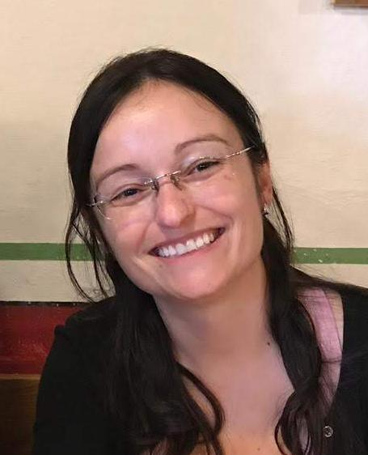
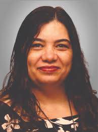
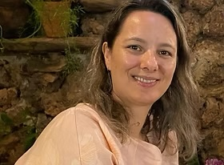
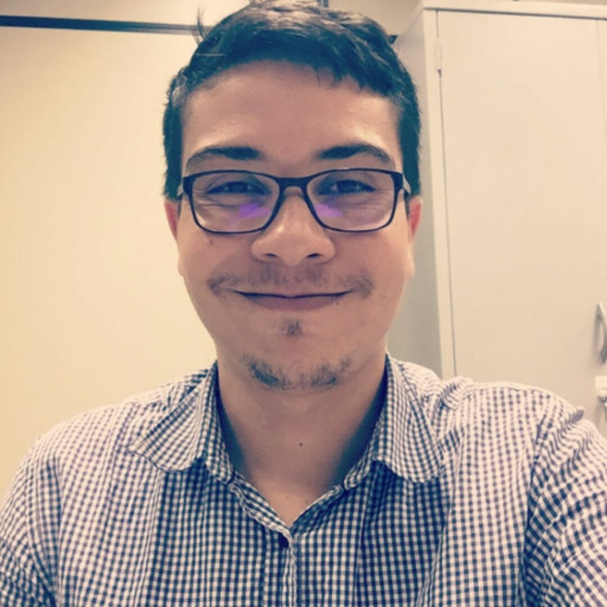

# Equipe

A equipe do **PRO-BIOINFO** reúne docentes, discentes e colaboradores externos do [Laboratório de Genética & Biodiversidade (LGBio/ICB-UFG)](index.md) e instituições parceiras. Conheça quem faz o programa acontecer.

## :material-account-star: Coordenação

- { .team-photo }

    **Renata de Oliveira Dias**

    Coordenadora · Docente

    [:material-school: Lattes](http://lattes.cnpq.br/5189684087836977)

- { .team-photo }

    **Mariana Pires de Campos Telles**

    Vice-coordenadora · Docente

    [:material-school: Lattes](http://lattes.cnpq.br/4648436798023532)

## :material-school: Docentes colaboradores

- { .team-photo }

    **Thannya Nascimento Soares**

    Docente

    [:material-school: Lattes](http://lattes.cnpq.br/5590256762396056)

## :material-account-group: Discentes

- { .team-photo }

    **Héctor Antônio Assunção Romão**

    Discente · Integrante

    [:material-school: Lattes](http://lattes.cnpq.br/9152652191665275)

- { .team-photo }

    **Júllia Costa dos Reis**

    Discente · Integrante

    [:material-school: Lattes](http://lattes.cnpq.br/8164966087509436)

- { .team-photo }

    **Wilian Wingert Córdova**

    Discente · Integrante

    [:material-school: Lattes](http://lattes.cnpq.br/8961347172143738)

## :material-handshake: Colaboradores externos

- { .team-photo }

    **Rhewter Nunes**

    Colaborador externo

    [:material-school: Lattes](http://lattes.cnpq.br/6169806655018346)

- { .team-photo }

    **Ramilla dos Santos Braga Ferreira**

    Colaboradora externa

    [:material-school: Lattes](http://lattes.cnpq.br/6300428213623066)

## :material-account-plus: Como contribuir

Interessado(a) em colaborar com o PRO-BIOINFO como instrutor(a), monitor(a) ou parceiro(a) institucional? Entre em contato com a coordenação ou abra uma _issue_ no [repositório do GitHub](https://github.com/LGBIO-UFG/PRO-BIOINFO/issues).
